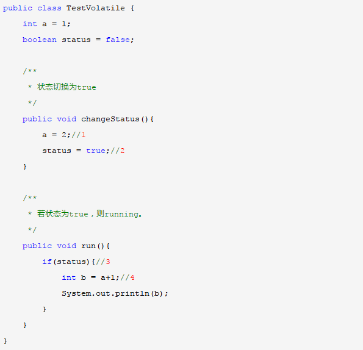
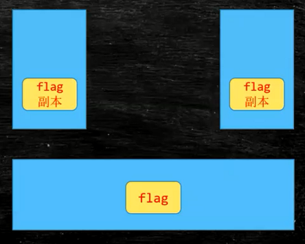
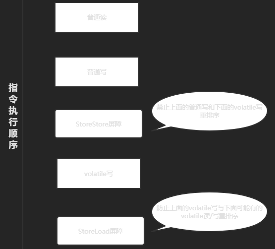
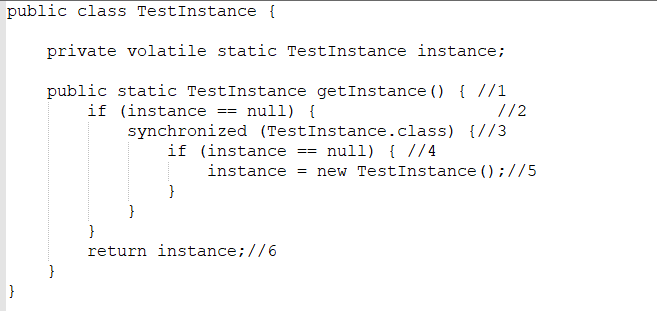
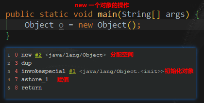

## Volatile介绍
<https://github.com/GudaoFQ/Multithreading/tree/main/src/main/java/com/gudao/m007_volatile_visible>
```shell
volatile可以保证线程可见性且提供了一定的有序性，但是无法保证原子性。在JVM底层volatile是采用“内存屏障”来实现的。观察加入volatile关键字和没有加入volatile关键字时所生成的汇编代码发现，加入volatile关键字时，会多出一个lock前缀指令，lock前缀指令实际上相当于一个内存屏障（也成内存栅栏），
内存屏障会提供3个功能：
1. 它确保指令重排序时不会把其后面的指令排到内存屏障之前的位置，也不会把前面的指令排到内存屏障的后面；即在执行到内存屏障这句指令时，在它前面的操作已经全部完成；
2. 它会强制将对缓存的修改操作立即写入主存；
3. 如果是写操作，它会导致其他CPU中对应的缓存行无效。
```

####　volatile变量的特性
* 保证可见性，不保证原子性
    1. 当写一个volatile变量时，JMM会把该线程本地内存中的变量强制刷新到主内存中去；
    2. 这个写会操作会导致其他线程中的缓存无效。
* 禁止指令重排
    1. 重排序是指编译器和处理器为了优化程序性能而对指令序列进行排序的一种手段。重排序需要遵守一定规则：
        1. 重排序操作不会对存在数据依赖关系的操作进行重排序。比如：a=1;b=a; 这个指令序列，由于第二个操作依赖于第一个操作，所以在编译时和处理器运行时这两个操作不会被重排序。
        2. 重排序是为了优化性能，但是不管怎么重排序，单线程下程序的执行结果不能被改变。比如：a=1;b=2;c=a+b这三个操作，第一步（a=1)和第二步(b=2)由于不存在数据依赖关系， 所以可能会发生重排序，但是c=a+b这个操作是不会被重排序的，因为需要保证最终的结果一定是c=a+b=3。
#### 示例
> 重排序在单线程下一定能保证结果的正确性，但是在多线程环境下，可能发生重排序，影响结果，下例中的1和2由于不存在数据依赖关系，则有可能会被重排序，先执行status=true再执行a=2。而此时线程B会顺利到达4处，而线程A中a=2这个操作还未被执行，所以b=a+1的结果也有可能依然等于2。
<br>
```shell
使用volatile关键字修饰共享变量便可以禁止这种重排序。若用volatile修饰共享变量，在编译时，会在指令序列中插入内存屏障来禁止特定类型的处理器重排序,volatile禁止指令重排序也有一些规则：
    1.当程序执行到volatile变量的读操作或者写操作时，在其前面的操作的更改肯定全部已经进行，且结果已经对后面的操作可见；在其后面的操作肯定还没有进行；
    2.在进行指令优化时，不能将在对volatile变量访问的语句放在其后面执行，也不能把volatile变量后面的语句放到其前面执行。即执行到volatile变量时，其前面的所有语句都执行完，后面所有语句都未执行。且前面语句的结果对volatile变量及其后面语句可见。
```

#### 可见性
> MESI 使用了CPU中的缓存一致性协议

MESI协议：在早期的CPU中，是通过在总线加LOCK#锁的方式实现的，但是这种方式开销太大，所以Intel开发了缓存一致性协议，也就是MESI协议。该缓存一致性思路：当CPU写数据时，如果发现操作的变量时共享变量，即其他线程的工作内存也存在该变量，于是会发信号通知其他CPU该变量的内存地址无效。当其他线程需要使用这个变量时，如内存地址失效，那么它们会在主存中重新读取该值。
volatile是一种非锁机制，这种机制可以避免锁机制引起的上下文切换。

##### 说明
> 一个线程对一个多线程共享值的修改，不能实时的反应到另一个线程中去；加了volatile之后每次写都会被线程读取到
<br>

##### volatile修饰引用类型
> 修饰引用对象的时候，不会对引用中的属性进行可见性操作【volatile修饰引用对象只是修饰了其引用值，而不是其引用的内容的可见性，但是有一个地方是被修饰的引用对象当其他线程需要获取的所有变量都会从主内存去获取】
```markdown
具体示例请看【MSB007】volatile修饰引用类型示例.md
代码示例：https://github.com/GudaoFQ/Multithreading/blob/main/src/main/java/com/gudao/m007_volatile_visible/VolatileQuoteListVisible.java
```

#### 禁止指令重排
> 重排序在单线程下一定能保证结果的正确性，但是在多线程环境下，可能发生重排序，影响结果，下例中的1和2由于不存在数据依赖关系，则有可能会被重排序，先执行status=true再执行a=2。而此时线程B会顺利到达4处，而线程A中a=2这个操作还未被执行，所以b=a+1的结果也有可能依然等于2。
* 指令重排序有两个层面
    * 在虚拟机层面，为了尽可能减少内存操作速度远慢于CPU运行速度所带来的CPU空置的影响，虚拟机会按照自己的一些规则(这规则后面再叙述)将程序编写顺序打乱——即写在后面的代码在时间顺序上可能会先执行，而写在前面的代码会后执行——以尽可能充分地利用CPU。拿上面的例子来说：假如不是a=1的操作，而是a=new byte1024*1024，那么它会运行地很慢，此时CPU是等待其执行结束呢，还是先执行下面那句flag=true呢？显然，先执行flag=true可以提前使用CPU，加快整体效率，当然这样的前提是不会产生错误(什么样的错误后面再说)。虽然这里有两种情况：后面的代码先于前面的代码开始执行；前面的代码先开始执行，但当效率较慢的时候，后面的代码开始执行并先于前面的代码执行结束。不管谁先开始，总之后面的代码在一些情况下存在先结束的可能。
    * 在硬件层面，CPU会将接收到的一批指令按照其规则重排序，同样是基于CPU速度比缓存速度快的原因，和上一点的目的类似，只是硬件处理的话，每次只能在接收到的有限指令范围内重排序，而虚拟机可以在更大层面、更多指令范围内重排序。硬件的重排序机制参见《从JVM并发看CPU内存指令重排序(Memory Reordering)》

* 被volatile修饰的变量，会加一个lock前缀的汇编指令。若变量被修改后，会立刻将变量由工作内存回写到主存中。那么意味了之前的操作已经执行完毕。这就是内存屏障。它确保指令重排序时不会把其后面的指令排到内存屏障之前的位置，也不会把前面的指令排到内存屏障的后面；即在执行到内存屏障这句指令时，在它前面的操作已经全部完成。非常经典的例子是在单例方法中同时对字段加入voliate，就是为了防止指令重排序。


#####　双重检查下的单例模式
<br>
需要volatile关键字的原因是，在并发情况下，如果没有volatile关键字，在第5行会出现问题。instance = new TestInstance();可以分解为3行伪代码
1. memory = allocate() //分配内存
2. ctorInstanc(memory) //初始化对象
3. instance = memory //设置instance指向刚分配的地址

<br>
上面的代码在编译运行时，可能会出现重排序从a-b-c排序为a-c-b。在多线程的情况下会出现以下问题。当线程A在执行第5行代码时，B线程进来执行到第2行代码。假设此时A执行的过程中发生了指令重排序，即先执行了a和c，没有执行b。那么由于A线程执行了c导致instance指向了一段地址，所以B线程判断instance不为null，会直接跳到第6行并返回一个未初始化的对象。

#### volatile不适用的场景
* volatile不适合复合操作
> 例如，inc++不是一个原子性操作，可以由读取、加、赋值3步组成，所以结果并不能达到30000。
