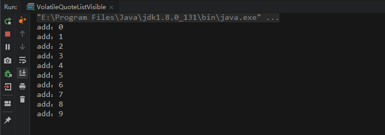
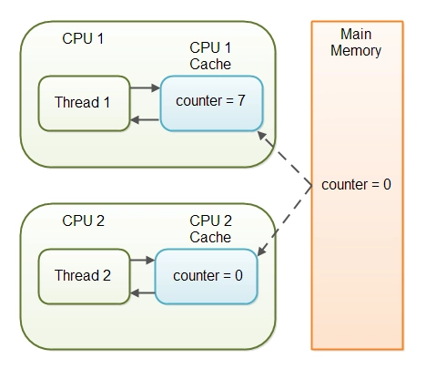

## Volatile修饰List【引用类型】
### 奇怪的知识
```shell
故事是这样的：说是有一道阿里的面试题，是这样描述的：
给定一个容器，提供两个方法add，size，写两个线程：
线程一：添加10个元素到容器中
线程二：实现监控元素个数，当个数到5个的时候，线程2给出提示并结束
```

#### 先按照正常思路码代码
```java
public class WithoutVolatile {
    //提供一个容器
    List list = new ArrayList();
    //list中加参数操作
    public void add(String name){
        this.list.add(name);
    }
    //查看list大小
    public int size(){
        return this.list.size();
    }
    
    public static void main(String[] args) {
        WithoutVolatile wVolatile = new WithoutVolatile();
        
        //新建一个线程B,用于监控容器的个数
        new Thread(()->{
            while(true){
                if(wVolatile.size()==5){
                    break;
                }
            }
            System.out.println("线程t2 结束");
        },"t2").start();
        
        //这是一个线程A,添加Object到容器中
        new Thread(()->{
            for (int i = 0; i < 10; i++) {
                wVolatile.add(new Object());
                System.out.println("add："+i);
            }
        },"t1").start();
    }
}
```

#### 思考一个问题
> 是不是我线程A改完链表后没有把数据跟线程B说啊，线程B不知道情况。那我们就让线程A改完后通知线程B，加个volatile吧，直接怼在ArrayList上吧，不管了。
```java
public class WithoutVolatile {
    //提供一个容器
    volatile List list = new ArrayList();
    //list中加参数操作
    public void add(String name){
        this.list.add(name);
    }
    //查看list大小
    public int size(){
        return this.list.size();
    }
    
    public static void main(String[] args) {
        WithoutVolatile wVolatile = new WithoutVolatile();
        
        //新建一个线程B,用于监控容器的个数
        new Thread(()->{
            while(true){
                if(wVolatile.size()==5){
                    break;
                }
            }
            System.out.println("线程t2 结束");
        },"t2").start();
        
        //这是一个线程A,添加Object到容器中
        new Thread(()->{
            for (int i = 0; i < 10; i++) {
                //这两行代码互换对结果影响比较大
                wVolatile.add(new Object());
                System.out.println("add："+i);
            }
        },"t1").start();
    }
}
```
有意思的事情发生了，运行结果有时可以有时不可以。而且最重要的是当线程A的输出打印代码在前在后会导致运行结果的较大差异。打印结果在后的程序运行成功的概率更大！
奇怪？
> 这里有两个疑问
1. 我们都知道volatile可以保持变量在线程之间的可见性。那为什么对于引用类型程序有时却不能保证，特别是打印语句在前的时候特别明显，难道有内鬼?
2. 为什么打印的代码在前在后会造成运行结果的较大差异呢？

**有疑问，www.baidu.com，输入：volatile可以修饰引用对象么，然后点了第一个链接，没错是它，随便看看。**
```markdown
原来，**volatile修饰引用对象只是修饰了其引用值，而不是其引用的内容的可见性，但是有一个地方是被修饰的引用对象当其他线程需要获取的所有变量都会从主内存去获取**。（有合理的解释当然就拿来凑合着用，留下了没有技术的泪水）。
这说明，**线程B对添加了volatile的Arraylist对象访问都是从内存中获取的，这里没毛病吧**，however，线程A修改后并不会通知其他线程：我修改了Arraylist，其他线程注意哦。线程也不会立马将修改的更新到内存中。这就造成线程B没办法从内存中读取到修改后的值，可能等到线程A添加到第六个对象到Arraylist中时才更新到内存，这时线程B已经没办法获取到5了。
```
##### 事实上，线程会在cpu空闲的时候将更新的值刷新到内存中。我们可以尝试一下，让线程A在更新后稍作休息。
```java
public class WithoutVolatile {
    volatile List list = new ArrayList();
    
    public void add(Object o){
        list.add(o);
    }
    public int size(){
        return list.size();
    }
    
    public static void main(String[] args) {
        WithoutVolatile wVolatile = new WithoutVolatile();
        
        new Thread(()->{
            while(true){
                if(wVolatile.size()==5){
                    break;
                }
            }
            System.out.println("线程t2 结束");
        },"t2").start();
        
        new Thread(()->{
            for (int i = 0; i < 10; i++) {
                // 这两行代码互换对结果影响比较大
                wVolatile.add(new Object());
                
                /**
                * 
                * 下面两行代码都是让线程休息，好让线程将值更新到内存中
                * 
                */
                System.out.println("add "+i);
                try {
                    Thread.sleep(1);
                } catch (InterruptedException e) {
                    e.printStackTrace();
                }
            }
        },"t1").start();
    }
}
```
这个时候运行得到的结果是正确的。（本人尝试了10几遍）

##### 接下来我来猜一下打印语句的疑问：（猜测）
> 前面说过，线程稍作休息，将改变的值刷新到内存中。会不会我们的系统在打印的时候cpu这个时候有空把更新的值写到内存中呢？但是又由于打印的时间是在是短的不行，比休息1毫秒还短。我想这就有可能解释为什么打印语句在后的时候还是有可能造成运行结果不正确，线程B无法拿到正确的值的原因。

##### 然而，这个时候可能有一个调皮的人就说，那我就是不用volatile修饰容器呢？
> 分析一下：<br>
不加volatile？ 那我线程A和线程B变量不可见哦，我线程B好像不能每次都是从内存中读数据了哦，因为我while（true）那可是快的飞起，可能没时间从内存中更新数据。而且线程A也就不会及时从线程工作内存中更新值到内存。我们来想想怎么解决。
1. 既然线程B没有时间从内存中更新，那我给你时间更新便是。
2. 既然线程A不会及时将更改的值刷新到内存，那我也给你充足的时间更新呗。
```java
public class WithoutVolatile {
    //不加volatile
    List list = new ArrayList();
    public void add(Object o){
        list.add(o);
    }
    public int size(){
        return list.size();
    }
    public static void main(String[] args) {
        WithoutVolatile wVolatile = new WithoutVolatile();
        new Thread(()->{
            while(true){
                //System.out.println(wVolatile.size());//线程有可能暂停
                if(wVolatile.size()==5){
                    break;
                }
                //休息一毫秒钟
                try {
                    Thread.sleep(1);
                } catch (InterruptedException e) {
                    e.printStackTrace();
                }
            }
            System.out.println("线程t2 结束");
        },"t2").start();
        new Thread(()->{
            for (int i = 0; i < 10; i++) {
                wVolatile.add(new Object());
                System.out.println("add "+i);
                //休息1毫秒钟
                try {
                    Thread.sleep(1);
                } catch (InterruptedException e) {
                    e.printStackTrace();
                }
            }
        },"t1").start();
    }
}
```
##### 这个时候，嘿嘿，运行的结果很如意。但是我们需要注意的是
* 线程B的休息时间不能长于线程A的休息时间。因为当线程B的休息时间过长，会导致线程A都把值改了两个了，线程B才检测到改变了两个值，这个时候就无法指定某个值结束线程B了。

#### 总结

```java
//问题：volatile修饰对象和数组时，只是保证其引用地址的可见性，可为什么我加了volatile之后下面的代码会马上打印“结束”，如果不给数组加volatile就永远不会打印。volatile修饰对象和数组时，线程对其域或元素操作的详细步骤是什么？

class Test{
    public static volatile int[] ints = new int[5];
    public static void main(String[] args) throws Exception {
    Object o = new Object();
    new Thread(() -> {
        //线程A
        try {
            TimeUnit.MILLISECONDS.sleep(100);
        } catch (InterruptedException e) {
            e.printStackTrace();
        }
       ints[0] = 2;
    }).start();
    new Thread(() -> {            //线程B
        while (true) {
            if (ints[0] == 2) {
                System.out.println("结束");
                break;
            }
        }
    }).start();
    }
}
```
首先如果不给数组加volatile就永远不会打印这个理解是错误的，就算不加volatile，cpu在空闲的时候也会将int[0]的值从线程缓存刷新到主存，只是while(true)太快了，导致cpu一直没空。你可以试试看加一行代码后是什么结果：
```java
//修改
if (ints[0] == 2) {     
    System.out.println("结束");     
    break; 
} 
System.out.println("waiting");
```
> 因为System.out.pringln()源码中有synchronized关键字，是很耗时的，这时候cpu就有空去刷新int[0]的值到主存了了。 volitile的作用就是强制将int[0]的值刷新到主存中，保证其在各个线程中的可见性