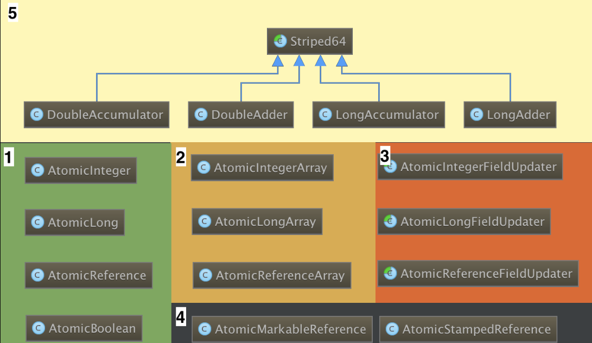

## Atomic

#### Atomic分类

##### 详细说明


#### 特点
* 使用java.util.concurrent.atomic提供的原子操作可以简化多线程编程：
    * 原子操作实现了无锁的线程安全；
    * 适用于计数器，累加器等。

#### Atomic包介绍
> Java的java.util.concurrent包除了提供底层锁、并发集合外，还提供了一组原子操作的封装类，它们位于java.util.concurrent.atomic包；Java1.5的Atomic包名为java.util.concurrent.atomic。这个包提供了一系列原子类。这些类可以保证多线程环境下，当某个线程在执行atomic的方法时，不会被其他线程打断，而别的线程就像自旋锁一样，一直等到该方法执行完成，才由JVM从等待队列中选择一个线程执行。Atomic类在软件层面上是非阻塞的，它的原子性其实是在硬件层面上借助相关的指令来保证的。

#### Atomic包中的类可以分成4组
> AtomicBoolean，AtomicInteger，AtomicLong，AtomicReference

> AtomicIntegerArray，AtomicLongArray

> AtomicLongFieldUpdater，AtomicIntegerFieldUpdater，AtomicReferenceFieldUpdater

> AtomicMarkableReference，AtomicStampedReference，AtomicReferenceArray

#### AtomicInteger常见的方法以及这些方法的作用

|  方法                  |  含义                                                          |
| ---------------------- | ------------------------------------------------------------- |
| get()                  |  直接返回值                                                    |
| getAndAdd(int)         |  增加指定的数据，返回变化前的数据                                 |
| getAndDecrement()      |  减少1，返回减少前的数据                                         |
| getAndIncrement()      |  增加1，返回增加前的数据                                         |
| getAndSet(int)         |  设置指定的数据，返回设置前的数据                                 |
| addAndGet(int)         |  增加指定的数据后返回增加后的数据                                 |
| decrementAndGet()      |  减少1，返回减少后的值                                          |
| incrementAndGet()      |  增加1，返回增加后的值                                          |
| lazySet(int)           |  仅仅当get时才会set                                            |
| CompareAndSet(int, int)|  尝试新增后对比，若增加成功则返回true否则返回false【用CAS方式设置】 |

> Atomic类是通过无锁（lock-free）的方式实现的线程安全（thread-safe）访问。它的主要原理是利用了CAS：Compare and Set。

#### CompareAndSet的用法
```java
public class AtomicCounter {

    private final AtomicInteger counter = new AtomicInteger(0);

    public int getValue() {
        return counter.get();
    }
    public void increment() {
        while(true) {
            int existingValue = getValue();
            int newValue = existingValue + 1;
            if(counter.compareAndSet(existingValue, newValue)) {
                return;
            }
        }
    }
}
```
#### 核心对象——Unsafe
> 整个atomic都是基于Unsafe实现的，Unsafe通过通过单例模式来提供实例对象，这里我们主要关注它提供的几个方法
```shell
# sun.misc.Unsafe.class
public final native boolean compareAndSwapInt(Object var1, long var2, 
        int var4, int var5);      // 核心方法CAS
// 参数释义：var1为类对象，参数var2为Field的偏移量，var4为旧值，var5为更新后的值
//（对象和偏移量构成唯一的内存地址，如果对源码JVM有兴趣，可下载源码参考，非本文范畴，不赘述）。

// 计算偏移量
public native long staticFieldOffset(Field var1);
public native long objectFieldOffset(Field var1);
```
Unsafe提供的大多是native方法，compareAndSwapInt()通过原子的方式将期望值和内存中的值进行对比，如果两者相等，则执行更新操作。
staticFieldOffset()和objectFieldOffset()两方法分别提供两静态、非静态域的偏移量计算方法。

##### 注意
> 之所以命名为Unsafe，因为该对于大部分Java开发者来说是不安全的，它像C一样，拥有操作指针、分配和回收内存的能力，由该对象申请的内存是无法被JVM回收的，因此轻易别用。当然，如果对并发有非常浓厚的兴趣，就要好好研究下它，许多高性能的框架都使用它作为底层实现，如Netty、Kafka。
