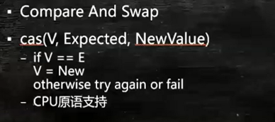

## CAS【无锁优化、自旋】

* V:要改的值
* Excepted:期望的值【当前线程认为原来应该有的那个值】
* NewValue:需要设定的新值
* cas是CPU指令级别的操作，中间不能被打断

#### 源码解读
1. 我们还可以使用AtomicInteger，就可以保证i原子的++了。
```java
public class Test {

    public AtomicInteger i;

    public void add() {
        i.getAndIncrement();
    }
}
```
2. getAndIncrement的内部代码
```java
public final int getAndIncrement() {
    return unsafe.getAndAddInt(this, valueOffset, 1);
}
```
3. 再深入到getAndAddInt()
```java
public final int getAndAddInt(Object var1, long var2, int var4) {
    int var5;
    do {
        var5 = this.getIntVolatile(var1, var2);
    } while(!this.compareAndSwapInt(var1, var2, var5, var5 + var4));

    return var5;
}
```
compareAndSwapInt前面的this，那么它属于哪个类呢，我们看上一步getAndAddInt，前面是unsafe。这里我们进入的Unsafe类。这里要对Unsafe类做个说明。结合AtomicInteger的定义来说：
```java
public class AtomicInteger extends Number implements java.io.Serializable {
    private static final long serialVersionUID = 6214790243416807050L;
    
    // setup to use Unsafe.compareAndSwapInt for updates
    private static final Unsafe unsafe = Unsafe.getUnsafe();
    private static final long valueOffset;
    
    static {
        try {
            valueOffset = unsafe.objectFieldOffset
                (AtomicInteger.class.getDeclaredField("value"));
        } catch (Exception ex) { throw new Error(ex); }
    }
    
    private volatile int value;
    ...
}
```
在AtomicInteger数据定义的部分，我们可以看到，其实实际存储的值是放在value中的，除此之外我们还获取了unsafe实例，并且定义了valueOffset。再看到static块，懂类加载过程的都知道，static块的加载发生于类加载的时候，是最先初始化的，这时候我们调用unsafe的objectFieldOffset从Atomic类文件中获取value的偏移量，那么valueOffset其实就是记录value的偏移量的。
再回到上面一个函数getAndAddInt，我们看var5获取的是什么，通过调用unsafe的getIntVolatile(var1, var2)，这是个native方法，具体实现到JDK源码里去看了，其实就是获取var1中，var2偏移量处的值。var1就是AtomicInteger，var2就是我们前面提到的valueOffset,这样我们就从内存里获取到现在valueOffset处的值了。