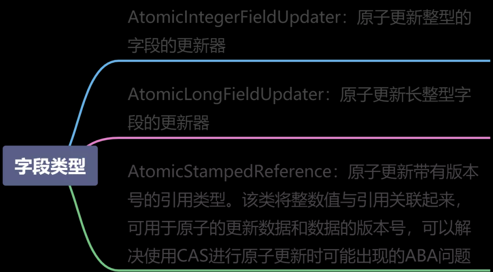

## 原子更新字段类AtomicStampedReference

> 如果需要原子地更新某个类里的某个字段时，就需要使用原子更新字段类，Atomic包提供了以下3个类进行原子字段更新。


#### AtomicIntegerFieldUpdater案例演示
> 原子地更新整形字段类，还是那个懵懂少年，在修改自己的票数。教师类如下
```java
public class Teacher {
    /**
     * 教师名称
     */
    public volatile String name;
    /**
     * 学生投票数
     */
    public volatile int ticketNum;

    public Teacher(String name, int ticketNum) {
        this.name = name;
        this.ticketNum = ticketNum;
    }

    public String getName() {
        return name;
    }

    public int getTicketNum() {
        return ticketNum;
    }
}


public class AtomicExample8 {
    private static AtomicIntegerFieldUpdater<Teacher> integerFieldUpdater = AtomicIntegerFieldUpdater.newUpdater(Teacher.class, "ticketNum");

    public static void main(String[] args) {
        // 设置懵懂少年 180票
        Teacher teacher = new Teacher("懵懂少年", 180);
        // 180
        System.out.println("getAndIncrement = " + integerFieldUpdater.getAndIncrement(teacher));
       
        System.out.println("get=" + integerFieldUpdater.get(teacher));
    }
}
//运行结果：
//getAndIncrement = 180
//get=181
```
#### 要想原子地更新字段类需要两步。
1. 第一步，因为原子更新字段类都是抽象类，每次使用的时候必须使用静态方法newUpdater()创建一个更新器，并且需要设置想要更新的类和属性。
2. 第二步，更新类的字段（属性）必须使用public volatile修饰符。
> AtomicIntegerFieldUpdater 和 AtomicReferenceFieldUpdater 方法基本类似，方法getAndIncrement()、getAndDecrement()、getAndAdd()等方法，跟前面的 Atomiclong实现也基本类同。

### AtomicStampedReference
我们都知道在使用 CAS 也就是使用 compareAndSet（current，next）方法进行无锁自加或者更换栈的表头之类的问题时会出现ABA问题，Java中使用 AtomicStampedReference 来解决 CAS 中的ABA问题，它不再像 compareAndSet 方法
中只比较内存中的值也当前值是否相等，而且`先比较引用是否相等，然后比较值是否相等`，这样就避免了ABA问题。
#### 那么 AtomicStampedReference 的基本用法是什么呢？看如下：
```java
//构造方法, 传入引用和戳
public AtomicStampedReference(V initialRef, int initialStamp)
//返回引用
public V getReference()
//返回版本戳
public int getStamp()
//如果当前引用 等于 预期值并且 当前版本戳等于预期版本戳, 将更新新的引用和新的版本戳到内存
public boolean compareAndSet(V   expectedReference,
                                 V   newReference,
                                 int expectedStamp,
                                 int newStamp)
//如果当前引用 等于 预期引用, 将更新新的版本戳到内存
public boolean attemptStamp(V expectedReference, int newStamp)
//设置当前引用的新引用和版本戳
public void set(V newReference, int newStamp) 

public boolean weakCompareAndSet(V   expectedReference, V   newReference, int expectedStamp, int newStamp)
```
##### weakCompareAndSet()方法说明
> 我从jdk 8 的官方文档的java.util.concurrent.atomic上找到这么二段话：
* The atomic classes also support method weakCompareAndSet, which has limited applicability. On some platforms, the weak version may be more efficient than compareAndSet in the normal case, but differs in that any given invocation of the weakCompareAndSet method may return false spuriously (that is, for no apparent reason). A false return means only that the operation may be retried if desired, relying on the guarantee that repeated invocation when the variable holds expectedValue and no other thread is also attempting to set the variable will eventually succeed. (Such spurious failures may for example be due to memory contention effects that are unrelated to whether the expected and current values are equal.) Additionally weakCompareAndSet does not provide ordering guarantees that are usually needed for synchronization control. However, the method may be useful for updating counters and statistics when such updates are unrelated to the other happens-before orderings of a program. When a thread sees an update to an atomic variable caused by a weakCompareAndSet, it does not necessarily see updates to any other variables that occurred before the weakCompareAndSet. This may be acceptable when, for example, updating performance statistics, but rarely otherwise.
* 一个原子类也支持weakCompareAndSet方法，该方法有适用性的限制。在一些平台上，在正常情况下weak版本比compareAndSet更高效，但是不同的是任何给定的weakCompareAndSet方法的调用都可能会返回一个虚假的失败( 无任何明显的原因 )。一个失败的返回意味着，操作将会重新执行如果需要的话，重复操作依赖的保证是当变量持有expectedValue的值并且没有其他的线程也尝试设置这个值将最终操作成功。( 一个虚假的失败可能是由于内存冲突的影响，而和预期值(expectedValue)和当前的值是否相等无关 )。此外weakCompareAndSet并不会提供排序的保证，即通常需要用于同步控制的排序保证。然而，这个方法可能在修改计数器或者统计，这种修改无关于其他happens-before的程序中非常有用。当一个线程看到一个通过weakCompareAndSet修改的原子变量时，它不被要求看到其他变量的修改，即便该变量的修改在weakCompareAndSet操作之前。
* weakCompareAndSet atomically reads and conditionally writes a variable but does not create any happens-before orderings, so provides no guarantees with respect to previous or subsequent reads and writes of any variables other than the target of the weakCompareAndSet.
* weakCompareAndSet实现了一个变量原子的读操作和有条件的原子写操作，但是它不会创建任何happen-before排序，所以该方法不提供对weakCompareAndSet操作的目标变量以外的变量的在之前或在之后的读或写操作的保证。
> 这二段话是什么意思了，也就是说weakCompareAndSet底层不会创建任何happen-before的保证，也就是不会对volatile字段操作的前后加入内存屏障。因为就无法保证多线程操作下对除了weakCompareAndSet操作的目标变量( 该目标变量一定是一个volatile变量 )之其他的变量读取和写入数据的正确性。
##### demo
```java
public class AtomicStampedReferenceDemo {
    public static void main(String[] args) {

        int a = 99, b = 100;

        /**
         * V initialRef : 引用；个人定义为可能修改的对象
         * int initialStamp : 戳；个人定义为版本号
         */
        AtomicStampedReference<Integer> stampedReference = new AtomicStampedReference<>(a, 1);
        stampedReference.compareAndSet(
                99,//引用的期望值【V initialRef】
                b,//引用的新值
                stampedReference.getStamp(),//版本戳期望值
                stampedReference.getStamp()+1);//版本戳新值

        //返回最新的引用值
        System.out.println("引用值：" + stampedReference.getReference());
        //返回最新的版本戳
        System.out.println("版本戳：" + stampedReference.getStamp());

        //如果当前引用 等于 预期引用, 将更新新的版本戳到内存【修改版本戳】{当前引用值已经变成了b，所以这边以a为引用期望值是不可能修改成功的}
        boolean changeResult = stampedReference.attemptStamp(
                a, //引用的期望值
                stampedReference.getStamp() + 1);//版本戳新值
        System.out.println("修改结果："+changeResult + "，版本戳：" + stampedReference.getStamp());

        boolean weakResult = stampedReference.weakCompareAndSet(100, 101, stampedReference.getStamp(), stampedReference.getStamp() + 1);
        System.out.println("weakCompareAndSet修改结果：" + weakResult);
    }
}
```

#### AtomicStampedReference 案例演示
> AtomicStampedReference的compareAndSet方法作用是首先检查当前引用是否等于预期引用，并且当前标志是否等于预期标志，如果全部相等，则以原子方式将该引用和该标志的值设置为给定的更新值。
##### ABA如何产生
> CAS 前面我们都知道，比较交换，要更新的变量和预期值相等，则修改为预期预期值，否则修改失败。所以 CAS 就产生了经典的 ABA 问题，什么是ABA 问题呢？比如一个值原来是A，变成了B，后来又变成了A，那么CAS检查时会发现它的值没有发生变化，但是实际上却是发生了变化的。

> 基础类型的ABA是不用管的，只有引用类型中ABA问题才需要处理
##### 加深印象
> 当跟女朋友分手了，她换了一个新的男朋友，但后面她跟那个男朋友又分手了，找你复合，那么此时的你的女朋友已经跟最初的不一样了
```java
/**
* 案例：
* 大学选课小伙伴应该深有体会，一到选课系统卡，崩溃重启还在卡，多人选课多人卡，除了支付都会卡。现在有一门网红网课，课程人数限制为 100 人，这门课程相当火爆，选课系统开启后，半分钟这门课程就达到了 99 人，还剩余1 个名额。学生 1 和 学生 2同时进入系统，并点击了该课程选择课程按钮，每一个名额都有一个相应的版本号进行控制，学生 2 在弹框出现的时候校园网突然断了，学生 1 就轻松选到了课程，但是学生1 发现心仪的女生没有选到此课程，就退掉了此课程，学生 2 网络好了 ，界面也出现虽然还剩下一个名额，但是已被学生 1 操作过，学生 2 拿出上次的版本号，已经无法选择课程。
*/
public class AtomicExample {
    private static AtomicStampedReference<Integer> atomicStampedReference = new AtomicStampedReference<>(99, 1);

    public static void main(String[] args) {
        Thread student1 = new Thread(() -> {
            int stamp = atomicStampedReference.getStamp();
            System.out.println(Thread.currentThread().getName() + "---首次 stamp： " + stamp);

            atomicStampedReference.compareAndSet(99, 100, atomicStampedReference.getStamp(), atomicStampedReference.getStamp() + 1);
            System.out.println(Thread.currentThread().getName() + "---第二次 stamp： " + atomicStampedReference.getStamp());
            atomicStampedReference.compareAndSet(100, 99, atomicStampedReference.getStamp(), atomicStampedReference.getStamp() + 1);
            System.out.println(Thread.currentThread().getName() + "---第三次 stamp： " + atomicStampedReference.getStamp());
        }, "student1");

        Thread student2 = new Thread(() -> {
            int stamp = atomicStampedReference.getStamp();
            System.out.println(Thread.currentThread().getName() + "---第一次 stamp： " + stamp);
            try {
                System.out.println(Thread.currentThread().getName() + "---你的校园网正在尝试重新连接......");
                TimeUnit.SECONDS.sleep(1);
            } catch (InterruptedException e) {
                e.printStackTrace();
            }
            //如果线程二还是认为这个是第一次修改，那么永远修改不了值
            //boolean result = atomicStampedReference.compareAndSet(99, 100, 1, stamp + 1);
            boolean result = atomicStampedReference.compareAndSet(99, 100, stamp, stamp + 1);
            System.out.println(Thread.currentThread().getName() + "---修改成功与否：" + result + "  当前 stamp：" + atomicStampedReference.getStamp());
            System.out.println(Thread.currentThread().getName() + "---当前课程已选人数：" + atomicStampedReference.getReference());
        }, "student2");

        student1.start();
        student2.start();
    }
}
```
```shell
student1---首次 stamp： 1
student1---第二次 stamp： 2
student1---第三次 stamp： 3
student2---第一次 stamp： 3
student2---你的校园网正在尝试重新连接......
student2---修改成功与否：true  当前 stamp：4
student2---当前课程已选人数：100
```