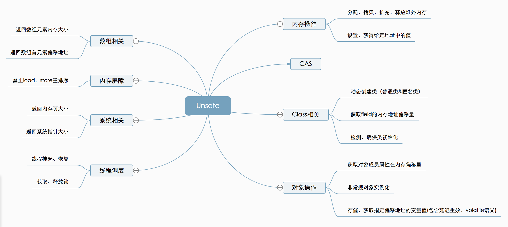

## Unsafe
<https://github.com/GudaoFQ/Multithreading/blob/main/src/main/java/com/gudao/m016_unsafe_demo/UnsafeDemo.java>

详情地址:https://tech.meituan.com/2019/02/14/talk-about-java-magic-class-unsafe.html

#### 基本说明
> 1.7版本

* 1.8能通过反射使用
* 后期版本好像不能使用了
* 底层使用CPU原语实现
* 所有的atomic底层都是用这个类中的CampareAndSwap...来实现的
* 变相的让java语言拥有了像c语言中的指针等操作，操作内存


#### Unsafe类部分方法说明
```java
/*Class类相关*/
//获取给定静态字段的内存地址偏移量，这个值对于给定的字段是唯一且固定不变的
public native long staticFieldOffset(Field f);
//获取一个静态类中给定字段的对象指针
public native Object staticFieldBase(Field f);
//判断是否需要初始化一个类，通常在获取一个类的静态属性的时候（因为一个类如果没初始化，它的静态属性也不会初始化）使用。 当且仅当ensureClassInitialized方法不生效时返回false。
public native boolean shouldBeInitialized(Class<?> c);
//检测给定的类是否已经初始化。通常在获取一个类的静态属性的时候（因为一个类如果没初始化，它的静态属性也不会初始化）使用。
public native void ensureClassInitialized(Class<?> c);
//定义一个类，此方法会跳过JVM的所有安全检查，默认情况下，ClassLoader（类加载器）和ProtectionDomain（保护域）实例来源于调用者
public native Class<?> defineClass(String name, byte[] b, int off, int len, ClassLoader loader, ProtectionDomain protectionDomain);
//定义一个匿名类
public native Class<?> defineAnonymousClass(Class<?> hostClass, byte[] data, Object[] cpPatches);

/*Object操作*/
//返回对象成员属性在内存地址相对于此对象的内存地址的偏移量
public native long objectFieldOffset(Field f);
//获得给定对象的指定地址偏移量的值，与此类似操作还有：getInt，getDouble，getLong，getChar等
public native Object getObject(Object o, long offset);
//给定对象的指定地址偏移量设值，与此类似操作还有：putInt，putDouble，putLong，putChar等
public native void putObject(Object o, long offset, Object x);
//从对象的指定偏移量处获取变量的引用，使用volatile的加载语义
public native Object getObjectVolatile(Object o, long offset);
//存储变量的引用到对象的指定的偏移量处，使用volatile的存储语义
public native void putObjectVolatile(Object o, long offset, Object x);
//有序、延迟版本的putObjectVolatile方法，不保证值的改变被其他线程立即看到。只有在field被volatile修饰符修饰时有效
public native void putOrderedObject(Object o, long offset, Object x);
//绕过构造方法、初始化代码来创建对象
public native Object allocateInstance(Class<?> cls) throws InstantiationException;

/*数组相关*/
//返回数组中第一个元素的偏移地址
public native int arrayBaseOffset(Class<?> arrayClass);
//返回数组中一个元素占用的大小
public native int arrayIndexScale(Class<?> arrayClass);

/*内存屏障*/
//内存屏障，禁止load操作重排序。屏障前的load操作不能被重排序到屏障后，屏障后的load操作不能被重排序到屏障前
public native void loadFence();
//内存屏障，禁止store操作重排序。屏障前的store操作不能被重排序到屏障后，屏障后的store操作不能被重排序到屏障前
public native void storeFence();
//内存屏障，禁止load、store操作重排序
public native void fullFence();

/*系统相关*/
//返回系统指针的大小。返回值为4（32位系统）或 8（64位系统）。
public native int addressSize();  
//内存页的大小，此值为2的幂次方。
public native int pageSize();
```