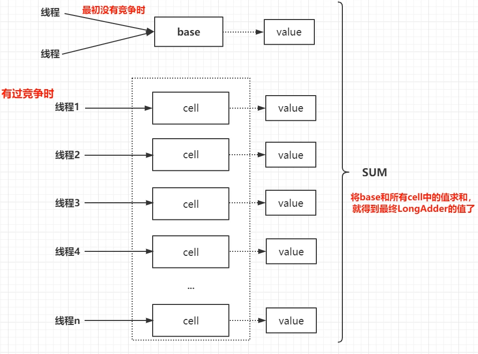

## LongAdder
<https://github.com/GudaoFQ/Multithreading/blob/main/src/main/java/com/gudao/m009_atomic_demo/LongAdderAtomicLongSynchromiezdCompare.java>
> 适用于线程并发量特别大的情况使用【内部实用的是分段锁来实现的】

> 【特别高的并发中】LongAdder是java8中新增的原子类，在多线程环境中，它比AtomicLong性能要高出不少，特别是写多的场景。

#### 原理
> LongAdder的原理是，在最初无竞争时，只更新base的值，当有多线程竞争时通过分段的思想，让不同的线程更新不同的段，最后把这些段相加就得到了完整的LongAdder存储的值。


#### LongAdder/AtomicLong/Synchronized在一万并发量的情况下的对一个数字的自增
> 例子请看个人的github
* LongAdder【分段锁也是CAS操作】
> 适合在特别高的并发量的情况下使用，内部实现的事分段锁进行，最后sum求和
* AtomicLong
> 内部并没有加锁操作，所以正常情况下是会比Synchronized效率高
* Synchronized
> 在多线程高并发的情况下，因为内部会进行锁升级，而且不会降级，所以高并发中可能会升级为重量级锁，这样就会在保证线程安全的情况下降低效率

#### 源码分析
> LongAdder继承自Striped64抽象类，Striped64中定义了Cell内部类和各重要属性。
```java
// Striped64中的内部类，使用@sun.misc.Contended注解，说明里面的值消除伪共享
@sun.misc.Contended static final class Cell {
    // 存储元素的值，使用volatile修饰保证可见性
    volatile long value;
    Cell(long x) { value = x; }
    // CAS更新value的值
    final boolean cas(long cmp, long val) {
        return UNSAFE.compareAndSwapLong(this, valueOffset, cmp, val);
    }
 
    // Unsafe实例
    private static final sun.misc.Unsafe UNSAFE;
    // value字段的偏移量
    private static final long valueOffset;
    static {
        try {
            UNSAFE = sun.misc.Unsafe.getUnsafe();
            Class<?> ak = Cell.class;
            valueOffset = UNSAFE.objectFieldOffset
                (ak.getDeclaredField("value"));
        } catch (Exception e) {
            throw new Error(e);
        }
    }
}
```
* Cell类使用@sun.misc.Contended注解，说明是要避免伪共享的。
* 使用Unsafe的CAS更新value的值，其中value的值使用volatile修饰，保证可见性。

#### 主要属性
```shell
// 这三个属性都在Striped64中
// cells数组，存储各个段的值
transient volatile Cell[] cells;
// 最初无竞争时使用的，也算一个特殊的段
transient volatile long base;
// 标记当前是否有线程在创建或扩容cells，或者在创建Cell
// 通过CAS更新该值，相当于是一个锁
transient volatile int cellsBusy;
```

#### LongAdder VS AtomicLong 性能对比
```java
public class LongAdderVSAtomicLongTest {
    public static void main(String[] args){
        testAtomicLongVSLongAdder(1, 10000000);
        testAtomicLongVSLongAdder(10, 10000000);
        testAtomicLongVSLongAdder(20, 10000000);
        testAtomicLongVSLongAdder(40, 10000000);
        testAtomicLongVSLongAdder(80, 10000000);
    }
 
    static void testAtomicLongVSLongAdder(final int threadCount, final int times){
        try {
            System.out.println("threadCount：" + threadCount + ", times：" + times);
            long start = System.currentTimeMillis();
            testLongAdder(threadCount, times);
            System.out.println("LongAdder elapse：" + (System.currentTimeMillis() - start) + "ms");
 
            long start2 = System.currentTimeMillis();
            testAtomicLong(threadCount, times);
            System.out.println("AtomicLong elapse：" + (System.currentTimeMillis() - start2) + "ms");
        } catch (InterruptedException e) {
            e.printStackTrace();
        }
    }
 
    static void testAtomicLong(final int threadCount, final int times) throws InterruptedException {
        AtomicLong atomicLong = new AtomicLong();
        List<Thread> list = new ArrayList<>();
        for (int i=0;i<threadCount;i++){
            list.add(new Thread(() -> {
                for (int j = 0; j<times; j++){
                    atomicLong.incrementAndGet();
                }
            }));
        }
 
        for (Thread thread : list){
            thread.start();
        }
 
        for (Thread thread : list){
            thread.join();
        }
    }
 
    static void testLongAdder(final int threadCount, final int times) throws InterruptedException {
        LongAdder longAdder = new LongAdder();
        List<Thread> list = new ArrayList<>();
        for (int i=0;i<threadCount;i++){
            list.add(new Thread(() -> {
                for (int j = 0; j<times; j++){
                    longAdder.add(1);
                }
            }));
        }
 
        for (Thread thread : list){
            thread.start();
        }
 
        for (Thread thread : list){
            thread.join();
        }
    }
}   
```

#### 总结
1. LongAdder通过base和cells数组来存储值；
2. 不同的线程会hash到不同的cell上去更新，减少了竞争；
3. LongAdder的性能非常高，最终会达到一种无竞争的状态；

