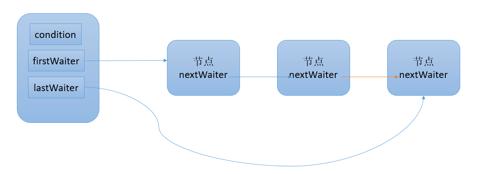
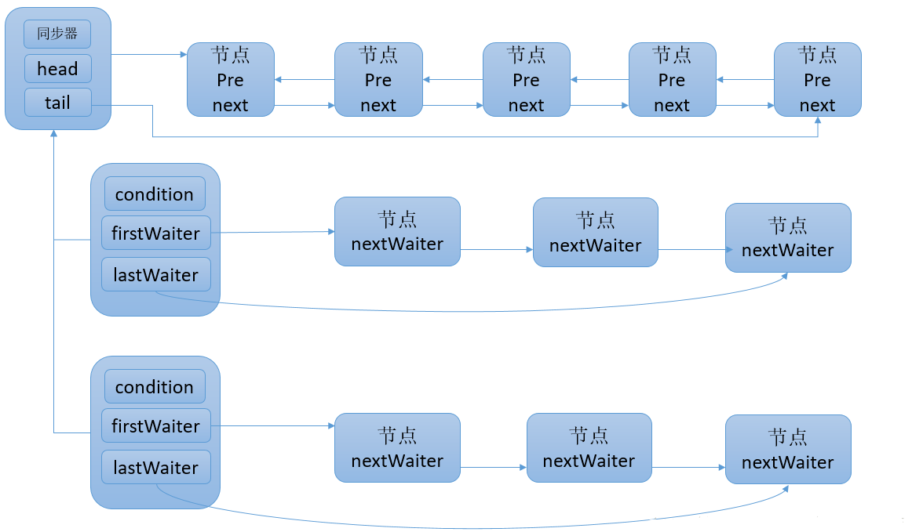
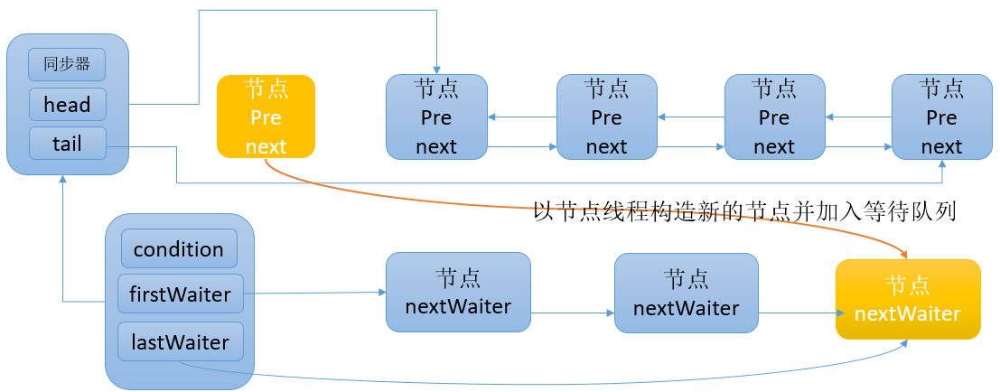
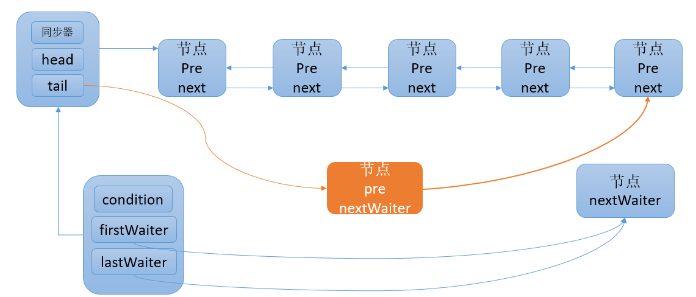

## Condition
> ConditionObject是同步器AbstractQueuedSynchronizer的内部类，因为Condition的操作需要获取相关联的锁，所以作为同步器的内部类也较为合理。每个Condition对象都包含着一个队列，该队列是Condition对象实现等待/通知功能的关键。下面将分析Condition的实现，主要包括：等待队列、等待和通知

* Condition中的await()方法相当于Object的wait()方法
* Condition中的signal()方法相当于Object的notify()方法
* Condition中的signalAll()相当于Object的notifyAll()方法
* 不同的是Object中的wait(),notify(),notifyAll()方法是和"同步锁"(synchronized关键字)捆绑使用的，而Condition是需要与"互斥锁"/"共享锁"捆绑使用的。

#### Condition的等待队列模型
> 等待队列是一个FIFO的队列，在队列中的每个节点都包含了一个线程引用，该线程就是在Condition对象上等待的线程，如果一个线程调用了Condition.await()方法，那么该线程将会释放锁、构造成节点加入等待队列并进入等待状态，一个Condition包含一个等待队列，Condition拥有首节点（firstWaiter）和尾节点（lastWaiter）。当前线程调用Condition.await()方法，将会以当前线程构造节点，并将节点从尾部加入等待队列，等待队列的基本结构如下图所示

* 如图所示，Condition拥有首尾节点的引用，而新增节点只需要将原有的尾节点nextWaiter指向它，并且更新尾节点即可。上述节点引用更新的过程并没有使用CAS保证，原因在于调用await()方法的线程必定是获取了锁的线程，也就是说该过程是由锁来保证线程安全的。在Object的监视器模型上，一个对象拥有一个同步队列和等待队列，而并发包中的Lock（更确切地说是同步器）拥有一个同步队列和多个等待队列，其对应关系如下图所示


#### 等待
> 调用Condition的await()方法（或者以await开头的方法），会使当前线程进入等待队列并释放锁，同时线程状态变为等待状态。当从await()方法返回时，当前线程一定获取了Condition相关联的锁。如果从队列（同步队列和等待队列）的角度看await()方法，当调用await()方法时，相当于同步队列的首节点（获取了锁的节点）移动到Condition的等待队列中
```java
public final void await() throws InterruptedException {
    // 1.如果当前线程被中断，则抛出中断异常
    if (Thread.interrupted())
        throw new InterruptedException();
    // 2.将节点加入到Condition队列中去，这里如果lastWaiter是cancel状态，那么会把它踢出Condition队列。
    Node node = addConditionWaiter();
    // 3.调用tryRelease，释放当前线程的锁
    long savedState = fullyRelease(node);
    int interruptMode = 0;
    // 4.为什么会有在AQS的等待队列的判断？
    // 解答：signal操作会将Node从Condition队列中拿出并且放入到等待队列中去，在不在AQS等待队列就看signal是否执行了
    // 如果不在AQS等待队列中，就park当前线程，如果在，就退出循环，这个时候如果被中断，那么就退出循环
    while (!isOnSyncQueue(node)) {
        LockSupport.park(this);
        if ((interruptMode = checkInterruptWhileWaiting(node)) != 0)
            break;
    }
    // 5.这个时候线程已经被signal()或者signalAll()操作给唤醒了，退出了4中的while循环
    // 自旋等待尝试再次获取锁，调用acquireQueued方法
    if (acquireQueued(node, savedState) && interruptMode != THROW_IE)
        interruptMode = REINTERRUPT;
    if (node.nextWaiter != null)
        unlinkCancelledWaiters();
    if (interruptMode != 0)
        reportInterruptAfterWait(interruptMode);
}

```
调用该方法的线程成功获取了锁的线程，也就是同步队列中的首节点，该方法会将当前线程构造成节点并加入等待队列中，然后释放同步状态，唤醒同步队列中的后继节点，然后当前线程会进入等待状态。当等待队列中的节点被唤醒，则唤醒节点的线程开始尝试获取同步状态。如果不是通过其他线程调用Condition.signal()方法唤醒，而是对等待线程进行中断，则会抛出InterruptedException
1. 将当前线程加入Condition锁队列。特别说明的是，这里不同于AQS的队列，这里进入的是Condition的FIFO队列。 
2. 释放锁。这里可以看到将锁释放了，否则别的线程就无法拿到锁而发生死锁。 
3. 自旋(while)挂起，直到被唤醒（signal把他重新放回到AQS的等待队列）或者超时或者CACELLED等。 
4. 获取锁(acquireQueued)。并将自己从Condition的FIFO队列中释放，表明自己不再需要锁（我已经拿到锁了）。

#### 通知
> 调用Condition的signal()方法，将会唤醒在等待队列中等待时间最长的节点（首节点），在唤醒节点之前，会将节点移到同步队列中

```java
public final void signal() {
            if (!isHeldExclusively())
              //如果同步状态不是被当前线程独占，直接抛出异常。从这里也能看出来，Condition只能配合独占类同步组件使用。
                throw new IllegalMonitorStateException(); 
            Node first = firstWaiter;
            if (first != null)
                //通知等待队列队首的节点。
                doSignal(first); 
        }

private void doSignal(Node first) {
            do {
                if ( (firstWaiter = first.nextWaiter) == null)
                    lastWaiter = null;
                first.nextWaiter = null;
            } while (!transferForSignal(first) &&   //transferForSignal方法尝试唤醒当前节点，如果唤醒失败，则继续尝试唤醒当前节点的后继节点。
                     (first = firstWaiter) != null);
        }

    final boolean transferForSignal(Node node) {
        //如果当前节点状态为CONDITION，则将状态改为0准备加入同步队列；如果当前状态不为CONDITION，说明该节点等待已被中断，则该方法返回false，doSignal()方法会继续尝试唤醒当前节点的后继节点
        if (!compareAndSetWaitStatus(node, Node.CONDITION, 0))
            return false;

        /*
         * Splice onto queue and try to set waitStatus of predecessor to
         * indicate that thread is (probably) waiting. If cancelled or
         * attempt to set waitStatus fails, wake up to resync (in which
         * case the waitStatus can be transiently and harmlessly wrong).
         */
        Node p = enq(node);  //将节点加入同步队列，返回的p是节点在同步队列中的先驱节点
        int ws = p.waitStatus;
        //如果先驱节点的状态为CANCELLED(>0) 或设置先驱节点的状态为SIGNAL失败，那么就立即唤醒当前节点对应的线程，线程被唤醒后会执行acquireQueued方法，该方法会重新尝试将节点的先驱状态设为SIGNAL并再次park线程；如果当前设置前驱节点状态为SIGNAL成功，那么就不需要马上唤醒线程了，当它的前驱节点成为同步队列的首节点且释放同步状态后，会自动唤醒它。
        //其实笔者认为这里不加这个判断条件应该也是可以的。只是对于CAS修改前驱节点状态为SIGNAL成功这种情况来说，如果不加这个判断条件，提前唤醒了线程，等进入acquireQueued方法了节点发现自己的前驱不是首节点，还要再阻塞，等到其前驱节点成为首节点并释放锁时再唤醒一次；而如果加了这个条件，线程被唤醒的时候它的前驱节点肯定是首节点了，线程就有机会直接获取同步状态从而避免二次阻塞，节省了硬件资源。
        if (ws > 0 || !compareAndSetWaitStatus(p, ws, Node.SIGNAL))
            LockSupport.unpark(node.thread);
        return true;
    }
```
调用该方法的前置条件是当前线程必须获取了锁，可以看到signal()方法进行了isHeldExclusively()检查，也就是当前线程必须是获取了锁的线程。接着获取等待队列的首节点，将其移动到同步队列并使用LockSupport唤醒节点中的线程
1. 线程1调用reentrantLock.lock时，尝试获取锁。如果成功，则返回，从AQS的队列中移除线程；否则阻塞，保持在AQS的等待队列中。
2. 线程1调用await方法被调用时，对应操作是被加入到Condition的等待队列中，等待signal信号；同时释放锁。
3. 锁被释放后，会唤醒AQS队列中的头结点，所以线程2会获取到锁。
4. 线程2调用signal方法，这个时候Condition的等待队列中只有线程1一个节点，于是它被取出来，并被加入到AQS的等待队列中。注意，这个时候，线程1 并没有被唤醒，只是被加入AQS等待队列。
5. signal方法执行完毕，线程2调用unLock()方法，释放锁。这个时候因为AQS中只有线程1，于是，线程1被唤醒，线程1恢复执行。所以：发送signal信号只是将Condition队列中的线程加到AQS的等待队列中。只有到发送signal信号的线程调用reentrantLock.unlock()释放锁后，这些线程才会被唤醒。

* 节点从等待队列移动到同步队列的过程如下图所示

