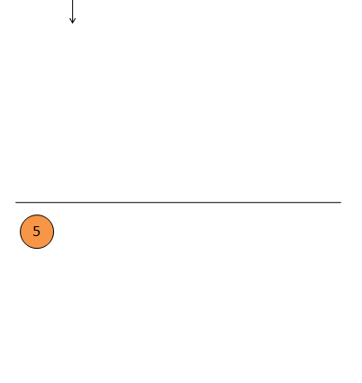

## CyclicBarrier 栅栏
<https://github.com/GudaoFQ/Multithreading/blob/main/src/main/java/com/gudao/m011_otherlock_demo/CyclicBarrierDemo.java>
> CyclicBarrier的字面意思就是可循环使用的屏障。它要做的事情就是让一组线程到达一个屏障时被阻塞，直到最后一个线程到达屏障时，屏障才会开门，所有被屏障拦截的线程才会继续运行。<br>
> CyclicBarrier字面意思是“可重复使用的栅栏”，CyclicBarrier 相比 CountDownLatch 来说，要简单很多，其源码没有什么高深的地方，它是 ReentrantLock 和 Condition 的组合使用。

#### 比喻
> CyclicBarrier相当于一个栅栏，当值满了之后，相当于栅栏被人推倒了，代码才能继续向下执行

#### 原理
> 利用CyclicBarrier类可以实现一组线程相互等待，当所有线程都到达某个屏障点后再进行后续的操作


#### 构造方法
```shell
# parties 是参与线程的个数
public CyclicBarrier(int parties)
# 第二个构造方法有一个 Runnable 参数，这个参数的意思是最后一个到达线程要做的任务
public CyclicBarrier(int parties, Runnable barrierAction)
```
#### 重要方法
```shell
# 线程调用 await() 表示自己已经到达栅栏
public int await() throws InterruptedException, BrokenBarrierException
# BrokenBarrierException 表示栅栏已经被破坏，破坏的原因可能是其中一个线程 await() 时被中断或者超时
public int await(long timeout, TimeUnit unit) throws InterruptedException, BrokenBarrierException, TimeoutException
```

#### 使用场景
可以用于多线程计算数据，最后合并计算结果的场景。

#### 基础代码
```java
//创建时，就需要指定参与的parties个数  
int parties = 12;  
CyclicBarrier barrier = new CyclicBarrier(parties);  
//线程池中同步task  
ExecutorService executor = Executors.newFixedThreadPool(parties);  
for(int i = 0; i < parties; i++) {  
    executor.execute(new Runnable() {  
        @Override  
        public void run() {  
            try {  
                int i = 0;  
                while (i < 3 && !barrier.isBroken()) {  
                    System.out.println("generation begin:" + i + ",tid:" + Thread.currentThread().getId());  
                    Thread.sleep(3000);  
                    //如果所有的parties都到达，则开启新的一次周期（generation）  
                    //barrier可以被重用  
                    barrier.await();  
                    i++;  
                }  
  
            } catch (Exception e) {  
                e.printStackTrace();  
            }  
            finally {  
  
            }  
        }  
    });  
}  
Thread.sleep(100000);  
```