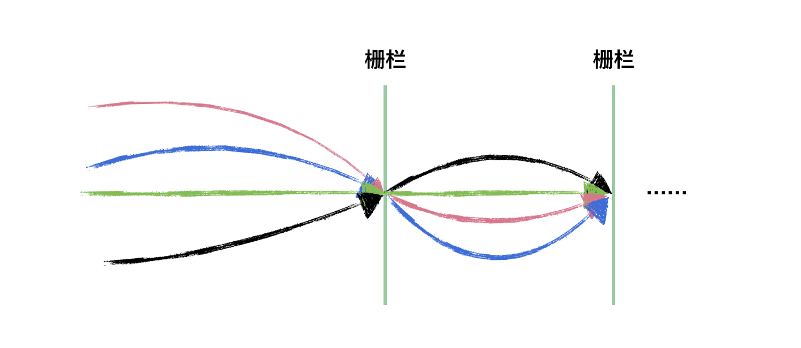
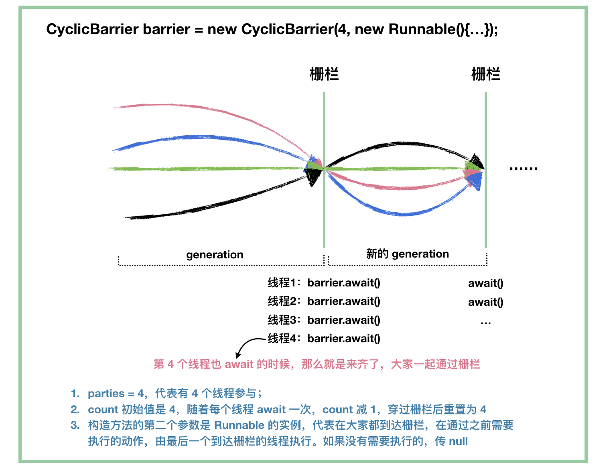
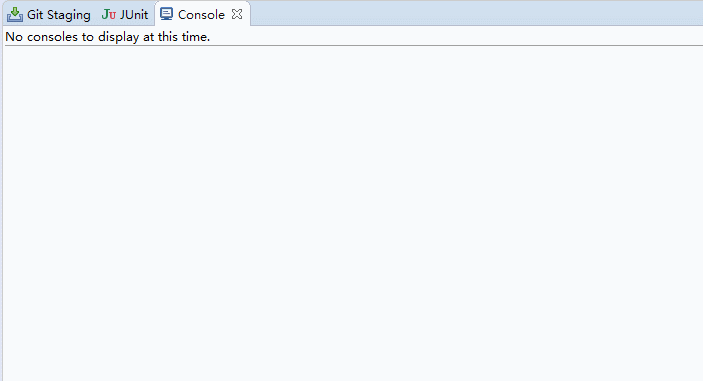

## 源码说明
CyclicBarrier 和 CountDownLatch 是不是很像，只是 CyclicBarrier 可以有不止一个栅栏，因为它的栅栏（Barrier）可以重复使用（Cyclic）。<br>
<br>
CyclicBarrier 的源码实现和 CountDownLatch 大相径庭，CountDownLatch 基于 AQS 的共享模式的使用，而 CyclicBarrier 基于 Condition 来实现的。因为 CyclicBarrier 的源码相对来说简单许多，读者只要熟悉了前面关于 Condition 的分析，那么这里的源码是毫无压力的，就是几个特殊概念罢了。<br>
在CyclicBarrier类的内部有一个计数器，每个线程在到达屏障点的时候都会调用await方法将自己阻塞，此时计数器会减1，当计数器减为0的时候所有因调用await方法而被阻塞的线程将被唤醒。这就是实现一组线程相互等待的原理，下面我们先看看CyclicBarrier有哪些成员变量。<br>
```shell
//同步操作锁
private final ReentrantLock lock = new ReentrantLock();
//线程拦截器
private final Condition trip = lock.newCondition();
//每次拦截的线程数
private final int parties;
//换代前执行的任务
private final Runnable barrierCommand;
//表示栅栏的当前代
private Generation generation = new Generation();
//计数器
private int count;
 
//静态内部类Generation
private static class Generation {
  boolean broken = false;
}
```
上面贴出了CyclicBarrier所有的成员变量，可以看到CyclicBarrier内部是通过条件队列trip来对线程进行阻塞的，并且其内部维护了两个int型的变量parties和count，parties表示每次拦截的线程数，该值在构造时进行赋值。count是内部计数器，它的初始值和parties相同，以后随着每次await方法的调用而减1，直到减为0就将所有线程唤醒。CyclicBarrier有一个静态内部类Generation，该类的对象代表栅栏的当前代，就像玩游戏时代表的本局游戏，利用它可以实现循环等待。barrierCommand表示换代前执行的任务，当count减为0时表示本局游戏结束，需要转到下一局。在转到下一局游戏之前会将所有阻塞的线程唤醒，在唤醒所有线程之前你可以通过指定barrierCommand来执行自己的任务。我用一图来描绘下 CyclicBarrier 里面的一些概念：
<br>

它的构造器

```shell
//同步操作锁
private final ReentrantLock lock = new ReentrantLock();
//线程拦截器
private final Condition trip = lock.newCondition();
//每次拦截的线程数
private final int parties;
//换代前执行的任务
private final Runnable barrierCommand;
//表示栅栏的当前代
private Generation generation = new Generation();
//计数器
private int count;
 
//静态内部类Generation
private static class Generation {
  boolean broken = false;
}
```
CyclicBarrier有两个构造器，其中构造器1是它的核心构造器，在这里你可以指定本局游戏的参与者数量(要拦截的线程数)以及本局结束时要执行的任务，还可以看到计数器count的初始值被设置为parties。CyclicBarrier类最主要的功能就是使先到达屏障点的线程阻塞并等待后面的线程，其中它提供了两种等待的方法，分别是定时等待和非定时等待。

```shell
//非定时等待
public int await() throws InterruptedException, BrokenBarrierException {
  try {
    return dowait(false, 0L);
  } catch (TimeoutException toe) {
    throw new Error(toe);
  }
}
 
//定时等待
public int await(long timeout, TimeUnit unit) throws InterruptedException, BrokenBarrierException, TimeoutException {
  return dowait(true, unit.toNanos(timeout));
}
```
可以看到不管是定时等待还是非定时等待，它们都调用了dowait方法，只不过是传入的参数不同而已。下面我们就来看看dowait方法都做了些什么。

```shell
//核心等待方法
private int dowait(boolean timed, long nanos) throws InterruptedException, BrokenBarrierException, TimeoutException {
  final ReentrantLock lock = this.lock;
  lock.lock();
  try {
    final Generation g = generation;
    //检查当前栅栏是否被打翻
    if (g.broken) {
      throw new BrokenBarrierException();
    }
    //检查当前线程是否被中断
    if (Thread.interrupted()) {
      //如果当前线程被中断会做以下三件事
      //1.打翻当前栅栏
      //2.唤醒拦截的所有线程
      //3.抛出中断异常
      breakBarrier();
      throw new InterruptedException();
    }
    //每次都将计数器的值减1
    int index = --count;
    //计数器的值减为0则需唤醒所有线程并转换到下一代
    if (index == 0) {
      boolean ranAction = false;
      try {
        //唤醒所有线程前先执行指定的任务
        final Runnable command = barrierCommand;
        if (command != null) {
          command.run();
        }
        ranAction = true;
        //唤醒所有线程并转到下一代
        nextGeneration();
        return 0;
      } finally {
        //确保在任务未成功执行时能将所有线程唤醒
        if (!ranAction) {
          breakBarrier();
        }
      }
    }
 
    //如果计数器不为0则执行此循环
    for (;;) {
      try {
        //根据传入的参数来决定是定时等待还是非定时等待
        if (!timed) {
          trip.await();
        }else if (nanos > 0L) {
          nanos = trip.awaitNanos(nanos);
        }
      } catch (InterruptedException ie) {
        //若当前线程在等待期间被中断则打翻栅栏唤醒其他线程
        if (g == generation && ! g.broken) {
          breakBarrier();
          throw ie;
        } else {
          //若在捕获中断异常前已经完成在栅栏上的等待, 则直接调用中断操作
          Thread.currentThread().interrupt();
        }
      }
      //如果线程因为打翻栅栏操作而被唤醒则抛出异常
      if (g.broken) {
        throw new BrokenBarrierException();
      }
      //如果线程因为换代操作而被唤醒则返回计数器的值
      if (g != generation) {
        return index;
      }
      //如果线程因为时间到了而被唤醒则打翻栅栏并抛出异常
      if (timed && nanos <= 0L) {
        breakBarrier();
        throw new TimeoutException();
      }
    }
  } finally {
    lock.unlock();
  }
}
```
上面贴出的代码中注释都比较详细，我们只挑一些重要的来讲。可以看到在dowait方法中每次都将count减1，减完后立马进行判断看看是否等于0，如果等于0的话就会先去执行之前指定好的任务，执行完之后再调用nextGeneration方法将栅栏转到下一代，在该方法中会将所有线程唤醒，将计数器的值重新设为parties，最后会重新设置栅栏代次，在执行完nextGeneration方法之后就意味着游戏进入下一局。如果计数器此时还不等于0的话就进入for循环，根据参数来决定是调用trip.awaitNanos(nanos)还是trip.await()方法，这两方法对应着定时和非定时等待。如果在等待过程中当前线程被中断就会执行breakBarrier方法，该方法叫做打破栅栏，意味着游戏在中途被掐断，设置generation的broken状态为true并唤醒所有线程。同时这也说明在等待过程中有一个线程被中断整盘游戏就结束，所有之前被阻塞的线程都会被唤醒。线程醒来后会执行下面三个判断，看看是否因为调用breakBarrier方法而被唤醒，如果是则抛出异常；看看是否是正常的换代操作而被唤醒，如果是则返回计数器的值；看看是否因为超时而被唤醒，如果是的话就调用breakBarrier打破栅栏并抛出异常。这里还需要注意的是，如果其中有一个线程因为等待超时而退出，那么整盘游戏也会结束，其他线程都会被唤醒。下面贴出nextGeneration方法和breakBarrier方法的具体代码。

```shell
//切换栅栏到下一代
private void nextGeneration() {
  //唤醒条件队列所有线程
  trip.signalAll();
  //设置计数器的值为需要拦截的线程数
  count = parties;
  //重新设置栅栏代次
  generation = new Generation();
}
 
//打翻当前栅栏
private void breakBarrier() {
  //将当前栅栏状态设置为打翻
  generation.broken = true;
  //设置计数器的值为需要拦截的线程数
  count = parties;
  //唤醒所有线程
  trip.signalAll();
}
```
重置一个栅栏
```shell
public void reset() {
    final ReentrantLock lock = this.lock;
    lock.lock();
    try {
        breakBarrier();   // break the current generation
        nextGeneration(); // start a new generation
    } finally {
        lock.unlock();
    }
}
```
我们设想一下，如果初始化时，指定了线程 parties = 4，前面有 3 个线程调用了 await 等待，在第 4 个线程调用 await 之前，我们调用 reset 方法，那么会发生什么？

首先，打破栅栏，那意味着所有等待的线程（3个等待的线程）会唤醒，await 方法会通过抛出 BrokenBarrierException 异常返回。然后开启新的一代，重置了 count 和 generation，相当于一切归零了。

上面我们已经通过源码将CyclicBarrier的原理基本都讲清楚了，下面我们就通过一个赛马的例子来深入掌握它的使用。
```java
class Horse implements Runnable {
  
  private static int counter = 0;
  private final int id = counter++;
  private int strides = 0;
  private static Random rand = new Random(47);
  private static CyclicBarrier barrier;
  
  public Horse(CyclicBarrier b) { barrier = b; }
  
  @Override
  public void run() {
    try {
      while(!Thread.interrupted()) {
        synchronized(this) {
          //赛马每次随机跑几步
          strides += rand.nextInt(3);
        }
        barrier.await();
      }
    } catch(Exception e) {
      e.printStackTrace();
    }
  }
  
  public String tracks() {
    StringBuilder s = new StringBuilder();
    for(int i = 0; i < getStrides(); i++) {
      s.append("*");
    }
    s.append(id);
    return s.toString();
  }
  
  public synchronized int getStrides() { return strides; }
  public String toString() { return "Horse " + id + " "; }
  
}
 
public class HorseRace implements Runnable {
  
  private static final int FINISH_LINE = 75;
  private static List<Horse> horses = new ArrayList<Horse>();
  private static ExecutorService exec = Executors.newCachedThreadPool();
  
  @Override
  public void run() {
    StringBuilder s = new StringBuilder();
    //打印赛道边界
    for(int i = 0; i < FINISH_LINE; i++) {
      s.append("=");
    }
    System.out.println(s);
    //打印赛马轨迹
    for(Horse horse : horses) {
      System.out.println(horse.tracks());
    }
    //判断是否结束
    for(Horse horse : horses) {
      if(horse.getStrides() >= FINISH_LINE) {
        System.out.println(horse + "won!");
        exec.shutdownNow();
        return;
      }
    }
    //休息指定时间再到下一轮
    try {
      TimeUnit.MILLISECONDS.sleep(200);
    } catch(InterruptedException e) {
      System.out.println("barrier-action sleep interrupted");
    }
  }
  
  public static void main(String[] args) {
    CyclicBarrier barrier = new CyclicBarrier(7, new HorseRace());
    for(int i = 0; i < 7; i++) {
      Horse horse = new Horse(barrier);
      horses.add(horse);
      exec.execute(horse);
    }
  }
  
}
```
该赛马程序主要是通过在控制台不停的打印各赛马的当前轨迹，以此达到动态显示的效果。整场比赛有多个轮次，每一轮次各个赛马都会随机走上几步然后调用await方法进行等待，当所有赛马走完一轮的时候将会执行任务将所有赛马的当前轨迹打印到控制台上。这样每一轮下来各赛马的轨迹都在不停的增长，当其中某个赛马的轨迹最先增长到指定的值的时候将会结束整场比赛，该赛马成为整场比赛的胜利者！程序的运行结果如下：
<br>
至此我们难免会将CyclicBarrier与CountDownLatch进行一番比较。这两个类都可以实现一组线程在到达某个条件之前进行等待，它们内部都有一个计数器，当计数器的值不断的减为0的时候所有阻塞的线程将会被唤醒。有区别的是CyclicBarrier的计数器由自己控制，而CountDownLatch的计数器则由使用者来控制，在CyclicBarrier中线程调用await方法不仅会将自己阻塞还会将计数器减1，而在CountDownLatch中线程调用await方法只是将自己阻塞而不会减少计数器的值。另外，CountDownLatch只能拦截一轮，而CyclicBarrier可以实现循环拦截。一般来说用CyclicBarrier可以实现CountDownLatch的功能，而反之则不能，例如上面的赛马程序就只能使用CyclicBarrier来实现。总之，这两个类的异同点大致如此，至于何时使用CyclicBarrier，何时使用CountDownLatch，还需要读者自己去拿捏。