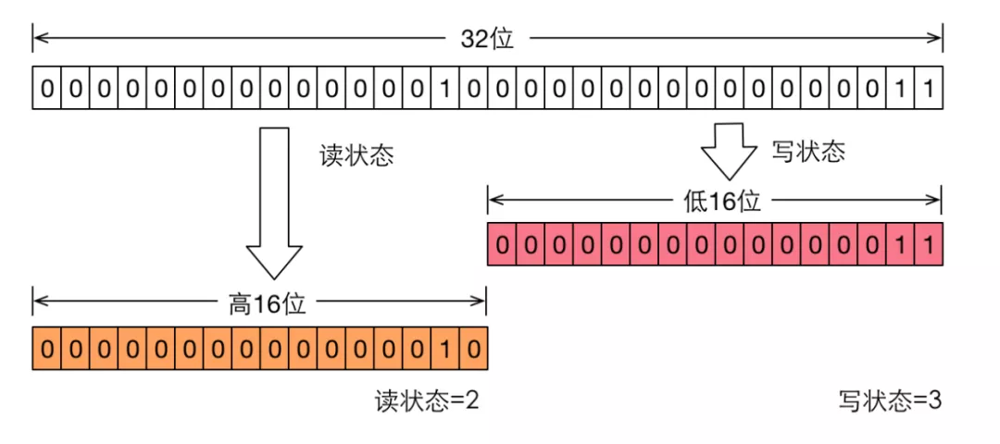

## ReadWriteLock 读写锁
> 共享锁read +排他锁write

> 读写锁在同一时刻可以允许多个读线程访问，但是在写线程访问时，所有的读线程和其他写线程均被阻塞。读写锁维护了一对锁，一个读锁和一个写锁，通过分离读锁和写锁，使得并发性相比一般的排他锁有了很大提升。读写锁的访问约束：
* 读-读不互斥：读读之间不阻塞
* 读-写互斥：读堵塞写，写也阻塞读
* 写-写互斥：写写阻塞

#### 特性
* 公平性选择
> 支持非公平（默认）和公平的锁获取模式，吞吐量还是非公平优于公平
* 重入性
> 该锁支持重入锁，以读写线程为例：读线程在获取读锁之后，能够再次读取读锁，而写线程在获取写锁之后可以同时再次获取读锁和写锁
* 锁降级
> 遵循获取写锁，获取读锁再释放写锁的次序，写锁能够降级为读锁

#### ReentrantReadWriteLock介绍
> ReentrantReadWriteLock 为ReadWriteLock接口的实现，ReadWriteLock仅定义了获取读锁和写锁的两个方法，即readLock()方法和writeLock()方法。
```java
public interface ReadWriteLock {
    Lock readLock();
    Lock writeLock();
}
```
除了接口方法之外，ReentrantReadWriteLock  还提供了一些便于外界监控其内部工作状态的方法。
* int getReadLockCount()
> 返回当前读锁被获取的次数。该次数不等于获取读锁的线程数，例如，仅一个线程，他连续获取（重进入）了 n 次读锁，那么占据读锁的线程数是 1 ，但该方法返回 n。
* int getReadHoldCount()
> 返回当前线程获取读锁的次数。该方法在 Java 6 中加入到 ReentrantReadWriteLock 中，使用 ThreadLocal 保存当前线程获取次数，这也使得 Java 6 的实现变得更加复杂
* boolean isWriteLocked()
> 判断写锁是否被获取
* int getWriteHoldCount()
> 返回当前写锁被获取的次数

#### 读写状态的设计
读写锁同样依赖自定义同步器来实现同步功能，而读写状态就是其同步器的同步状态。ReentrantLock 中自定义同步器的实现，同步状态表示锁被一个线程重复获取的次数，而读写锁的自定义同步器需要在同步状态（一个整型变量）上维护多个读线程和一个写线程的状态，使得该状态的设计成为读写锁实现的关键。

如果在一个整型变量上维护多种状态，就一定需要“按位切割使用”这个变量，读写锁将变量切分成了两个部分，高16位表示读，低16位表示写。

#### 通过ReentrantReadWriteLock实现一个简单的缓存
```java
public class LockExample {
    private static final Map<String, Object> map = new HashMap<>();
    private static final ReentrantReadWriteLock lock = new ReentrantReadWriteLock();
    private static final Lock readLock = lock.readLock();
    private static final Lock writeLock = lock.writeLock();

    /**
     * 向 map 存入数据
     *
     * @param key
     * @param value
     * @return
     */
    public static Object put(String key, Object value) {
        writeLock.lock();
        try {
            return map.put(key, value);
        } finally {
            writeLock.unlock();
        }
    }

    /**
     * 获取单个键值的值
     *
     * @param key
     * @return
     */
    public static Object get(String key) {
        readLock.lock();
        try {
            return map.get(key);
        } finally {
            readLock.unlock();
        }
    }

    /**
     * 获取 map 的键值
     *
     * @return
     */
    public static Set<String> getAllKeys() {
        readLock.lock();
        try {
            return map.keySet();
        } finally {
            readLock.unlock();
        }
    }

    /**
     * 清除 map 所有的数据
     */
    public static void clear() {
        writeLock.lock();
        try {
            map.clear();
        } finally {
            writeLock.unlock();
        }
    }
}
```
##### 测试
```java
public class LockExample3Test {
    // 请求总数
    public static int requestTotal = 10;

    public static void main(String[] args) throws Exception {
        ExecutorService executorService = Executors.newCachedThreadPool();
        final CountDownLatch countDownLatch = new CountDownLatch(requestTotal);
        for (int i = 0; i < requestTotal; i++) {
            final String temp = String.valueOf(i);
            executorService.execute(() -> {
                try {
                    add(temp);
                } catch (Exception e) {
                }
                countDownLatch.countDown();
            });
        }
        // 等待所有的线程运行完成
        countDownLatch.await();
        // 多线程获取 key
        for (int i = 0; i < requestTotal; i++) {
            final String temp = String.valueOf(i);
            executorService.execute(() -> {
                try {
                    get(temp);
                } catch (Exception e) {
                }
            });
        }
        executorService.shutdown();
        TimeUnit.SECONDS.sleep(1);
        // 获取所有的keys
        System.out.println("获取所有的键值\t" + LockExample3.getAllKeys());
        //  清除所有的 keys
        LockExample3.clear();
        // 再次获取所有的keys 发现已被清空
        System.out.println("获取所有的键值\t" + LockExample3.getAllKeys());
    }

    private static void add(String i) {
        LockExample3.put(i, Thread.currentThread().getName());
    }

    private static void get(String i) {
        System.out.println(i + "\t" + LockExample3.get(i));
    }
}
```
##### 结果
```shell
0 pool-1-thread-1
1 pool-1-thread-2
2 pool-1-thread-3
4 pool-1-thread-5
3 pool-1-thread-4
8 pool-1-thread-9
7 pool-1-thread-8
6 pool-1-thread-7
5 pool-1-thread-6
9 pool-1-thread-10
获取所有的键值 [0, 1, 2, 3, 4, 5, 6, 7, 8, 9]
获取所有的键值 []
```