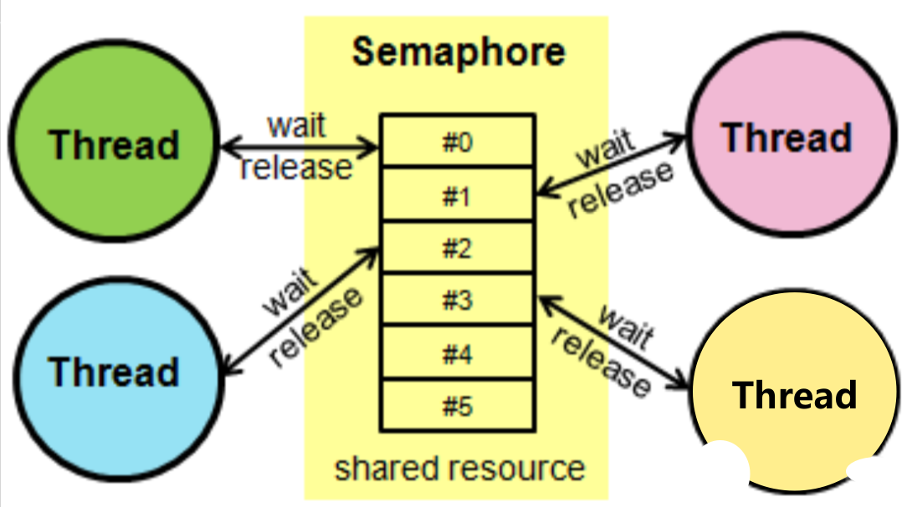

## Semaphore 递增同步器
> 【限流作用】Semaphore（信号量）是用来控制同时访问特定资源的线程数量，它通过协调各个线程，以保证合理的使用公共资源。
> Semaphore用于限制可以访问某些资源（物理或逻辑的）的线程数目，他维护了一个许可证集合，有多少资源需要限制就维护多少许可证集合，假如这里有N个资源，那就对应于N个许可证，同一时刻也只能有N个线程访问。一个线程获取许可证就调用acquire方法，用完了释放资源就调用release方法。

#### 比喻
> 相信在学生时代都去餐厅打过饭，假如有3个窗口可以打饭，同一时刻也只能有3名同学打饭。第四个人来了之后就必须在外面等着，只要有打饭的同学好了，就可以去相应的窗口了。

#### 说明与ThreadPool的区别
* Semaphore表示代码中可以出现许多的线程，但是同时运行的只有New Semaphore(int)中的int数量的线程
* Pool表示最多只能有NewSingleThreadPool(int)中的int线程数

#### 构造方法
    1、Semaphore(int permits) //非公平模式指定最大允许访问许可证数量
    
    2、Semaphore(int permits, boolean fair)//可以通过第二个参数控制是否使用公平模式

#### API说明
    1、acquire(int permits)：从此信号量获取给定数目的许可，在提供这些许可前一直将线程阻塞，或者线程已被中断。就好比是一个学生占两个窗口。这同时也对应了相应的release方法。
    
    2、release(int permits)：释放给定数目的许可，将其返回到信号量。这个是对应于上面的方法，一个学生占几个窗口完事之后还要释放多少
    
    3、availablePermits()：返回此信号量中当前可用的许可数。也就是返回当前还有多少个窗口可用。
    
    4、reducePermits(int reduction)：根据指定的缩减量减小可用许可的数目。
    
    5、hasQueuedThreads()：查询是否有线程正在等待获取资源。
    
    6、getQueueLength()：返回正在等待获取的线程的估计数目。该值仅是估计的数字。
    
    7、tryAcquire(int permits, long timeout, TimeUnit unit)：如果在给定的等待时间内此信号量有可用的所有许可，并且当前线程未被中断，则从此信号量获取给定数目的许可。
    
    8、acquireUninterruptibly(int permits)：从此信号量获取给定数目的许可，在提供这些许可前一直将线程阻塞。
    
    基本上常见的使用方法都在这，Semaphore底层是由AQS和Uasafe完成的

#### 注意
1. 大多数时候使用Semaphore都应该是公平模式，默认是非公平模式，如果需要公平模式可以在构造函数里面指定，公平性可以 保证先进先出，不会有线程饥饿问题出现，非公平模式，不保证顺序，吞吐量会更好一些。
2. 共享资源的访问，一般指的是读取，而不是更新，这里面不要做对共享变量的修改，除非你使用同步块来保证。

#### 底层原理
> Semaphore底层与CountDownLatch类似都是通过AQS的共享锁机制来实现的，指定的数量会设置到AQS里面的state里面，然后对于每一个 调用acquire方法线程，state都会减去一，如果state等于0，那么调用该方法的线程会被添加到同步队列里面，同时使用 LockSupport.park方法挂起等待，知道有线程调用了release方法，会对state加1，然后唤醒共享队列里面的线程，注意这里如果是 公平模式，就直接唤醒下一个等待线程即可，如果是非公平模式就允许新加入的线程与已有的线程进行竞争，谁先得到就是谁的，如果新加入的 竞争失败，就会走公平模式进入队列排队。