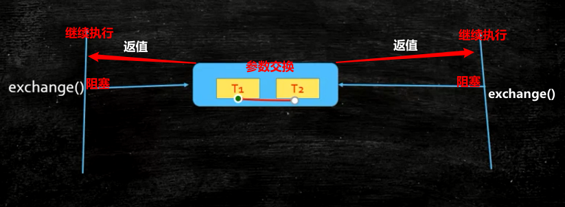

## Exchanger 交换器
> Exchanger 是 JDK 1.5 开始提供的一个用于两个工作线程之间交换数据的封装工具类；Exchanger类源于java.util.concurrent包，它可以在两个线程之间传输数据，Exchanger中的public V exchange(V x)方法被调用后等待另一个线程到达交换点（如果当前线程没有被中断），然后将已知的对象传给它，返回接收的对象

####原理图


#### 比喻
> 游戏中两人交换装备

#### 构造方法
```shell
Exchanger(); //创建一个新的 Exchanger。
```
#### 主要方法
```shell
exchange(V x); //等待另一个线程到达此交换点（除非它被中断），然后将给定的对象传送给该线程，并接收该线程的对象。
exchange(V x, long timeout, TimeUnit unit)； // 等待另一个线程到达此交换点（除非它被中断，或者超出了指定的等待时间），然后将给定的对象传送给该线程，同时接收该线程的对象。
```

#### 基础代码
```java
public class ExchangeerTest {
    private static final Exchanger<String> exgr=new Exchanger<>();
    private static ExecutorService threadPool = Executors.newFixedThreadPool(2);

    public static void main(String[] args) {
        Future<?> r1 = threadPool.submit(new Runnable() {
            @Override
            public void run() {
                String A = "银行流水A";
                try {
                    String B=exgr.exchange(A);
                    System.out.println("B:"+B);
                } catch (InterruptedException e) {
                    e.printStackTrace();
                }
            }
            });
       threadPool.submit(new Runnable() {
                @Override
                public void run() {
                    String B = "银行流水B";
                    String A = null;
                    try {
                        A = exgr.exchange(B);
                    } catch (InterruptedException e) {
                        e.printStackTrace();
                    }
                    System.out.println("A和B是否一致：" + A.equals(B) + ",A录入的是：" + A + ",B录入的是：" + B);
                }
            });
    threadPool.shutdown();
    }
}
```