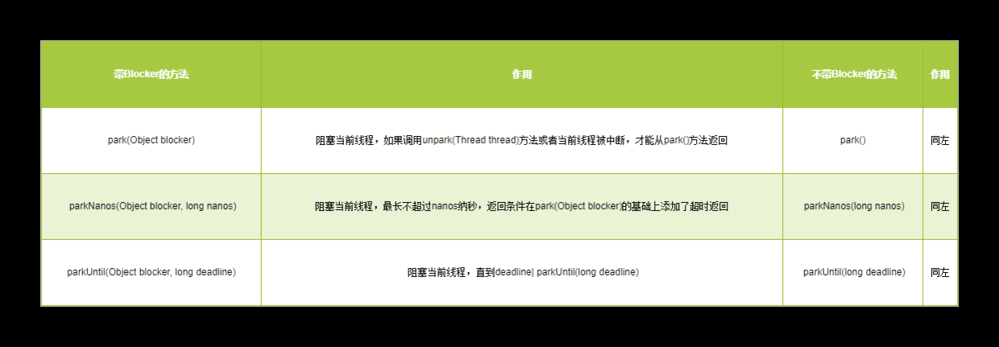
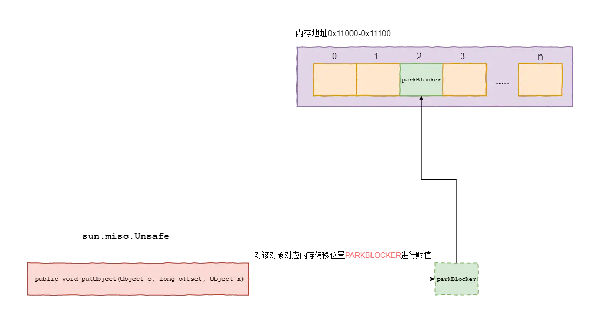

## LockSupport
> LockSupport是一个线程阻塞工具类，所有的方法都是静态方法，可以让线程在任意位置阻塞，当然阻塞之后肯定得有唤醒的方法。
> LockSupport 和 CAS 是Java并发包中很多并发工具控制机制的基础，它们底层其实都是依赖Unsafe实现

* LockSupport是用来创建锁和其他同步类的基本线程阻塞原语。LockSupport 提供park()和unpark()方法实现阻塞线程和解除线程阻塞，LockSupport和每个使用它的线程都与一个许可(permit)关联。permit相当于1，0的开关，默认是0，调用一次unpark就加1变成1，调用一次park会消费permit, 也就是将1变成0，同时park立即返回。再次调用park会变成block（因为permit为0了，会阻塞在这里，直到permit变为1）, 这时调用unpark会把permit置为1。每个线程都有一个相关的permit, permit最多只有一个，重复调用unpark也不会积累。
* 
* park()和unpark()不会有 “Thread.suspend和Thread.resume所可能引发的死锁” 问题，由于许可的存在，调用 park 的线程和另一个试图将其 unpark 的线程之间的竞争将保持活性。
* 
* 如果调用线程被中断，则park方法会返回。同时park也拥有可以设置超时时间的版本。
* 
* 需要特别注意的一点：park 方法还可以在其他任何时间“毫无理由”地返回，因此通常必须在重新检查返回条件的循环里调用此方法。从这个意义上说，park 是“忙碌等待”的一种优化，它不会浪费这么多的时间进行自旋，但是必须将它与 unpark 配对使用才更高效。
* 
* 三种形式的 park 还各自支持一个 blocker 对象参数。此对象在线程受阻塞时被记录，以允许监视工具和诊断工具确定线程受阻塞的原因。（这样的工具可以使用方法 getBlocker(java.lang.Thread) 访问 blocker。）建议最好使用这些形式，而不是不带此参数的原始形式。在锁实现中提供的作为 blocker 的普通参数是 this。

#### 延伸
由于在Java 5之前，当线程阻塞时（使用synchronized关键字）在一个对象上时，通过线程dump能够查看到该线程的阻塞对象。方便问题定位，而Java 5退出的Lock等并发工具却遗漏了这一点，致使在线程dump时无法提供阻塞对象的信息。因此，在Java 6中，LockSupport新增了含有阻塞对象的park方法。用以替代原有的park方法。

#### 常用的方法

> 主要有两类方法：park和unpark。
* public static void park(Object blocker);
> 暂停当前线程

* public static void parkNanos(Object blocker, long nanos); 
> 暂停当前线程，不过有超时时间的限制

* public static void parkUntil(Object blocker, long deadline); 
> 暂停当前线程，直到某个时间

* public static void park(); 
> 无期限暂停当前线程

* public static void parkNanos(long nanos); 
> 暂停当前线程，不过有超时时间的限制

* public static void parkUntil(long deadline); 
> 暂停当前线程，直到某个时间

* public static void unpark(Thread thread); 
> 恢复当前线程

* public static Object getBlocker(Thread t);

##### 注意
park(Object blocker)与parkNanos(Object blocker, long nanos)及parkUntil(Object blocker, long deadline)三个方法是Java 6中新增加的方法。其中参数blocker是用来标识当前线程等待的对象（下文简称为阻塞对象），该对象主要用于问题排查和系统监控

#### LockSupport中的blocker
##### Blocker的原理
* 既然线程都被阻塞了，是通过什么办法将阻塞对象设置到线程中去的呢？ 继续查看含有阻塞对象(Object blocker)的park方法。 内部都调用了setBlocker(Thread t, Object arg)方法。具体代码如下所示：
```shell
private static void setBlocker(Thread t, Object arg) {
    U.putObject(t, PARKBLOCKER, arg);
}
```
* 其中U为sun.misc.包下的Unsafe类。而其中的PARKBLOCKER是在静态代码块中进行赋值的，也就是如下代码：
```shell
private static final sun.misc.Unsafe U = sun.misc.Unsafe.getUnsafe();
  static {
        try {
            PARKBLOCKER = U.objectFieldOffset
                (Thread.class.getDeclaredField("parkBlocker"));
		   //省略部分代码
        } catch (ReflectiveOperationException e) {
            throw new Error(e);
        }
    }
```
> Thread.class.getDeclaredField("parkBlocker")方法其实很好理解，就是获取线程中的parkBlocker字段。如果有则返回其对应的Field字段，如果没有则抛出NoSuchFieldException异常。那么关于Unsafe中的objectFieldOffset(Field f)方法怎么理解呢？
在JVM中，可以自由选择如何实现Java对象的"布局",也就Java对象的各个部分分别放在内存那个地方，JVM是可以感知和决定的。 在sun.misc.Unsafe中提供了objectFieldOffset()方法用于获取某个字段相对 Java对象的“起始地址”的偏移量,也提供了getInt、getLong、getObject之类的方法可以使用前面获取的偏移量来访问某个Java 对象的某个字段。


> 在上图中，我们创建了两个Thread对象，其中Thread对象1在内存中分配的地址为0x10000-0x10100,Thread对象2在内存中分配的地址为0x11000-0x11100,其中parkBlocker对应内存偏移量为2（这里我们假设相对于其对象的“起始位置”的偏移量为2）。那么通过objectFieldOffset(Field f)就能获取该字段的偏移量。需要注意的是某字段在其类中的内存偏移量总是相同的，也就是对于Thread对象1与Thread对象2，parkBlocker字段在其对象所在的内存偏移量始终是相同的。
那么我们再回到setBlocker(Thread t, Object arg)方法，当我们获取到parkBlocker字段在其对象内存偏移量后，
接着会调用U.putObject(t, PARKBLOCKER, arg);，该方法有三个参数,第一个参数是操作对象，第二个参数是内存偏移量，第三个参数是实际存储值。该方法理解起来也很简单，就是操作某个对象中某个内存地址下的数据。那么结合我们上面所讲的。该方法的实际操作结果如下图所示：


> 到现在，我们就应该懂了，尽管当前线程已经阻塞，但是我们还是能直接操控线程中实际存储该字段的内存区域来达到我们想要的结果。

尽管当前线程已经阻塞，但是我们还是能直接操控线程中实际存储该字段的内存区域来达到我们想要的结果
    
#### 总结
1. park和unpark可以实现类似wait和notify的功能，但是并不和wait和notify交叉，也就是说unpark不会对wait起作用，notify也不会对park起作用。
2. park和unpark的使用不会出现死锁的情况
3. blocker的作用是在dump线程的时候看到阻塞对象的信息
