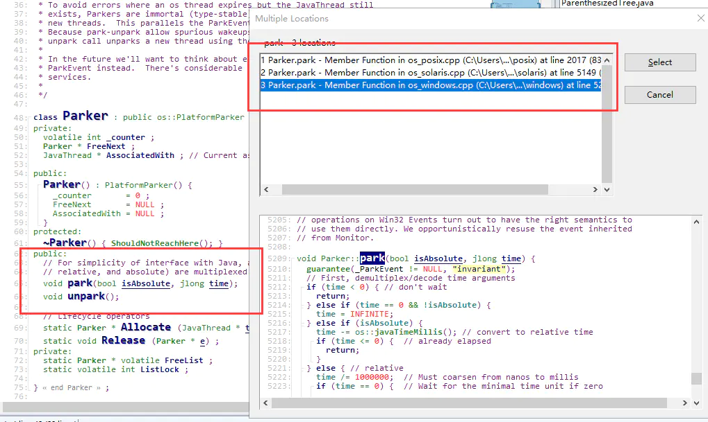

## LockSupport底层代码实现
通过阅读源代码我们可以发现，LockSupport中关于线程的阻塞和唤醒，主要调用的是sun.misc.Unsafe 中的park(boolean isAbsolute, long time)与unpark(Object thread)方法，也就是如下代码：
```java
private static final jdk.internal.misc.Unsafe theInternalUnsafe =   
      jdk.internal.misc.Unsafe.getUnsafe();
      
	public void park(boolean isAbsolute, long time) {
        theInternalUnsafe.park(isAbsolute, time);
    }
    public void unpark(Object thread) {
        theInternalUnsafe.unpark(thread);
    }
```
复制代码查看sun.misc.包下的Unsafe.java文件我们可以看出，内部其实调用的是jdk.internal.misc.Unsafe中的方法。继续查看jdk.internal.misc.中的Unsafe.java中对应的方法：
```java
 @HotSpotIntrinsicCandidate
    public native void unpark(Object thread);

    @HotSpotIntrinsicCandidate
    public native void park(boolean isAbsolute, long time);
```
复制代码通过查看方法，我们可以得出最终调用的是JVM中的方法，也就是会调用hotspot.share.parims包下的unsafe.cpp中的方法。继续跟踪。
```shell
UNSAFE_ENTRY(void, Unsafe_Park(JNIEnv *env, jobject unsafe, jboolean isAbsolute, jlong time)) {
  //省略部分代码
  thread->parker()->park(isAbsolute != 0, time);
  //省略部分代码
} UNSAFE_END

UNSAFE_ENTRY(void, Unsafe_Unpark(JNIEnv *env, jobject unsafe, jobject jthread)) {
  Parker* p = NULL;
  //省略部分代码
  if (p != NULL) {
    HOTSPOT_THREAD_UNPARK((uintptr_t) p);
    p->unpark();
  }
} UNSAFE_END
```
复制代码通过观察代码我们发现，线程的阻塞和唤醒其实是与hotspot.share.runtime中的Parker类相关。我们继续查看：
```java
class Parker : public os::PlatformParker {
private:
  volatile int _counter ;//该变量非常重要，下文我们会具体描述
	 //省略部分代码
protected:
  ~Parker() { ShouldNotReachHere(); }
public:
  // For simplicity of interface with Java, all forms of park (indefinite,
  // relative, and absolute) are multiplexed into one call.
  void park(bool isAbsolute, jlong time);
  void unpark();
  //省略部分代码
}
```
复制代码在上述代码中，volatile int _counter该字段的值非常重要，一定要注意其用volatile修饰（在下文中会具体描述，接着当我们通过SourceInsight工具(推荐大家阅读代码时，使用该工具)点击其park与unpark方法时，我们会得到如下界面：
<br>
从图中红色矩形中我们可也看出，针对线程的阻塞和唤醒，不同操作系统有着不同的实现。众所周知Java是跨平台的。针对不同的平台，做出不同的处理。也是非常理解的。因为作者对windows与solaris操作系统不是特别了解。所以这里我选择对Linux下的平台下进行分析。也就是选择hotspot.os.posix包下的os_posix.cpp文件进行分析。

## park()的原理
concurrent包是基于AQS (AbstractQueuedSynchronizer)框架的，AQS框架借助于两个类：
* Unsafe（提供CAS操作）
* LockSupport（提供park/unpark操作）
因此，LockSupport非常重要。

#### 两个重点
1. 操作对象
> 归根结底，LockSupport.park()和LockSupport.unpark(Thread thread)调用的是Unsafe中的native代码：
```java
//LockSupport中
public static void park() {
        UNSAFE.park(false, 0L);
    }
//LockSupport中
public static void unpark(Thread thread) {
        if (thread != null)
            UNSAFE.unpark(thread);
    }
```
Unsafe类中的对应方法：
```java
//park
    public native void park(boolean isAbsolute, long time);
    
    //unpack
    public native void unpark(Object var1);
```
park函数是将当前调用Thread阻塞，而unpark函数则是将指定线程Thread唤醒。

##### 与Object类的wait/notify机制相比，park/unpark有两个优点：
* 以thread为操作对象更符合阻塞线程的直观定义
* 操作更精准，可以准确地唤醒某一个线程（notify随机唤醒一个线程，notifyAll唤醒所有等待的线程），增加了灵活性。

2. 关于“许可”
> 在上面的文字中，我使用了阻塞和唤醒，是为了和wait/notify做对比。

其实park/unpark的设计原理核心是“许可”：park是等待一个许可，unpark是为某线程提供一个许可。
如果某线程A调用park，那么除非另外一个线程调用unpark(A)给A一个许可，否则线程A将阻塞在park操作上。

有一点比较难理解的，是unpark操作可以再park操作之前。
也就是说，先提供许可。当某线程调用park时，已经有许可了，它就消费这个许可，然后可以继续运行。这其实是必须的。考虑最简单的生产者(Producer)消费者(Consumer)模型：Consumer需要消费一个资源，于是调用park操作等待；Producer则生产资源，然后调用unpark给予Consumer使用的许可。非常有可能的一种情况是，Producer先生产，这时候Consumer可能还没有构造好（比如线程还没启动，或者还没切换到该线程）。那么等Consumer准备好要消费时，显然这时候资源已经生产好了，可以直接用，那么park操作当然可以直接运行下去。如果没有这个语义，那将非常难以操作。

但是这个“许可”是不能叠加的，“许可”是一次性的。
比如线程B连续调用了三次unpark函数，当线程A调用park函数就使用掉这个“许可”，如果线程A再次调用park，则进入等待状态。

Unsafe.park和Unsafe.unpark的底层实现原理
在Linux系统下，是用的Posix线程库pthread中的mutex（互斥量），condition（条件变量）来实现的。
mutex和condition保护了一个_counter的变量，当park时，这个变量被设置为0，当unpark时，这个变量被设置为1。

源码：
每个Java线程都有一个Parker实例，Parker类是这样定义的：
```jvm
class Parker : public os::PlatformParker {  
private:  
  volatile int _counter ;  
  ...  
public:  
  void park(bool isAbsolute, jlong time);  
  void unpark();  
  ...  
}  
class PlatformParker : public CHeapObj<mtInternal> {  
  protected:  
    pthread_mutex_t _mutex [1] ;  
    pthread_cond_t  _cond  [1] ;  
    ...  
}  
```
可以看到Parker类实际上用Posix的mutex，condition来实现的。
在Parker类里的_counter字段，就是用来记录“许可”的。

park 过程
* 当调用park时，先尝试能否直接拿到“许可”，即_counter>0时，如果成功，则把_counter设置为0，并返回：
```jvm
void Parker::park(bool isAbsolute, jlong time) {  
  
  // Ideally we'd do something useful while spinning, such  
  // as calling unpackTime().  
  
  // Optional fast-path check:  
  // Return immediately if a permit is available.  
  // We depend on Atomic::xchg() having full barrier semantics  
  // since we are doing a lock-free update to _counter.  
  
  if (Atomic::xchg(0, &_counter) > 0) return;
```
  
* 如果不成功，则构造一个ThreadBlockInVM，然后检查_counter是不是>0，如果是，则把_counter设置为0，unlock mutex并返回：
```jvm
ThreadBlockInVM tbivm(jt);  
if (_counter > 0)  { // no wait needed  
  _counter = 0;  
  status = pthread_mutex_unlock(_mutex);
```  

* 否则，再判断等待的时间，然后再调用pthread_cond_wait函数等待，如果等待返回，则把_counter设置为0，unlock mutex并返回：
```jvm
if (time == 0) {  
  status = pthread_cond_wait (_cond, _mutex) ;  
}  
_counter = 0 ;  
status = pthread_mutex_unlock(_mutex) ;  
assert_status(status == 0, status, "invariant") ;  
OrderAccess::fence();
```
  
##### unpark 过程
当unpark时，则简单多了，直接设置_counter为1，再unlock mutex返回。如果_counter之前的值是0，则还要调用pthread_cond_signal唤醒在park中等待的线程：
```jvm
void Parker::unpark() {  
  int s, status ;  
  status = pthread_mutex_lock(_mutex);  
  assert (status == 0, "invariant") ;  
  s = _counter;  
  _counter = 1;  
  if (s < 1) {  
     if (WorkAroundNPTLTimedWaitHang) {  
        status = pthread_cond_signal (_cond) ;  
        assert (status == 0, "invariant") ;  
        status = pthread_mutex_unlock(_mutex);  
        assert (status == 0, "invariant") ;  
     } else {  
        status = pthread_mutex_unlock(_mutex);  
        assert (status == 0, "invariant") ;  
        status = pthread_cond_signal (_cond) ;  
        assert (status == 0, "invariant") ;  
     }  
  } else {  
    pthread_mutex_unlock(_mutex);  
    assert (status == 0, "invariant") ;  
  }  
}
```  
