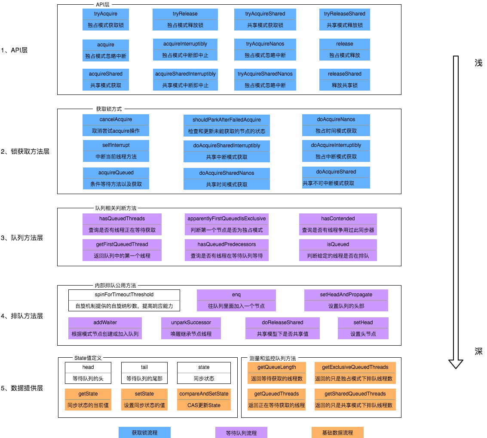
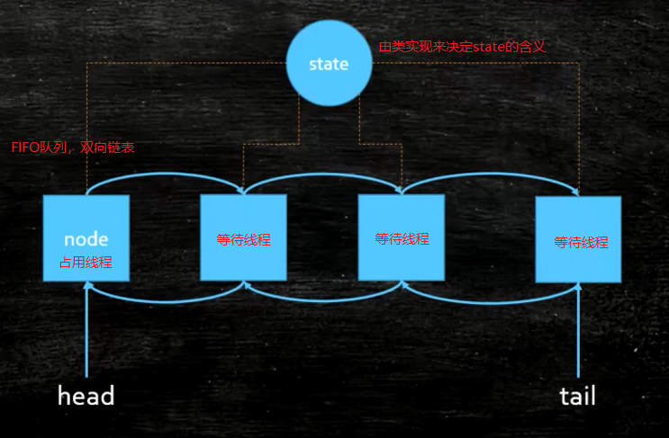
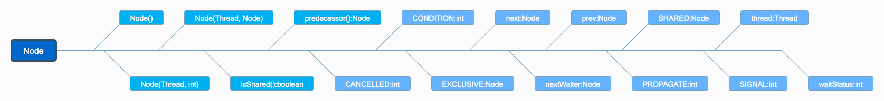
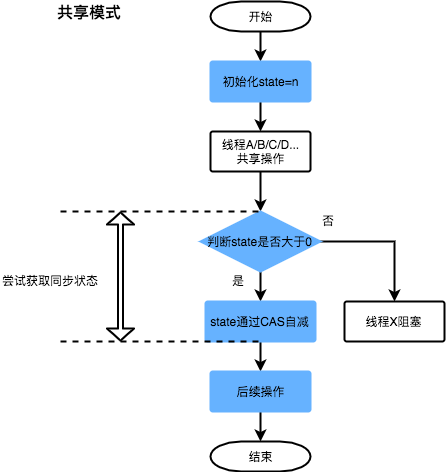
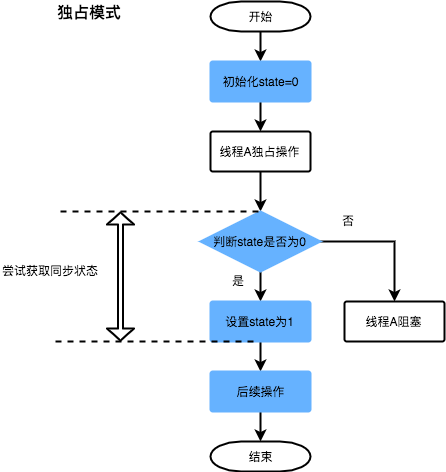

#### ReentrantLock与AQS的关联   

#### 非公平锁源码中的加锁流程
```java
// java.util.concurrent.locks.ReentrantLock#NonfairSync

// 非公平锁
static final class NonfairSync extends Sync {
	...
	final void lock() {
		if (compareAndSetState(0, 1))
			setExclusiveOwnerThread(Thread.currentThread());
		else
			acquire(1);
		}
  ...
}
```
##### 代码说明
* 若通过CAS设置变量State（同步状态）成功，也就是获取锁成功，则将当前线程设置为独占线程。
* 若通过CAS设置变量State（同步状态）失败，也就是获取锁失败，则进入Acquire方法进行后续处理。

##### 第二步获取锁失败后，线程获取锁失败的后续流程
* 存在某种排队等候机制，线程继续等待，仍然保留获取锁的可能，获取锁流程仍在继续。

#### 公平锁源码中获锁的方式
```java
// java.util.concurrent.locks.ReentrantLock#FairSync

static final class FairSync extends Sync {
  ...  
	final void lock() {
		acquire(1);
	}
  ...
}
```
#### AQS架构

* 上图中有颜色的为Method，无颜色的为Attribution。
* 总的来说，AQS框架共分为五层，自上而下由浅入深，从AQS对外暴露的API到底层基础数据。
* 当有自定义同步器接入时，只需重写第一层所需要的部分方法即可，不需要关注底层具体的实现流程。当自定义同步器进行加锁或者解锁操作时，先经过第一层的API进入AQS内部方法，然后经过第二层进行锁的获取，接着对于获取锁失败的流程，进入第三层和第四层的等待队列处理，而这些处理方式均依赖于第五层的基础数据提供层

#### 原理概览
> AQS核心思想是，如果被请求的共享资源空闲，那么就将当前请求资源的线程设置为有效的工作线程，将共享资源设置为锁定状态；如果共享资源被占用，就需要一定的阻塞等待唤醒机制来保证锁分配。这个机制主要用的是CLH队列的变体实现的，将暂时获取不到锁的线程加入到队列中。

CLH：Craig、Landin and Hagersten队列，是单向链表，AQS中的队列是CLH变体的虚拟双向队列（FIFO），AQS是通过将每条请求共享资源的线程封装成一个节点来实现锁的分配。
主要原理图如下：

> AQS使用一个`Volatile`的int类型的成员变量来表示同步状态，通过内置的FIFO队列来完成资源获取的排队工作，通过CAS完成对State值的修改

#### AQS数据结构
> AQS中最基本的数据结构——Node，Node即为上面CLH变体队列中的节点

* 方法和属性值的含义

| 方法和属性值 | 含义                              |
| ------------ | --------------------------------- |
| waitStatus   | 当前节点在队列中的状态            |
| thread       | 表示处于该节点的线程              |
| prev         | 前驱指针                          |
| predecessor  | 返回前驱节点，没有的话抛出npe     |
| nextWaiter   | 指向下一个处于CONDITION状态的节点 |
| next         | 后继指针                          |

* 线程两种锁的模式

| 模式      | 含义                           |
| --------- | ------------------------------ |
| SHARED    | 表示线程以共享的模式等待锁     |
| EXCLUSIVE | 表示线程正在以独占的方式等待锁 |

* waitStatus有下面几个枚举值
| 枚举      | 含义                                           |
| --------- | ---------------------------------------------- |
| 0         | 当一个Node被初始化的时候的默认值               |
| CANCELLED | 为1，表示线程获取锁的请求已经取消了            |
| CONDITION | 为-2，表示节点在等待队列中，节点线程等待唤醒   |
| PROPAGATE | 为-3，当前线程处在SHARED情况下，该字段才会使用 |
| SIGNAL    | 为-1，表示线程已经准备好了，就等资源释放了     |

#### 同步状态State
> AQS中维护了一个名为state的字段，意为同步状态，是由Volatile修饰的，用于展示当前临界资源的获锁情况
```java
// java.util.concurrent.locks.AbstractQueuedSynchronizer

private volatile int state;
```
* 下面提供了几个访问这个字段的方法

| 方法名                                                       | 描述                 |
| ------------------------------------------------------------ | -------------------- |
| protected final int getState()                               | 获取State的值        |
| protected final void setState(int newState)                  | 设置State的值        |
| protected final boolean compareAndSetState(int expect, int update) | 使用CAS方式更新State |

* 这几个方法都是Final修饰的，说明子类中无法重写它们。我们可以通过修改State字段表示的同步状态来实现多线程的独占模式和共享模式（加锁过程）



自定义的同步工具，需要自定义获取同步状态和释放状态的方式，也就是AQS架构图中的第一层：API层。

**AQS重要方法与ReentrantLock的关联请看<ReentrantLock底层源码.md>**