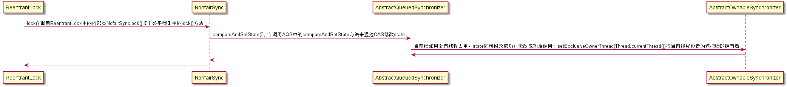
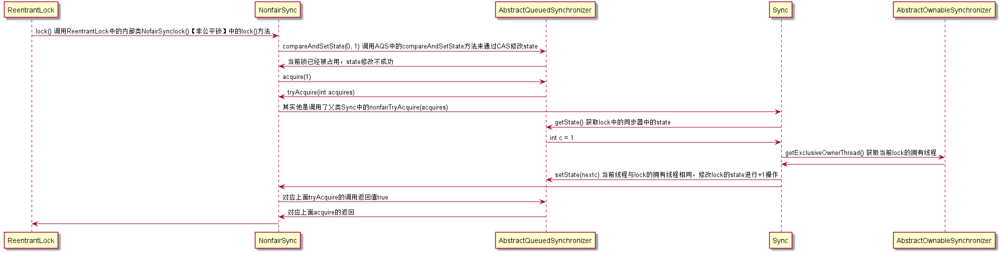

##AQS源码【结合ReentrantLock源码解析】

#### AQS框架


#### JDK8AQS第一次加锁成功代码


#### JDK8AQS重入锁源码

```java
//Sync继承了AQS下面是Sync中的nonfairTryAcquire
final boolean nonfairTryAcquire(int acquires) {
    final Thread current = Thread.currentThread();//获取当前线程
    int c = getState();//获取当前线程中的state值，判断当前lock是否已经被其他线程占用
    if (c == 0) {//如果没有被占用，就通过cas修改state值
        if (compareAndSetState(0, acquires)) {
            setExclusiveOwnerThread(current);//将state的值修改成功后将锁设置当前线程的
            return true;
        }
    }
    else if (current == getExclusiveOwnerThread()) {//如果state!=0表示当前锁已经被占用，判断占用锁的线程是不是当前线程【可重入性】
        int nextc = c + acquires;//如果当前线程与占用锁的线程是同一个，那么对state进行+1的操作
        if (nextc < 0) // overflow
            throw new Error("Maximum lock count exceeded");
        setState(nextc);//通过cas修改state的值
        return true;
    }
    return false;
}
```
#### FairSync与NonfairSync区别
`FairSync` 相比 `NonfairSync` 中 `tryAcquire` ，唯一多的就是一行判断 `!hasQueuedPredecessors()`