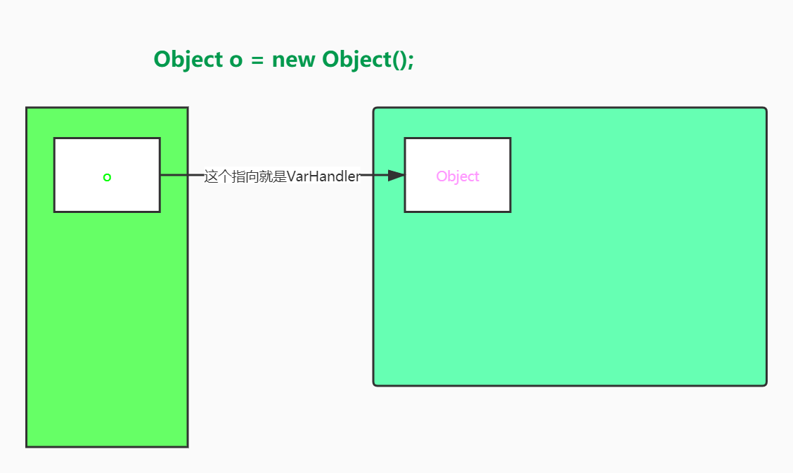

## VarHandle
<https://github.com/GudaoFQ/Multithreading/blob/main/src/main/java/com/gudao/m014_varhandle_demo/VarHandleDemo.java>
> 当一个变量通过引用指向一个变量时，此过程中指向另这个对象的引用就是VarHandler

#### 特性
1. 可以将普通属性进行原子操作
2. 比反射快,直接操纵二进制码