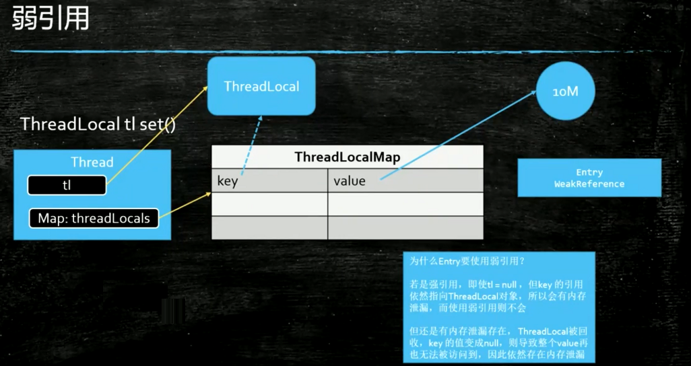
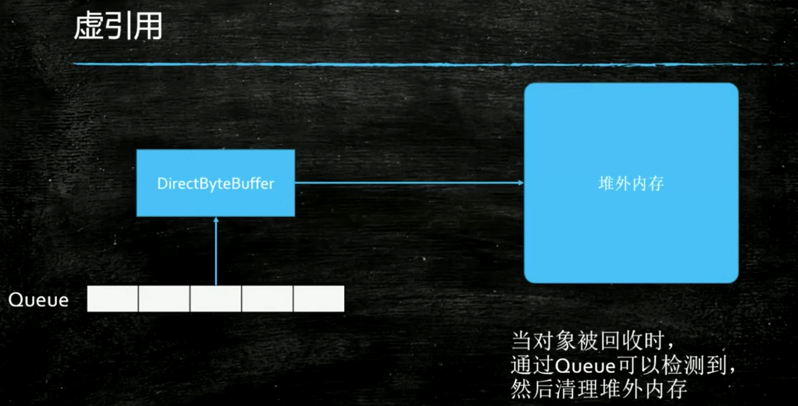

## Java引用

#### 引用分类
* 强引用【当没有对象引用指向就会被回收】
    * Object o = new Object()
* 软引用【当内存不够的时候，GC将其回收】
    * 大对象的缓存
    * 常用对象的缓存
* 弱引用【只要遭遇GC就被回收】
    * 缓存,沒有容器引用指向的时候就需要清除的缓存
    * ThreadLocal<br>
    
        ```shell
        ThreadLocal<M> tl = new ThreadLocal<>(); 
        t1.set(new M()); 
        //不remove也会存在内存泄露
        tl.remove();
        ```
    * WeakHashMap
* 虚引用【一般给写JVM的人用的】
    * 管理堆外内存
    