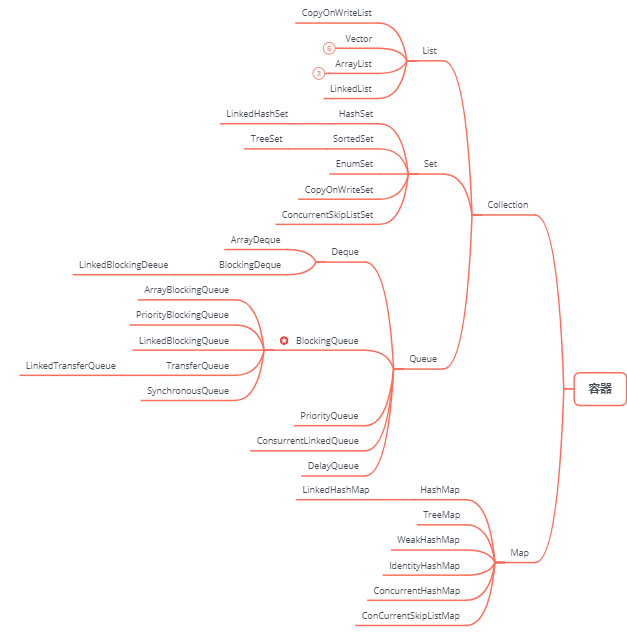

## 容器

* Java集合大致可以分为Set、List、Queue和Map四种体系。
    * Set代表无序、不可重复的集合；
    * List代表有序、重复的集合；
    * Map则代表具有映射关系的集合；
    * Java5又增加了Queue体系集合，代表一种队列集合实现；
> Java集合就像一种容器，可以把多个对象（实际上是对象的引用，单习惯上都称对象）“丢进”该容器。我们可以使用这些工具来解决数量惊人的问题。容器还有其他一些特征。例如，Set对于每个值都只保存一个对象，Map是允许你将某些对象与其他一些对象关联起来的关联数组，Java集合类都可以自动地调整自己的尺寸。因此，与数组不同，在编程时，可以将任意数量的对象放置到容器中，并且不需要担心容器应该设置为多大。从Java5增加了泛型以后，Java集合可以记住容器中对象的数据类型，使得编码更加简洁、健壮。


#### Java集合和数组的区别：
1. 数组声明了它容纳元素的类型，而集合不声明。
2. 数组存放的类型只能是一种（基本类型/引用类型），集合存放的类型可以不是一种（不加泛型时添加的类型是Object）。
3. 数组是静态的，一个数组实例具有固定的大小，一旦创建了就无法改变容量了。而集合是可以动态扩展容量，可以根据需要动态改变大小，集合提供更多的成员方法，能满足更多的需求。

#### Java1.0的时候，java的容器只有Vector和HashTable
> 当初设计的时候将它们两个都设置为了线程安全的容器，都使用sychronized进行修饰【设计缺陷】

#### 发展历程
HashTable -> HashMap -> synchronizedHashMap -> ConcurrentHashMap
Vector -> List -> Queue

#### 物理上存储的数据结构
连续存储：数组Array
非连续存储：链表Link

#### Collection<E>接口是集合的根接口 继承Iterable
`public interface Collection<E> extends Iterable<E>`
> Collection接口是Set,Queue,List的父接口。Collection<E>并不关心这组元素是否重复，是否有序。他只提供操作对这组元素的基本操作方法，怎么添加，怎么删除，怎么循环。所有的实现类都必须提供这些方法

* Collection用法有：添加元素，删除元素，返回Collection集合的个数以及清空集合等。集中重点在于iterator()方法，该方法的返回值是Iterator。这个将于以后的学习中详细复习。
```java
boolean hasNext();
E next();
void remove();
```
##### iterator()方法
> iterator方法返回一个实现了Iterator接口的对象，作用是依次访问集合中的元素，Iterator<E>接口包含3个方法：
* 通过多次调用next()方法可遍历集合中的所有元素，需要注意的是需要在调用next()之前调用hasNext()方法，并在hasNext()返回true的时候才可以调用next(),例如：
```java
private static void collectionIterator() {
    //不用关注Arrays.asList，只需要知道他能返回一个Collection<E>接口就行
    Collection<String> collection = Arrays.asList("Java", "C++", "Python");
    Iterator<String> iterator = collection.iterator();
    while (iterator.hasNext()) {
        String string = (String) iterator.next();
        System.out.println(string);
    }
}
//output:
//Java
//C++
//Python
```
> 从JDK5开始使用“for each”这种更加方便的方式来遍历集合，只要实现了Iterable接口，都可以使用“for each”来遍历，效果和使用iterator一样。Iterable接口只包含一个方法：
```java
private static void foreachCollectionIterator() {
	Collection<String> collection = Arrays.asList("Java", "C++", "Python");
	for (String string : collection) {
		System.out.println(string);
	}
}
//output:
//Java
//C++
//Python
```

#### Set<E>接口 继承Collection
`public interface Set<E> extends Collection<E>`
> Set<E>接口在方法签名上与Collection<E>接口是一样的，只不过在方法的说明上有更严格的定义，最重要的特点是**他拒绝添加重复元素，不能通过整数索引来访问**。Set集合与Collection集合基本相同，没有提供任何额外方法。实际上Set就是Collection,只是行为略有不同（Set不允许包含重复元素）。
* **Set集合注重独一无二的性质**,该体系集合可以知道某物是否已近存在于集合中,不会存储重复的元素。用于存储无序(存入和取出的顺序不一定相同)元素，值不能重复。如果试图把两个相同的元素加入同一个Set集合中，则添加操作失败，add()方法返回false，且新元素不会被加入。

#### List接口 继承Collection
`public interface List<E> extends Collection<E>`
> List集合代表一个元素有序【不是按大小帮你排序】、可重复的集合，集合中每个元素都有对应的顺序索引。
* **List集合允许使用重复元素**，可以通过索引来访问指定位置的集合元素。List集合默认是按元素的添加顺序设置元素的索引，例如：第一个添加的元素索引为0，第二个添加的元素索引为1......List作为Collection接口的子接口，可以使用Collection接口里的全部方法。因为List是有序集合，List集合里增加了一些根据索引来操作集合元素的方法。
```java
// 部分方法
E get(int index);
E set(int index, E element);
void add(int index, E element);
E remove(int index);
int indexOf(Object o);
ListIterator<E> listIterator();
ListIterator<E> listIterator(int index);
List<E> subList(int fromIndex, int toIndex);
```
##### ListIterator<E> listIterator()方法
> ListIterator<E>接口继承自Iterator<E>接口，所以他们的差异在ListIterator<E>接口新增的功能上：
* ListIterator<E>可以向后迭代previous()
* ListIterator<E>可以获取前后索引nextIndex()
* ListIterator<E>可以添加新值add(E e)
* ListIterator<E>可以设置新值set(E e)

#### Queue集合 继承Collection
> Queue用于模拟队列这种数据结构。
* **队列通常是指“先进先出(FIFO)”的容器**。队列的头部保存在队列中存放时间最长的元素，尾部保存存放时间最短的元素。新元素插入到队列的尾部，取出元素会返回队列头部的元素。通常，队列不允许随机访问队列中的元素。

#### Map<K,V>
`public interface Map<K,V>`
> Map用于保存具有映射关系的数据，因此Map集合里保存着两组数，一组值用于保存Map里的key，另一组值用于保存Map里的value,key和value都可以是任何引用类型的数据。

> 基本都是一些行为控制的方法，重点在于它的内部接口Map.Entry
* Map的key不允许重复，即通过指定的key,总能找到唯一的、确定的value。Map提供了一个更通用的元素存储方法。从概念上而言，我们可以将List看作是具有数值键的Map。而实际上，除了List和Map都在定义java.util中外，两者并没有直接的联系。下面是Map的类结构图
    * java Set<K> keySet()
    > 返回映射中包含的键集视图，是一个Set<E>，说明了映射中键是不可重复的。
    * java Collection<V> values()
    > 返回映射中包含的值得集合视图，Collection<E>，说明了映射中值是可以重复的。
    * java Set<Map.Entry<K,V>> entrySet()
    > 返回映射中包含的映射集合视图，这个视图是一个Set<E>，这是由他的键集不能重复的特点决定的。
    * entrySet()
    > 返回的是一个Map.Entry<K,V>类型的集，Map.Entry<K,V>接口定义了获取键值、设置值的方法，定义如下：
    ```java
    interface Entry<K,V> {
        K getKey();
        V getValue();
        V setValue(V value);
        boolean equals(Object o);
        int hashCode();
    }
    ```

#### Map与Set、List的关系，区别及适用场景
1. Map集合与Set集合的关系：如果把Map里的所有key放在一起看，他们就组成了一个Set集合（所有的key没有顺序，key与key之间不能重复），实际上Map确实包含了一个keySet()方法，用户返回Map里所有key组成的Set集合。
2. Map集合与List集合的关系：如果把Map里的所有value放在一起来看，它们又非常类似于一个List：元素与元素之间可以重复，每个元素可以根据索引来查找，只是Map中索引不再使用整数值，而是以另外一个对象作为索引。
3. List特点：元素有放入顺序，元素可重复；Set特点：元素无放入顺序，元素不可重复，重复元素会覆盖掉。
4. Set和List对比：Set检索元素效率低下，删除和插入效率高，插入和删除不会引起元素位置改变；List和数组类似，List可以动态增长，查找元素效率高，插入删除元素效率低，会引起其他元素位置改变。

#### Queue List区别 
Queue添加了对线程友好的API offer peek poll；BlockingQueue put take->阻塞
    DelayQueue SynchronousQ TransferQ

