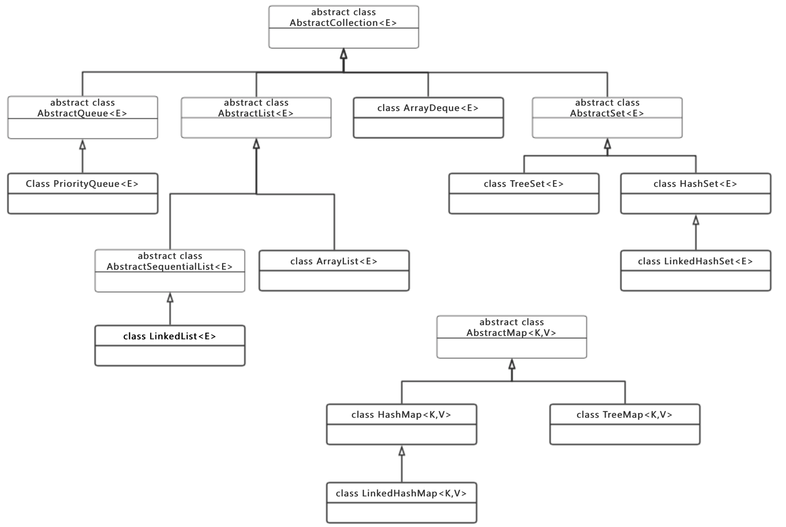

## 容器类结构

#### 类结构图


#### 抽象类
* 关键的抽象类包括**AbstractCollection<E>;、AbstractMap<K,V>、AbstractList<E>和AbstractSet<E>，从命名可以看出他们分别实现了Collection<E>、Map<K,V>、List<E>和Set<E>接口**
* 各个集合的关键区别就在每个集合所使用的数据结构和算法上，所以在抽象类层面都没有涉及具体的数据结构和算法，只对操作这些数据结构的方法做了基本实现

#### AbstractCollection<E>
`public abstract class AbstractCollection<E> implements Collection<E>`

AbstractCollection<E>基本实现了Collection<E>下的所有方法，除了以下几个方法:
````java
public abstract Iterator<E> iterator();

public abstract int size();

public boolean add(E e) {
    throw new UnsupportedOperationException();
}
````

如果需要实现的是一个不可修改的集合，只需要实现iterator()和size()方法即可，如果需要实现一个可修改的集合，必须重写add(E e)方法。
在AbstractCollection<E>已经实现的方法中可以发现，AbstractCollection<E>所实现的所有方法都是通过Iterator<E>来操作的。
```java
public boolean contains(Object o) {
    //获取迭代器
    Iterator<E> it = iterator();
    if (o==null) {
        while (it.hasNext())
            if (it.next()==null)
                return true;
    } else {
        while (it.hasNext())
            if (o.equals(it.next()))
                return true;
    }
    return false;
}
```
#### AbstractList<E>
`public abstract class AbstractList<E> extends AbstractCollection<E> implements List<E>`

AbstractList<E>抽象类在AbstractCollection<E>抽象类的基础上添加了专属于List<E>接口的部分方法，但大部分方法都是空方法，没有具体实现。
```java
abstract public E get(int index);

public E set(int index, E element) {
    throw new UnsupportedOperationException();
}

public void add(int index, E element) {
    throw new UnsupportedOperationException();
}

public E remove(int index) {
    throw new UnsupportedOperationException();
}

public Iterator<E> iterator() {
    return new Itr();
}

public ListIterator<E> listIterator() {
    return listIterator(0);
}

public ListIterator<E> listIterator(final int index) {
    rangeCheckForAdd(index);

    return new ListItr(index);
}
```
没有实现的原因在于AbstractList<E>是一个抽象类，他并没有确定具体的数据结构，当在数据结构没有确定的情况下，是直接使用整数索引的方式还是通过迭代器循环遍历的方式来查找具体的位置更方便是不确定的，所以在具体实现上都由他的子类来决定。
值得注意的是AbstractList<E>实现了Iterator以及ListIterator两种类型的迭代器，很大程度上方便了子类的扩展：
```java
private class Itr implements Iterator<E> {
//......
    public E next() {
        checkForComodification();
        try {
            int i = cursor;
            //向后遍历集合，通过get(i)获取当前索引的元素，每次调用之后cursor = i + 1，get(i)为抽象方法
            E next = get(i);
            lastRet = i;
            cursor = i + 1;
            return next;
        } catch (IndexOutOfBoundsException e) {
            checkForComodification();
            throw new NoSuchElementException();
        }
    }

    public void remove() {
        if (lastRet < 0)
            throw new IllegalStateException();
        checkForComodification();

        try {
            //通过AbstractList<E>类的remove方法来删除元素，AbstractList<E>中remove(int index)是一个空方法，需要子类来实现
            AbstractList.this.remove(lastRet);
            if (lastRet < cursor)
                cursor--;
            lastRet = -1;
            expectedModCount = modCount;
        } catch (IndexOutOfBoundsException e) {
            throw new ConcurrentModificationException();
        }
    }
}
//......

private class ListItr extends Itr implements ListIterator<E> {
//......
    public E previous() {
        checkForComodification();
        try {
            int i = cursor - 1;
            //向前遍历集合，通过get(i)获取当前索引的元素，每次调用之前cursor - 1，get(i)为抽象方法
            E previous = get(i);
            lastRet = cursor = i;
            return previous;
        } catch (IndexOutOfBoundsException e) {
            checkForComodification();
            throw new NoSuchElementException();
        }
    }
//......
}
```

#### AbstractSet<E>
`public abstract class AbstractSet<E> extends AbstractCollection<E> implements Set<E>`

AbstractSet<E>抽象类在实现上非常简单，只在AbstractCollection<E>抽象类的基础上实现了equal 和 hashCode 方法，但具体的实现还是需要通过contain()方法来判断，由于Set<E>接口类型不考虑元素的顺序，所以只要两个AbstractSet<E>包含相同元素就判断为相等，不需要元素顺序相同，而AbstractList<E>则需要顺序也相同。
````java
//AbstractSet<E> 中的 equals
public boolean equals(Object o) {
    if (o == this)
        return true;

    if (!(o instanceof Set))
        return false;
    Collection<?> c = (Collection<?>) o;
    if (c.size() != size())
        return false;
    try {
        //containsAll在AbstractCollection<E>中已经实现，只要包含所有元素就可以
        return containsAll(c);
    } catch (ClassCastException unused)   {
        return false;
    } catch (NullPointerException unused) {
        return false;
    }
}

//AbstractCollection<E> 中的containsAll
public boolean containsAll(Collection<?> c) {
    for (Object e : c)
        if (!contains(e))
            return false;
    return true;
}

//AbstractList<E> 中的equals
public boolean equals(Object o) {
    if (o == this)
        return true;
    if (!(o instanceof List))
        return false;

    ListIterator<E> e1 = listIterator();
    ListIterator<?> e2 = ((List<?>) o).listIterator();
    //需要两个集合中的元素以及元素顺序都相同才返回true
    while (e1.hasNext() && e2.hasNext()) {
        E o1 = e1.next();
        Object o2 = e2.next();
        if (!(o1==null ? o2==null : o1.equals(o2)))
            return false;
    }
    return !(e1.hasNext() || e2.hasNext());
}
````

#### AbstractMap<K,V>
`public abstract class AbstractMap<K,V> implements Map<K,V>`

AbstractMap<K,V>抽象类中实现了除entrySet()方法外的基本所有方法，其中返回键集的Set<K> keySet()和返回值集的Collection<V> values()在实现上非常有趣，从返回值上看是创建了一个新的集合，但实际实现上是返回来一个实现Set<K>或Collection<V>的类对象，类对象的所有操作都是在原映射表的基础上进行的，这种有趣的操作叫视图，java.util框架中存在大量应用。
这里使用视图的好处在于抽象类中你不需要确定返回的Set<K>或Collection<V>的具体实现类是什么，这样就可以在抽象类中没有决定使用哪种数据结构的时候最大化抽象类的功能，增加扩展的方便性。
##### keySet()的源码：
```java
public Set<K> keySet() {
    Set<K> ks = keySet;
    if (ks == null) {
        ks = new AbstractSet<K>() {
            public Iterator<K> iterator() {
                return new Iterator<K>() {
                    //获取原映射表的迭代器来实现自己的迭代器
                    private Iterator<Entry<K,V>> i = entrySet().iterator();

                    public boolean hasNext() {
                        return i.hasNext();
                    }

                    public K next() {
                        return i.next().getKey();
                    }

                    public void remove() {
                        i.remove();
                    }
                };
            }

            public int size() {
                //直接操作原映射表的size()方法
                return AbstractMap.this.size();
            }

            public boolean isEmpty() {
                return AbstractMap.this.isEmpty();
            }

            public void clear() {
                AbstractMap.this.clear();
            }

            public boolean contains(Object k) {
                return AbstractMap.this.containsKey(k);
            }
        };
        keySet = ks;
    }
    return ks;
}
```