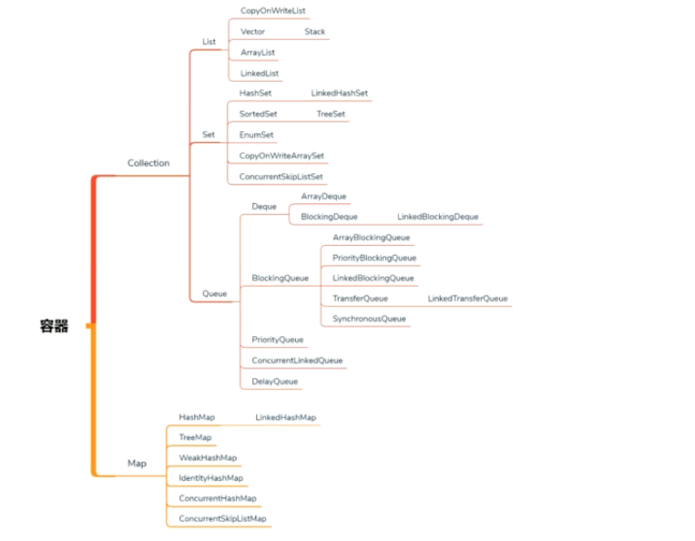

## 容器

#### 物理上存储的数据结构
连续存储：数组Array
非连续存储：链表Link

Vector Hashtable 
-自带锁-基本不用

Hashtable-> ConcurrectHashMap
Vector -> Queue 
Queue List区别 
Queue添加了对线程友好的API offer peek poll；BlockingQueue put take->阻塞

DelayQueue SynchronousQ TransferQ
