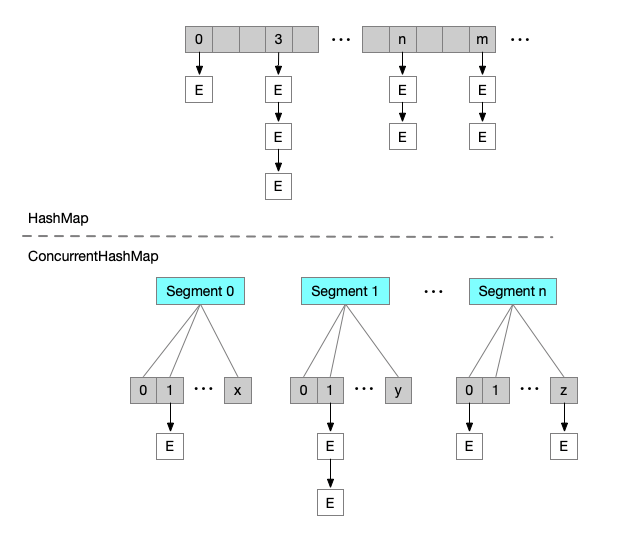
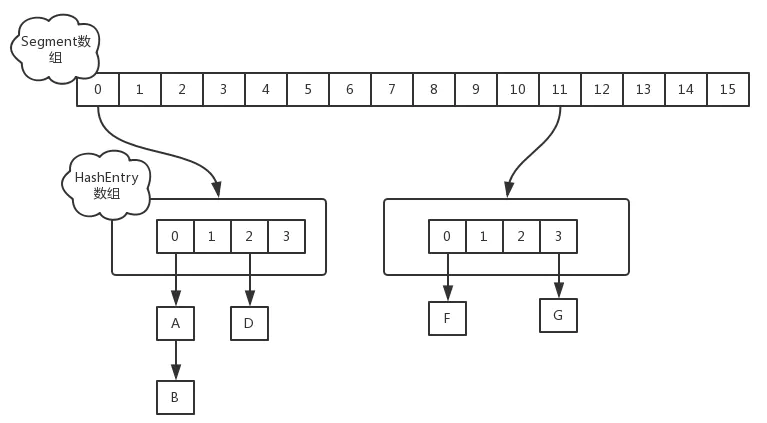

## 1.7ConcurrentHashMap
> 在 JDK 1.7 版本及之前的版本中，ConcurrentHashMap 为了解决 HashTable 会锁住整个 hash 表的问题，提出了分段锁的解决方案，分段锁就是将一个大的 hash 表分解成若干份小的 hash 表，需要加锁时就针对小的 hash 表进行加锁，从而来提升 hash 表的性能。JDK1.7 中的 ConcurrentHashMap 引入了 Segment 对象，将整个 hash 表分解成一个一个的 Segment 对象，每个 Segment 对象呢可以看作是一个细粒度的 HashMap。

#### JDK7
JDK7的ConcurrentHashMap中，加入了分段锁的逻辑，在分段锁的设计中，数据会被按照一定的规则分段（一般是对数据的hashcode，进行二次哈希计算），每个段使用一个锁，这样如果访问的数据不在一个分段中，则不会产生锁冲突，从而提高并发性能。<br>

主要区别在于ConcurrentHashMap多了一层Segment分段锁，每个Segment下面是一个数组+链表的HashMap结构。

#### 数据结构
ConcurrentHashMap实现线程安全的关键就在于Segment分段锁，当需要修改元素时，要先获得Segment锁，从而保障在并发场景下的数据安全。`Segment是继承自ReentrantLock`，一个**基于AQS的重入锁**。在 Segment 对象中通过 HashEntry 数组来维护其内部的 hash 表。每个 HashEntry 就代表了 map 中的一个 K-V，如果发生 hash 冲突时，在该位置就会形成链表。

```java
public class ConcurrentHashMap<K, V> extends AbstractMap<K, V>
        implements ConcurrentMap<K, V>, Serializable {

    final Segment<K,V>[] segments;
    
    static final class HashEntry<K,V> {
        final int hash;
        final K key;
        // volatile，保证多线程下，内存可见性
        volatile V value;
        // 链表中它的后一位元素
        volatile HashEntry<K,V> next;
    }

    static final class Segment<K,V> extends ReentrantLock implements Serializable {
        transient volatile HashEntry<K,V>[] table;
        // 记录当前分段的数据容量
        transient int count;
        // 记录当前分段，数据被修改的次数
        // 每次数据修改会导致modCount += 1
        transient int modCount;
        // 阈值
        transient int threshold;
        // 负载因子
        final float loadFactor;
        
        Segment(float lf, int threshold, HashEntry<K,V>[] tab) {
            this.loadFactor = lf;
            this.threshold = threshold;
            this.table = tab;
        }
    }
}
```
#### segment初始化
```java
static final int DEFAULT_INITIAL_CAPACITY = 16;
static final float DEFAULT_LOAD_FACTOR = 0.75f;
//并发等级
static final int DEFAULT_CONCURRENCY_LEVEL = 16;

public ConcurrentHashMap(int initialCapacity, float loadFactor, int concurrencyLevel) {
    if (!(loadFactor > 0) || initialCapacity < 0 || concurrencyLevel <= 0)
        throw new IllegalArgumentException();
    if (concurrencyLevel > MAX_SEGMENTS)
        concurrencyLevel = MAX_SEGMENTS;

    int sshift = 0;
    // segments数组长度，2的sshif次方等于ssize
    int ssize = 1;
    while (ssize < concurrencyLevel) {
        ++sshift;
        ssize <<= 1;
    }

    // 这两个变量主要用于segment寻址
    this.segmentShift = 32 - sshift;
    this.segmentMask = ssize - 1;

    if (initialCapacity > MAXIMUM_CAPACITY)
        initialCapacity = MAXIMUM_CAPACITY;
    // 计算segment中HashEntry数组的初始容量，2的n次方
    int c = initialCapacity / ssize;
    if (c * ssize < initialCapacity)
        ++c;
    int cap = MIN_SEGMENT_TABLE_CAPACITY;
    while (cap < c)
        cap <<= 1;
    // 初始化segments数组中的第一个segment，其余的延迟初始化
    Segment<K,V> s0 =
        new Segment<K,V>(loadFactor, (int)(cap * loadFactor),
                         (HashEntry<K,V>[])new HashEntry[cap]);
    Segment<K,V>[] ss = (Segment<K,V>[])new Segment[ssize];
    UNSAFE.putOrderedObject(ss, SBASE, s0); // ordered write of segments[0]
    this.segments = ss;
}

public ConcurrentHashMap(int initialCapacity, float loadFactor) {
    this(initialCapacity, loadFactor, DEFAULT_CONCURRENCY_LEVEL);
}

public ConcurrentHashMap(int initialCapacity) {
    this(initialCapacity, DEFAULT_LOAD_FACTOR, DEFAULT_CONCURRENCY_LEVEL);
}

public ConcurrentHashMap() {
    this(DEFAULT_INITIAL_CAPACITY, DEFAULT_LOAD_FACTOR, DEFAULT_CONCURRENCY_LEVEL);
}
```

