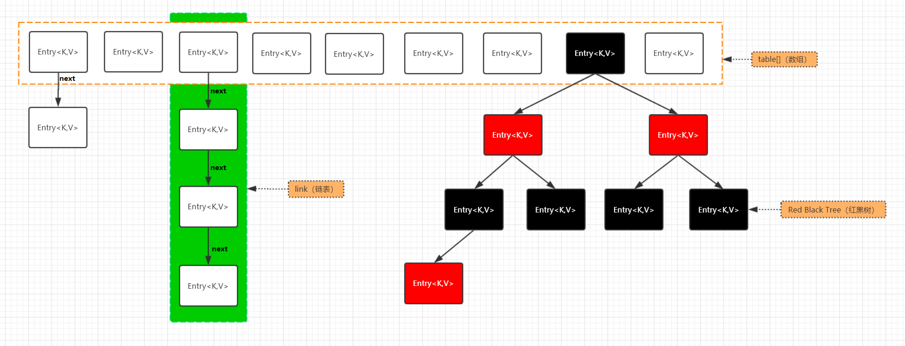
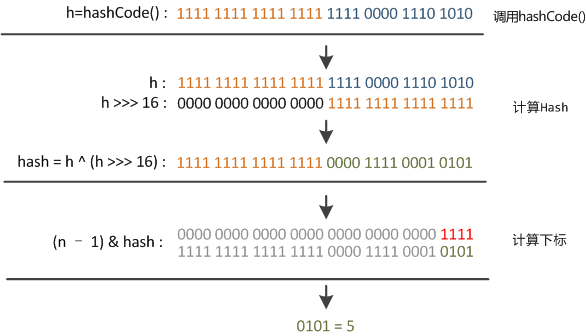
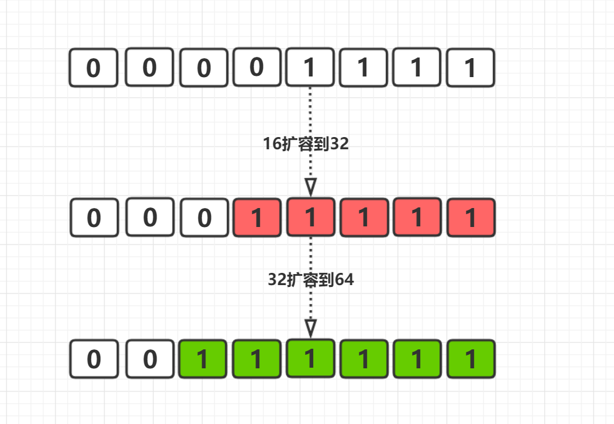
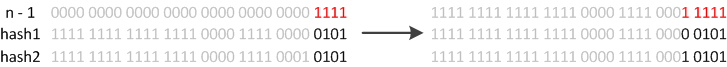
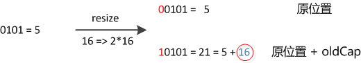
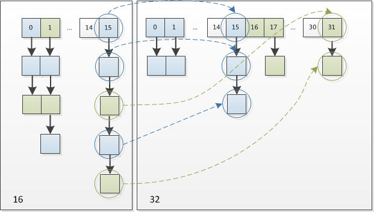

## HashMap
> 为了将一个特定类的对象用做一个key，这个类必须提供两个方法，equals() 和 hashCode()。

#### 数据结构
> 在java1.8中HashMap的数据结构是动态数组+红黑树<br>


#### 特性
* 线程不安全
* 底层通过数组+链表+红黑树
* 默认容器大小16
* 负载因子0.75
* 默认扩容到原来数组的2倍
* 红黑树阀值8【当链表的长度大于8，自动转化为红黑树】
* 链表阀值6【当链表长度低于6，自动转化为链表】
* HashMap中的key，value都能为null
    * 在HashMap中通过内部方法hash()计算key的hash值得时候，会执行`(key == null) ? 0 : (h = key.hashCode()) ^ (h >>> 16);`，如果为空，直接通过三目得出key为0

#### put函数大致的思路为：
1. 对key的hashCode()做hash，然后再计算index;
2. 如果没碰撞直接放到bucket里；
3. 如果碰撞了，以链表的形式存在buckets后；
4. 如果碰撞导致链表过长(大于等于TREEIFY_THRESHOLD)，就把链表转换成红黑树；
5. 如果节点已经存在就替换old value(保证key的唯一性)
6. 如果bucket满了(超过load factor*current capacity)，就要resize。

#### get大致思路如下

1. bucket里的第一个节点，直接命中；
2. 如果有冲突，则通过key.equals(k)去查找对应的entry
    1. 若为树，则在树中通过key.equals(k)查找，O(logn)；
    2. 若为链表，则在链表中通过key.equals(k)查找，O(n)


#### hash函数的实现
> 在get和put的过程中，计算下标时，先对hashCode进行hash操作，然后再通过hash值进一步计算下标，如下图所示：


##### 在对hashCode()计算hash时具体实现
```java
static final int hash(Object key) {
    int h;
    return (key == null) ? 0 : (h = key.hashCode()) ^ (h >>> 16);
}
```
可以看到这个函数大概的作用就是：高16bit不变，低16bit和高16bit做了一个异或。

在设计hash函数时，因为目前的table长度n为2的幂，而计算下标的时候，是这样实现的(使用&位操作，而非%求余)：`(n - 1) & hash`

#### RESIZE的实现
> 当put时，如果发现目前的bucket占用程度已经超过了Load Factor所希望的比例，那么就会发生resize。在resize的过程，简单的说就是把bucket扩充为2倍，之后重新计算index，把节点再放到新的bucket中。resize的注释是这样描述的:当超过限制的时候会resize，然而又因为我们使用的是2次幂的扩展(指长度扩为原来2倍)，所以，元素的位置要么是在原位置，要么是在原位置再移动2次幂的位置。

##### 实现图解
```java
tab[i = (n - 1) & hash])
```
* key计算后的哈希值小于16
.jpg)
* key计算后的哈希值大于16
.jpg)
* 图中的与运算就是源码中Entry确定table下标的代码，也就是上面putval代码的第七行 `p = tab[i = (n - 1) & hash]` 这行代码的计算。从图中计算的结果可以看出，与运算保留了低位的值，去掉了高位的值。因此在hash值小于16的情况下，旧的Entry在重新定位到扩容后的新HashMap的table下标时，得到的下标值是一样的。而在hash值大于16的情况下，旧的Entry在重新定位到扩容后的新HashMap的table下标时，得到的下标值是不一样的。这说明在第一次HashMap扩容时，hash值大于16的Entry会迁移到新的位置，而小于16的Entry不需要迁移。这就保证了旧table已经散列良好的数据位置重新调换的频率。**而每次扩容两倍更是保证了，每次变化的位数只有一位**，如下图

* 这样就可以使之前已经散列好的数组变动最小，这也是为什么扩容2倍的原因。到这里可以给HashMap的原理做个总结：
    * HashMap由数组加链表组成的，数组是HashMap的哈希桶，链表则是为解决哈希碰撞而存在的，如果定位到的数组位置不含链表（即哈希桶中只有一个Entry）,那么对于查找，添加等操作很快，仅需一次寻址即可（数组根据下标寻址，速度很快）；
    * 如果定位到的数组包含链表，对于添加操作，其时间复杂度为O(n)，首先遍历链表，存在即覆盖，否则新增；对于查找操作来讲，也需遍历链表，然后通过key对象的equals方法逐一比较查找。所以，性能考虑，HashMap中的链表出现越少，性能就会越好。（其实也就是key的哈希值越离散，Entry就会尽可能的均匀分布，出现链表的概率也就越低）
    * 哈希碰撞：个人理解为当table中的索引值相同

##### 另一种说明
* 例如我们从16扩展为32时，具体的变化如下所示

* 因此元素在重新计算hash之后，因为n变为2倍，那么n-1的mask范围在高位多1bit(红色)，因此新的index就会发生这样的变化

* 我们在扩充HashMap的时候，不需要重新计算hash，只需要看看原来的hash值新增的那个bit是1还是0就好了，是0的话索引没变，是1的话索引变成“原索引+oldCap”。可以看看下图为16扩充为32的resize示意图

这个设计确实非常的巧妙，既省去了重新计算hash值的时间，而且同时，由于新增的1bit是0还是1可以认为是随机的，因此resize的过程，均匀的把之前的冲突的节点分散到新的bucket了。


#### 阿里面试题：为什么Map桶中个数超过8才转为红黑树
要弄明白这个问题，我们首先要明白为什么要转换，这个问题比较简单，因为Map中桶的元素初始化是链表保存的，其查找性能是O(n)，而树结构能将查找性能提升到O(log(n))。当链表长度很小的时候，即使遍历，速度也非常快，但是当链表长度不断变长，肯定会对查询性能有一定的影响，所以才需要转成树。至于为什么阈值是8，我想，去源码中找寻答案应该是最可靠的途径。8这个阈值定义在HashMap中，如下所示，这段注释只说明了8是bin（bin就是bucket，即HashMap中hashCode值一样的元素保存的地方）从链表转成树的阈值，但是并没有说明为什么是8：
```java
/**
 * The bin count threshold for using a tree rather than list for a
 * bin.  Bins are converted to trees when adding an element to a
 * bin with at least this many nodes. The value must be greater
 * than 2 and should be at least 8 to mesh with assumptions in
 * tree removal about conversion back to plain bins upon shrinkage.
 */
static final int TREEIFY_THRESHOLD = 8;
```
我们继续往下看，在HashMap中有一段`Implementation notes`，笔者摘录了几段重要的描述，第一段如下所示，大概含义是当bin变得很大的时候，就会被转换成TreeNodes中的bin，其结构和TreeMap相似，也就是红黑树：
```java
This map usually acts as a binned (bucketed) hash table, but
when bins get too large, they are transformed into bins of TreeNodes,
each structured similarly to those in java.util.TreeMap
```
继续往下看，TreeNodes占用空间是普通Nodes的两倍，所以只有当bin包含足够多的节点时才会转成TreeNodes，而是否足够多就是由TREEIFY_THRESHOLD的值决定的。当bin中节点数变少时，又会转成普通的bin。并且我们查看源码的时候发现，链表长度达到8就转成红黑树，当长度降到6就转成普通bin。

##### 链表转红黑树的阈值为什么是8
这样就解析了为什么不是一开始就将其转换为TreeNodes，而是需要一定节点数才转为TreeNodes，说白了就是trade-off，空间和时间的权衡：
```jvm
Because TreeNodes are about twice the size of regular nodes, we
use them only when bins contain enough nodes to warrant use
(see TREEIFY_THRESHOLD). And when they become too small (due to
removal or resizing) they are converted back to plain bins.  In
usages with well-distributed user hashCodes, tree bins are
rarely used.  Ideally, under random hashCodes, the frequency of
nodes in bins follows a Poisson distribution
(http://en.wikipedia.org/wiki/Poisson_distribution) with a
parameter of about 0.5 on average for the default resizing
threshold of 0.75, although with a large variance because of
resizing granularity. Ignoring variance, the expected
occurrences of list size k are (exp(-0.5)*pow(0.5, k)/factorial(k)). 
The first values are:
0:    0.60653066
1:    0.30326533
2:    0.07581633
3:    0.01263606
4:    0.00157952
5:    0.00015795
6:    0.00001316
7:    0.00000094
8:    0.00000006
more: less than 1 in ten million
```
> 简单来说，一个随机分布的hashCode，节点分布在哈希桶中的概率遵循泊松分布，按照泊松分布可以计算出哈希桶中的元素个数与概率的对照表，可以看到元素个数为8的概率已经非常低了，大于8的概率已经低于千万分之一了，因此将阈值数量定义为8。

这段内容还说到：当hashCode离散性很好的时候，树型bin用到的概率非常小，因为数据均匀分布在每个bin中，几乎不会有bin中链表长度会达到阈值。但是在随机hashCode下，离散性可能会变差，然而JDK又不能阻止用户实现这种不好的hash算法，因此就可能导致不均匀的数据分布。不过理想情况下随机hashCode算法下所有bin中节点的分布频率会遵循泊松分布，我们可以看到，一个bin中链表长度达到8个元素的概率为0.00000006，几乎是不可能事件。所以，之所以选择8，不是拍拍屁股决定的，而是根据概率统计决定的。由此可见，发展30年的Java每一项改动和优化都是非常严谨和科学的。

* 网上的另一种说法

红黑树的平均查找长度是log(n)，如果长度为8，平均查找长度为log(8)=3，链表的平均查找长度为n/2，当长度为8时，平均查找长度为8/2=4，这才有转换成树的必要；链表长度如果是小于等于6，6/2=3，而log(6)=2.6，虽然速度也很快的，但是转化为树结构和生成树的时间并不会太短。

这个答案不够严谨：3相比4有转换的必要，而2.6相比3就没有转换的必要？

#### 当用户自定义HashMap的容量
`HashMap caMap = new HashMap<>(3);`

如果定义的容量不是2的n次方，hashMap的源码中会通过`tableSizeFor(int cap)`来对其进行重新计算成2的n次方
