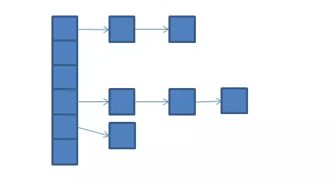

## HashTable【自带锁】
> Java1.0就有了，太老了，设计有缺陷，基本不用

> 为了将一个特定类的对象用做一个key，这个类必须提供两个方法，equals() 和 hashCode()。

#### 底层数据结构

#### 特性
* 线程安全
* 底层通过数组+链表
* 默认容器大小11
* 负载因子0.75
* 默认扩容到原来数组的2倍+1
* HashMap中的key，value都不能为null