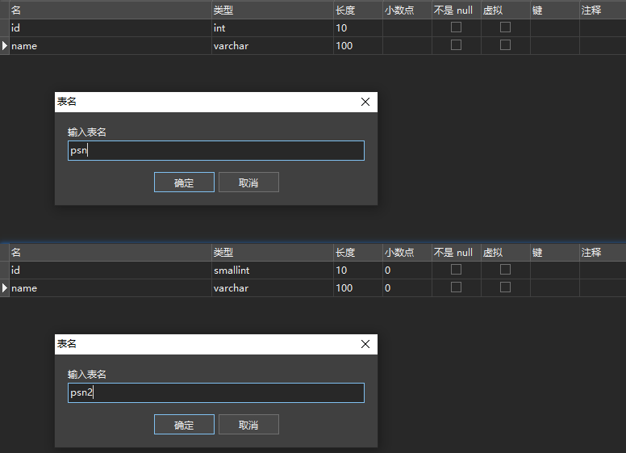
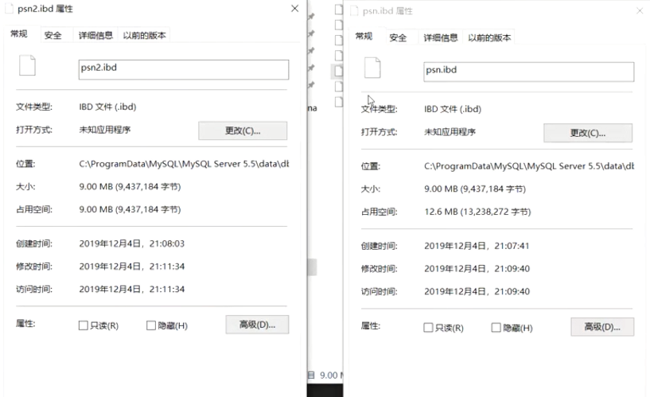
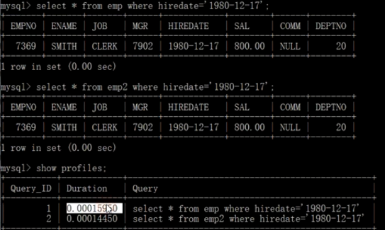

## 数据类型优化

### 优化一：数据类型更小的通常更好
> 应该尽量使用可以正确存储数据的最小数据类型，更小的数据类型通常更快，因为它们占用更少的磁盘、内存和CPU缓存，并且处理时需要的CPU周期更少，但是要确保没有低估需要存储的值的范围，如果无法确认哪个数据类型，就选择你认为不会超过范围的最小类型
#### 案例：
* 设计两张表，设计不同的数据类型，查看表的容量<br>
  
* 运行代码
```java
// 数据插入
import java.sql.Connection;
import java.sql.DriverManager;
import java.sql.PreparedStatement;

public class Test {
    public static void main(String[] args) throws Exception{
        Class.forName("com.mysql.jdbc.Driver");
        Connection conn = DriverManager.getConnection("jdbc:mysql://localhost:3306/sys?useUnicode=true&characterEncoding=utf8&zeroDateTimeBehavior=convertToNull&useSSL=false&serverTimezone=GMT%2B8","root","19980525");
        PreparedStatement pstmt = conn.prepareStatement("insert into psn values(?,?)");
        for (int i = 0; i < 20000; i++) {
            pstmt.setInt(1,i);
            pstmt.setString(2,i+"");
            pstmt.addBatch();
        }
        pstmt.executeBatch();
        conn.close();
    }
}
```
* 进入C:\ProgramData\MySQL\MySQL Server 5.7\Data\sys看结果【我用5.7数据库测不出来，就使用网络截图了】<br>
  
  * idb是innerDB中的数据文件，frm是数据结构文件

### 优化二：数据类型简单就好
> 简单数据类型的操作通常需要更少的CPU周期，例如，
1. 整型比字符操作代价更低，因为字符集和校对规则是字符比较比整型比较更复杂，
2. 使用mysql自建类型而不是字符串来存储日期和时间
3. 用整型存储IP地址
#### 案例：
* 创建两张相同的表，改变日期的数据类型，查看SQL语句执行的速度

  
### 优化三：尽量避免null
> 如果查询中包含可为NULL的列，对mysql来说很难优化，因为可为null的列使得索引、索引统计和值比较都更加复杂，坦白来说，通常情况下null的列改为not null带来的性能提升比较小，所有没有必要将所有的表的schema进行修改，但是应该尽量避免设计成可为null的列

### 数据类型优化具体说明
#### 整数类型
* 可以使用的几种整数类型：TINYINT，SMALLINT，MEDIUMINT，INT，BIGINT分别使用8，16，24，32，64位存储空间。
* 尽量使用满足需求的最小数据类型

#### 字符和字符串类型
* char长度固定，即每条数据占用等长字节空间；最大长度是255个字符，适合用在身份证号、手机号等定长字符串
* varchar可变程度，可以设置最大长度；最大空间是65535个字节，适合用在长度可变的属性
* text不设置长度，当不知道属性的最大长度时，适合用text
* 按照查询速度：char>varchar>text，由快到慢
##### varchar根据实际内容长度保存数据
* 使用最小的符合需求的长度。
* varchar(n) n小于等于255使用额外一个字节保存长度，n>255使用额外两个字节保存长度。
* varchar(5)与varchar(255)保存同样的内容，硬盘存储空间相同，但内存空间占用不同，是指定的大小 。
* varchar在mysql5.6之前变更长度，或者从255一下变更到255以上时时，都会导致锁表。
* 应用场景
    * 存储长度波动较大的数据，如：文章，有的会很短有的会很长
    * 字符串很少更新的场景，每次更新后都会重算并使用额外存储空间保存长度
    * 适合保存多字节字符，如：汉字，特殊字符等
##### char固定长度的字符串
* 最大长度：255
* 会自动删除末尾的空格
* 检索效率、写效率 会比varchar高，以空间换时间
* 应用场景
    * 存储长度波动不大的数据，如：md5摘要
    * 存储短字符串、经常更新的字符串
  
#### BLOB和TEXT类型
* MySQL 把每个 BLOB 和 TEXT 值当作一个独立的对象处理。
* 两者都是为了存储很大数据而设计的字符串类型，分别采用二进制和字符方式存储。

#### datetime和timestamp
* 不要使用字符串类型来存储日期时间数据
* 日期时间类型通常比字符串占用的存储空间小
* 日期时间类型在进行查找过滤时可以利用日期来进行比对
* 日期时间类型还有着丰富的处理函数，可以方便的对时间类型进行日期计算
* 使用int存储日期时间不如使用timestamp类型
##### datetime
* 占用8个字节
* 与时区无关，数据库底层时区配置，对datetime无效
* 可保存到毫秒
* 可保存时间范围大
* 不要使用字符串存储日期类型，占用空间大，损失日期类型函数的便捷性
##### timestamp
* 占用4个字节
* 时间范围：1970-01-01到2038-01-19
* 精确到秒
* 采用整形存储
* 依赖数据库设置的时区
* 自动更新timestamp列的值
##### date
* 占用的字节数比使用字符串、datetime、int存储要少，使用date类型只需要3个字节
* 使用date类型还可以利用日期时间函数进行日期之间的计算
* date类型用于保存1000-01-01到9999-12-31之间的日期

#### 使用枚举代替字符串类型
> 有时可以使用枚举类代替常用的字符串类型，mysql存储枚举类型会非常紧凑，会根据列表值的数据压缩到一个或两个字节中，mysql在内部会将每个值在列表中的位置保存为整数，并且在表的.frm文件中保存“数字-字符串”映射关系的查找表
```sql
create table enum_test(e enum('fish','apple','dog') not null);
insert into enum_test(e) values('fish'),('dog'),('apple');
select e+0 from enum_test;
```

#### 特殊类型数据
> 人们经常使用varchar(15)来存储ip地址，然而，它的本质是32位无符号整数不是字符串，可以使用INET_ATON()和INET_NTOA函数在这两种表示方法之间转换
* 案例：
```sql
select inet_aton('1.1.1.1')
select inet_ntoa(16843009)
```
