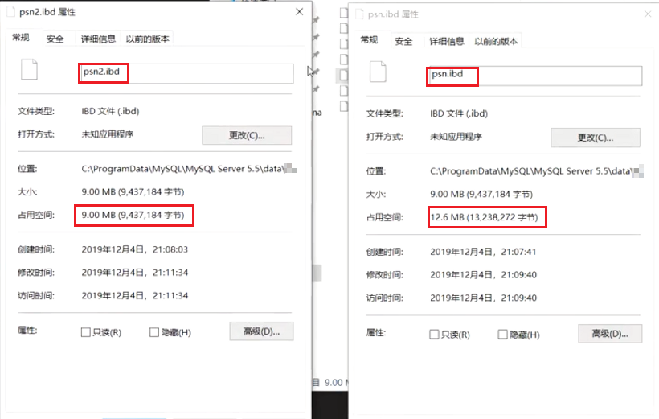

## 数据类型优化

### 优化一：数据类型越小的越好
> 应该尽量使用可以正确存储数据的最小数据类型，更小的数据类型通常更快，因为它们占用更少的磁盘、内存和CPU缓存，并且处理时需要的CPU周期更少，但是要确保没有低估需要存储的值的范围，如果无法确认哪个数据类型，就选择你认为不会超过范围的最小类型
#### 案例：
* 设计两张表，设计不同的数据类型，查看表的容量<br>
  
* 运行代码
```java
// 数据插入
import java.sql.Connection;
import java.sql.DriverManager;
import java.sql.PreparedStatement;

public class Test {
    public static void main(String[] args) throws Exception{
        Class.forName("com.mysql.jdbc.Driver");
        Connection conn = DriverManager.getConnection("jdbc:mysql://localhost:3306/sys?useUnicode=true&characterEncoding=utf8&zeroDateTimeBehavior=convertToNull&useSSL=false&serverTimezone=GMT%2B8","root","19980525");
        PreparedStatement pstmt = conn.prepareStatement("insert into psn values(?,?)");
        for (int i = 0; i < 20000; i++) {
            pstmt.setInt(1,i);
            pstmt.setString(2,i+"");
            pstmt.addBatch();
        }
        pstmt.executeBatch();
        conn.close();
    }
}
```
* 进入C:\ProgramData\MySQL\MySQL Server 5.7\Data\sys看结果【我用5.7数据库测不出来，就使用网络截图了】<br>
  
  * idb是innerDB中的数据文件，frm是数据结构文件

### 优化二：数据类型简单就好
> 简单数据类型的操作通常需要更少的CPU周期，例如，
1. 整型比字符操作代价更低，因为字符集和校对规则是字符比较比整型比较更复杂，
2. 使用mysql自建类型而不是字符串来存储日期和时间
3. 用整型存储IP地址
#### 案例：
* 创建两张相同的表，改变日期的数据类型，查看SQL语句执行的速度

  
### 数据类型优化具体说明
#### 整数类型
* 可以使用的几种整数类型：TINYINT，SMALLINT，MEDIUMINT，INT，BIGINT分别使用8，16，24，32，64位存储空间。
* 尽量使用满足需求的最小数据类型

#### 字符和字符串类型
* char长度固定，即每条数据占用等长字节空间；最大长度是255个字符，适合用在身份证号、手机号等定长字符串
* varchar可变程度，可以设置最大长度；最大空间是65535个字节，适合用在长度可变的属性
* text不设置长度，当不知道属性的最大长度时，适合用text
* 按照查询速度：char>varchar>text，由快到慢
##### varchar根据实际内容长度保存数据
* 使用最小的符合需求的长度。
* varchar(n) n小于等于255使用额外一个字节保存长度，n>255使用额外两个字节保存长度。
* varchar(5)与varchar(255)保存同样的内容，硬盘存储空间相同，但内存空间占用不同，是指定的大小 。
* varchar在mysql5.6之前变更长度，或者从255一下变更到255以上时时，都会导致锁表。
* 应用场景
    * 存储长度波动较大的数据，如：文章，有的会很短有的会很长
    * 字符串很少更新的场景，每次更新后都会重算并使用额外存储空间保存长度
    * 适合保存多字节字符，如：汉字，特殊字符等
##### char固定长度的字符串
* 最大长度：255
* 会自动删除末尾的空格
* 检索效率、写效率 会比varchar高，以空间换时间
* 应用场景
    * 存储长度波动不大的数据，如：md5摘要
    * 存储短字符串、经常更新的字符串
