## explain执行计划说明

### 执行计划运行结果图
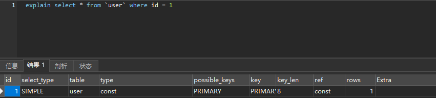

* id
    > id列数字越大越先执行，如果说数字一样大，那么就从上往下依次执行，id列为null的就表是这是一个结果集，不需要使用它来进行查询
  
* select_type
    > select查询的类型，主要是区别普通查询和联合查询、子查询之类的复杂查询
    * simple：表示不需要union操作或者不包含子查询的简单select查询。有连接查询时，外层的查询为simple，且只有一个
    * primary：一个需要union操作或者含有子查询的select，位于最外层的单位查询的select_type即为primary。且只有一个
    * union：union连接的两个select查询，第一个查询是dervied派生表，除了第一个表外，第二个以后的表select_type都是union
    * dependent union：与union一样，出现在union 或union all语句中，但是这个查询要受到外部查询的影响
    * union result：包含union的结果集，在union和union all语句中,因为它不需要参与查询，所以id字段为null
    * subquery：除了from字句中包含的子查询外，其他地方出现的子查询都可能是subquery
    * dependent subquery：与dependent union类似，表示这个subquery的查询要受到外部表查询的影响
    * derived：from字句中出现的子查询，也叫做派生表，其他数据库中可能叫做内联视图或嵌套select

* table
    > 显示的查询表名，如果查询使用了别名，那么这里显示的是别名，如果不涉及对数据表的操作，那么这显示为null，如果显示为尖括号括起来的<derived N>就表示这个是临时表，后边的N就是执行计划中的id，表示结果来自于这个查询产生。如果是尖括号括起来的<union M,N>，与<derived N>类似，也是一个临时表，表示这个结果来自于union查询的id为M,N的结果集

* type 
    > 联合查询所使用的类型，表示MySQL在表中找到所需行的方式，又称“访问类型”；扫描方式由快到慢：system，const，eq_ref，ref，fulltext，ref_or_null，unique_subquery，index_subquery，range，index_merge，index，ALL，除了all之外，其他的type都可以使用到索引，除了index_merge之外，其他的type只可以用到一个索引
    * system：表中只有一行数据或者是空表，且只能用于myisam和memory表。如果是Innodb引擎表，type列在这个情况通常都是all或者index
    * const：使用唯一索引或者主键，返回记录一定是1行记录的等值where条件时，通常type是const。其他数据库也叫做唯一索引扫描
    * eq_ref：出现在要连接过个表的查询计划中，驱动表只返回一行数据，且这行数据是第二个表的主键或者唯一索引，且必须为not null，唯一索引和主键是多列时，只有所有的列都用作比较时才会出现eq_ref
    * ref：不像eq_ref那样要求连接顺序，也没有主键和唯一索引的要求，只要使用相等条件检索时就可能出现，常见与辅助索引的等值查找。或者多列主键、唯一索引中，使用第一个列之外的列作为等值查找也会出现，总之，返回数据不唯一的等值查找就可能出现。
    * fulltext：全文索引检索，要注意，全文索引的优先级很高，若全文索引和普通索引同时存在时，mysql不管代价，优先选择使用全文索引
    * ref_or_null：与ref方法类似，只是增加了null值的比较。实际用的不多。
    * unique_subquery：用于where中的in形式子查询，子查询返回不重复值唯一值
    * index_subquery：用于in形式子查询使用到了辅助索引或者in常数列表，子查询可能返回重复值，可以使用索引将子查询去重。
    * range：索引范围扫描，常见于使用>,<,is null,between ,in ,like等运算符的查询中。
    * index_merge：表示查询使用了两个以上的索引，最后取交集或者并集，常见and ，or的条件使用了不同的索引，官方排序这个在ref_or_null之后，但是实际上由于要读取所个索引，性能可能大部分时间都不如range
    * index：索引全表扫描，把索引从头到尾扫一遍，常见于使用索引列就可以处理不需要读取数据文件的查询、可以使用索引排序或者分组的查询。
    * all：这个就是全表扫描数据文件，然后再在server层进行过滤返回符合要求的记录。

* key
    > 查询可能使用到的索引都会在这里列出来。如果没有索引被选择，键是NULL；select_type为index_merge时，这里可能出现两个以上的索引，其他的select_type这里只会出现一个

* key_len
    > 用于处理查询的索引长度，如果是单列索引，那就整个索引长度算进去，如果是多列索引，那么查询不一定都能使用到所有的列，具体使用到了多少个列的索引，这里就会计算进去，没有使用到的列，这里不会计算进去。留意下这个列的值，算一下你的多列索引总长度就知道有没有使用到所有的列了。要注意，mysql的ICP特性使用到的索引不会计入其中。另外，key_len只计算where条件用到的索引长度，而排序和分组就算用到了索引，也不会计算到key_len中
    ```shell
    # key_len 计算规则:
        # 字符串:
            # char(n): n字节长度
            
            # varchar(n): 
                # utf-8: 3n + 2 个字节长度，加的 2 字节用来存储字符串长度
                
                # utf8mb4: 4n + 2 个字节长度
                
        # 数值类型:
            # tinyint: 1字节
            
            # smallint: 2字节
            
            # int: 4字节
            
            # bigint: 8字节
            
        # 时间类型:
            # date: 3字节
            
            # timestamp: 4字节
            
            # datetime: 8字节
            
        # 如果字段允许为 NULL，需要 1 字节记录是否为 NULL
        
    # 索引最大长度时 768 字节，当字符串过长时，
        # MySQL 会做一个类似左前缀索引的处理，
        
        # 将前半部分的字符提取出来做索引。
    ```

* ref
    > 显示哪个字段或常数与key一起被使用；如果是使用的常数等值查询，这里会显示const，如果是连接查询，被驱动表的执行计划这里会显示驱动表的关联字段，如果是条件使用了表达式或者函数，或者条件列发生了内部隐式转换，这里可能显示为func

* rows
    > 表示mysql要遍历多少数据才能找到，不是精确值，表示MySQL根据表统计信息及索引选用情况，估算的找到所需的记录所需要读取的行数，在innodb上可能是不准确的

* Extra
    > 包含不适合在其他列中显示但十分重要的额外信息
    * distinct：在select部分使用了distinc关键字
    * no tables used：不带from字句的查询或者From dual查询
    * 使用not in()形式子查询或not exists运算符的连接查询，这种叫做反连接。即，一般连接查询是先查询内表，再查询外表，反连接就是先查询外表，再查询内表。
    * using filesort：排序时无法使用到索引时，就会出现这个。常见于order by和group by语句中
    * using index：查询时不需要回表查询，直接通过索引就可以获取查询的数据。
    * using join buffer（block nested loop），using join buffer（batched key accss）：5.6.x之后的版本优化关联查询的BNL，BKA特性。主要是减少内表的循环数量以及比较顺序地扫描查询。
    * using sort_union，using_union，using intersect，using sort_intersection：
      * using intersect：表示使用and的各个索引的条件时，该信息表示是从处理结果获取交集
      * using union：表示使用or连接各个使用索引的条件时，该信息表示从处理结果获取并集
      * using sort_union和using sort_intersection：与前面两个对应的类似，只是他们是出现在用and和or查询信息量大时，先查询主键，然后进行排序合并后，才能读取记录并返回。
    * using temporary：表示使用了临时表存储中间结果。临时表可以是内存临时表和磁盘临时表，执行计划中看不出来，需要查看status变量，used_tmp_table，used_tmp_disk_table才能看出来。
    * using where：表示存储引擎返回的记录并不是所有的都满足查询条件，需要在server层进行过滤。查询条件中分为限制条件和检查条件，5.6之前，存储引擎只能根据限制条件扫描数据并返回，然后server层根据检查条件进行过滤再返回真正符合查询的数据。5.6.x之后支持ICP特性，可以把检查条件也下推到存储引擎层，不符合检查条件和限制条件的数据，直接不读取，这样就大大减少了存储引擎扫描的记录数量。extra列显示using index condition
    * firstmatch(tb_name)：5.6.x开始引入的优化子查询的新特性之一，常见于where字句含有in()类型的子查询。如果内表的数据量比较大，就可能出现这个
    * loosescan(m..n)：5.6.x之后引入的优化子查询的新特性之一，在in()类型的子查询中，子查询返回的可能有重复记录时，就可能出现这个

* filtered
  > 使用explain extended时会出现这个列，5.7之后的版本默认就有这个字段，不需要使用explain extended了。这个字段表示存储引擎返回的数据在server层过滤后，剩下多少满足查询的记录数量的比例，注意是百分比，不是具体记录数
  
### explain中的type详解
#### system
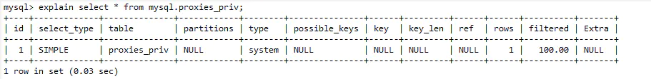<br>
上例中，从系统库mysql的系统标proxies_priv里查询数据，这里的数据在Mysql服务启动时候已经加载在内存中，不需要进行磁盘IO。
官方文档中的解释：该表只有一行（=系统表）。这是const联接类型的特例

#### const
模拟数据
```sql
create table user (
  id int primary key,
  name varchar(20)
)engine=innodb;

insert into user values(1,'ar414');
insert into user values(2,'zhangsan');
insert into user values(3,'lisi');
insert into user values(4,'wangwu');
```
复制代码Explain分析结果<br>
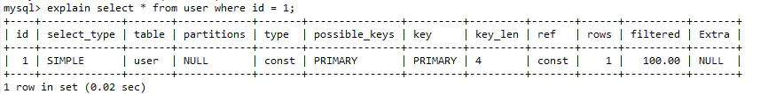

上例中id是主键(primary key)，连接部分是常量1，通过索引一次就能找到，速度非常快
场景：

命中主键(primary key)或者唯一索引(unique)
被连接的部分是一个常量值(const)

#### eq_ref
模拟数据
```sql
create table user (
    id int primary key,
    name varchar(20)
)engine=innodb;

insert into user values(1,'ar414');
insert into user values(2,'zhangsan');
insert into user values(3,'lisi');
insert into user values(4,'wangwu');

create table user_balance (
    uid int primary key,
    balance int
)engine=innodb;

insert into user_balance values(1,100);
insert into user_balance values(2,200);
insert into user_balance values(3,300);
insert into user_balance values(4,400);
insert into user_balance values(5,500);
```
复制代码Explain分析结果<br>
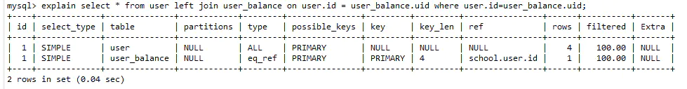

上例中对于前表user表中的每一行（row），对应后user_balance表只有一行被扫描，这类扫描的速度也非常的快
场景：
  * 联表(join)查询
  * 命中主键(primary key)或者非空唯一索引(unique not null)
  * 等值连接

#### ref
模拟数据
> 同eq_ref模拟数据区别：user_balance表中的主键索引改为普通索引

```sql
create table user (
    id int primary key,
    name varchar(20)
)engine=innodb;

insert into user values(1,'ar414');
insert into user values(2,'zhangsan');
insert into user values(3,'lisi');
insert into user values(4,'wangwu');

create table user_balance (
    uid int,
    balance int,
    index(uid)
)engine=innodb;

insert into user_balance values(1,100);
insert into user_balance values(2,200);
insert into user_balance values(3,300);
insert into user_balance values(4,400);
insert into user_balance values(5,500);
```
复制代码Explain分析结果
* 联表查询<br>
  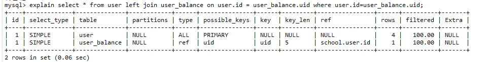
  > 由于后表使用了普通非唯一索引，对于前表user表的每一行(row)，后表user_balance表可能有多于一行的数据被扫描

* 单表查询<br>
  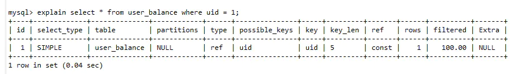
  > 当id改为普通非唯一索引后，常量的连接查询，也由const降级为了ref，因为非唯一索引所以有多于一行的数据被可能被扫描；ref每一次匹配可能有多行数据返回，虽然它比eq_ref要慢，但它仍然是一个很快的join类型
  * 场景：
    * 联表查询 
    * 普通非唯一索引

#### range
模拟数据
```sql
create table user (
    id int primary key,
    name varchar(20)
)engine=innodb;

insert into user values(1,'ar414');
insert into user values(2,'zhangsan');
insert into user values(3,'lisi');
insert into user values(4,'wangwu');
insert into user values(5,'zhaoliu');
```
复制代码Explain分析结果
* between<br>
  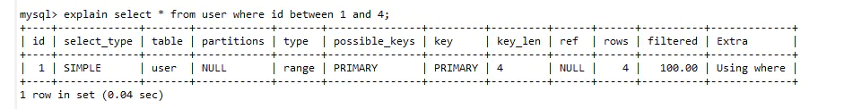
* in<br>
  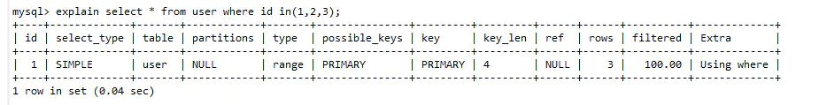
* `>,>=,<,<=`<br>
  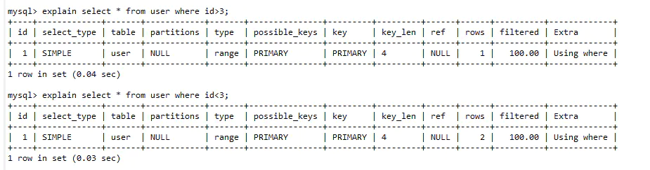
range比较好理解，它是索引上的范围查询，它会在索引上扫码特定范围内的值

#### index
> 话外音：当前测试表为InnoDb，MyISAM 内置了一个计数器，count()时它直接从计数器中读

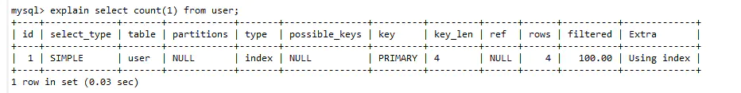<br>
index类型，需要扫描索引上的全部数据，它仅比全表扫描快一点

#### ALL
模拟数据
```sql
create table user (
  id int,
  name varchar(20)
)engine=innodb;

insert into user values(1,'ar414');
insert into user values(2,'zhangsan');
insert into user values(3,'lisi');
insert into user values(4,'wangwu');
insert into user values(5,'zhaoliu');
```
复制代码Explain分析结果<br>
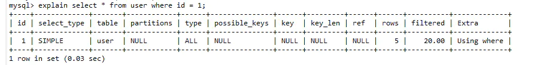<br>
如果id上不建索引,则全表扫描
