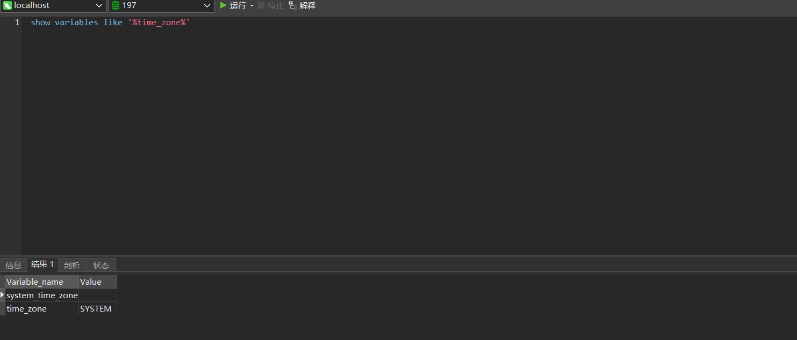
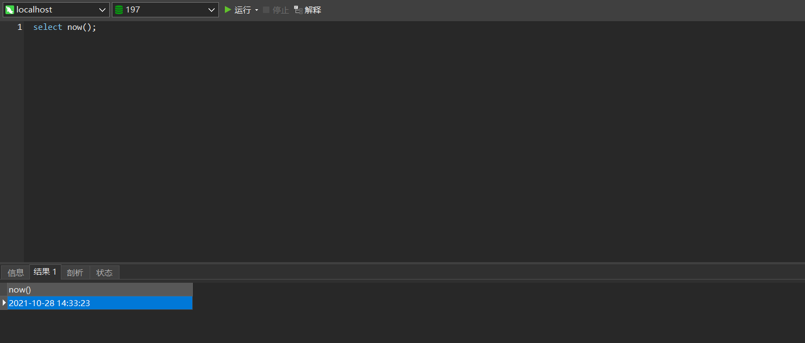
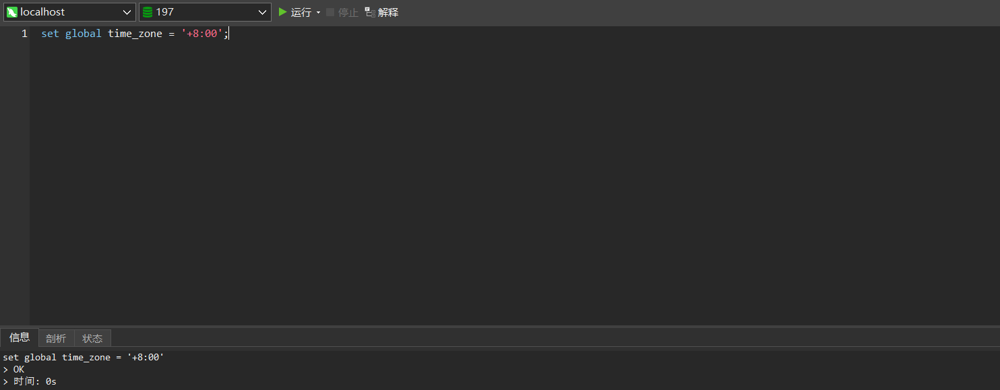
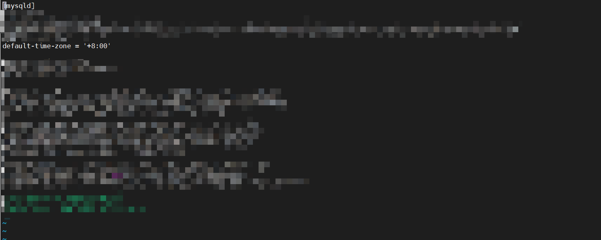

## Linux下修改Mysql时区

### 命令设置
#### 查看Mysql当前使用时区
```shell
show variables like '%time_zone%';
```


#### 查看当前数据库时间
```shell
select now();
```


#### 设置东八区时间
```shell
set global time_zone = '+8:00';
```


### 配置文件设置
#### 修改my.cnf文件，添加
```shell
default-time-zone = '+8:00'
```

