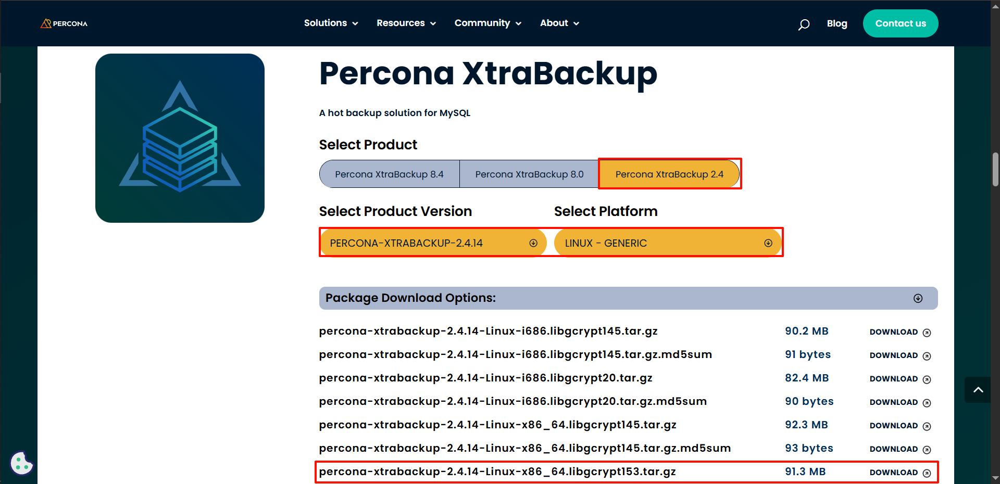

## XtraBackup热备工具操作说明

[toc]

### 环境说明
* Centos 7.9 x86
* Mysql 5.7
* XtraBackup 2.4.14
* 数据库大小：491GB

### 工具下载
[官方下载地址](https://www.percona.com/downloads)



**下载完成后，上传到数据库服务器（根据数据库所在服务器配置下载对应的工具包）**

### 数据库前期数据查看
```shell
# 查看数据库版本（下面只是其中一种，可以使用其它方式）
mysql  -h数据库IP -P数据库端口 -u数据库帐号 -p'数据库密码' -D数据库 -e "SELECT VERSION();"

# 清理数据库视图（可做可不做系列）
## 生成清理视图sql，然后复制这些sql进行批量清理
SELECT CONCAT('DROP VIEW IF EXISTS `', table_schema, '`.`', table_name, '`;') AS stmt
FROM information_schema.views
WHERE table_schema = '数据库名称';
## 然后执行生成的一堆语句

# 查看数据库大小，xback工具备份出来的数据存在空间不够
SELECT 
    table_schema AS 'Database',
    ROUND(SUM(data_length + index_length) / 1024 / 1024 / 1024, 2) AS 'Size_GB'
FROM 
    information_schema.tables
WHERE 
    table_schema = '数据库名称'
GROUP BY 
    table_schema;
    
# 查看 MySQL 数据目录；备份的时候如果使用国内封装后的国产mysql数据库，需要找到数据目录指定给xback中的datadir
mysql  -h数据库IP -P数据库端口 -u数据库帐号 -p'数据库密码' -e "SHOW VARIABLES LIKE 'datadir';"
```

### 数据备份
```shell
# xback执行备份
## 数据源文件位置，通过命令查找：SHOW VARIABLES LIKE 'datadir';
/bin/xtrabackup --backup --close-files \
--datadir=/data/teledb/p1/
--target-dir=/apps/data/sqlbak \
--user=root --password -host=10.238.9.63 --port=8921
```
* --backup
  * 指定执行备份操作（这是必须的）。如果不加，xtrabackup 会报错或执行其他操作模式。
* --close-files
  * **当系统当前会话的文件句柄限制过低会报错，可以通过这个参数关闭多文件句柄**（0是开启，1是关闭）；在备份完成后关闭所有打开的文件描述符，可以避免文件句柄过多的问题，适合大量数据或多实例情况下使用。
* --datadir=...
  * 指定 MySQL 数据目录，即当前正在运行的 MySQL 实例的数据存储路径。这个目录中包含数据文件（如 .ibd, .frm, .ib_logfile*, ibdata1 等）。
* --target-dir=...
  * 备份文件的输出目录，即将备份数据保存到这个路径下。该目录必须为空或不存在（否则报错），xtrabackup 会创建它。
* --user=root
  * 用于连接 MySQL 的用户名，xtrabackup 需要通过 MySQL 的连接来获取 InnoDB 的元信息等。
* --password=...
  * 与 --user 一起使用，指定连接 MySQL 时的密码。注意：这里明文传递密码存在安全风险，建议使用配置文件或者交互式输入（或使用 --password 而不跟密码，让系统提示输入）。
* -host=127.0.0.1
  * 与 --user 一起使用，指定连接 MySQL 时的数据库IP
* --port=3306
  * 与 --user 一起使用，指定连接 MySQL 时的数据库端口

### 数据恢复
```shell

```

### Percona XtraBackup 与 MySQL 版本兼容对应关系
> Percona XtraBackup 作为 MySQL 数据库备份工具，不同版本支持不同的 MySQL 版本。以下是主要 XtraBackup 版本与 MySQL 版本的对应关系：

#### XtraBackup 8.0 系列
XtraBackup 8.0.x：兼容 MySQL 8.0.x

同时向下兼容 MySQL 5.7
不支持 MySQL 8.1 及更高版本

#### XtraBackup 2.4 系列
XtraBackup 2.4.x：主要兼容 MySQL 5.7.x

同时向下兼容 MySQL 5.6 和 5.5
不支持 MySQL 8.0 及更高版本

#### XtraBackup 2.3 系列
XtraBackup 2.3.x：主要兼容 MySQL 5.6.x

同时向下兼容 MySQL 5.5
不支持 MySQL 5.7 及更高版本

#### XtraBackup 2.0/2.1/2.2 系列
XtraBackup 2.0-2.2：主要兼容 MySQL 5.5.x

部分版本向下兼容 MySQL 5.1 和 5.0
不支持 MySQL 5.6 及更高版本

#### 重要注意事项
建议尽量匹配 XtraBackup 主版本号与 MySQL 主版本号
备份和恢复操作最好使用相同版本的 XtraBackup
对于 MariaDB，需参考对应的 MariaDB 版本与 MySQL 版本的兼容性
产品环境使用前应在测试环境验证备份和恢复功能

选择 XtraBackup 版本时，请根据您的 MySQL 具体版本参考 Percona 官方文档获取最准确的兼容性信息。

### 异常处理

#### XtraBackup "Too many open files" 
```shell
InnoDB: Operating system error number 24 in a file operation.
InnoDB: Error number 24 means 'Too many open files'
InnoDB: File ./sca/c_v_s_separate_076fe4dc30ce4deda041aa49f99bd1c1.ibd: 'open' returned OS error 124. Cannot continue operation
InnoDB: Cannot continue operation.
```
解决方案
1. 临时提高当前会话的文件句柄限制
```shell
# 检查当前限制
ulimit -n

# 临时提高限制（仅对当前会话有效）
ulimit -n 65536

# 然后重试备份命令
```
2. 特定于 XtraBackup 的选项
> XtraBackup 2.4 版本可以尝试使用以下参数来减少打开文件数

```shell
# 在备份命令中添加
--close-files
```

#### XtraBackup 连接失败
```shell
Failed to connect to MySQL server: DBD::mysql::db connect('mysql_read_default_group=xtrabackup','root'...) failed: Can't connect to local MySQL server through socket '/var/lib/mysql/mysql.sock'
```
解决方案
1. 指定正确的 socket 文件（**不推荐**）
```shell
./xtrabackup --backup --datadir=通过SHOW查找到的数据库源文件位置 \
--target-dir=指定备份数据存放位置 \
--user=数据库帐号 --password --socket=/run/mysqld/mysqld.sock
```
* 通过自定mysql执行文件位置：--socket=/run/mysqld/mysqld.sock

2. 使用 TCP/IP 连接代替 socket（**推荐**）
```shell
./xtrabackup --backup --datadir=通过SHOW查找到的数据库源文件位置 \
--target-dir=指定备份数据存放位置 \
--user=数据库帐号 --password --host=数据库IP --port=数据库端口
```
* 通过指定数据库地址和端口：--host=127.0.0.1 --port=3306