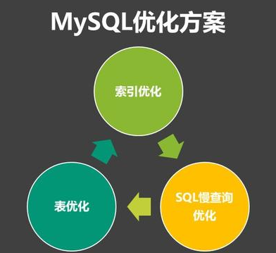
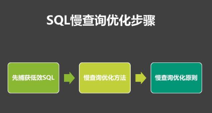

## MySQL优化概述 

MySQL数据库常见的两个瓶颈是：CPU和I/O的瓶颈。

CPU在饱和的时候一般发生在**数据装入内存或从磁盘上读取数据时候**。

磁盘I/O瓶颈发生在装入数据远大于内存容量的时候，如果应用分布在网络上，**那么查询量相当大的时候那么平瓶颈就会出现在网络上。**

我们可以用mpstat, iostat, sar和vmstat来查看系统的性能状态。除了服务器硬件的性能瓶颈，对于MySQL系统本身，我们可以使用工具来优化数据库的性能。

## MySQL优化方案 

**Mysql的优化，大体可以分为三部分：`索引的优化，sql语句的优化，表的优化`**



### 索引优化 

**1.索引**

一般的应用系统，读写比例在10：1左右，而且插入操作和一般的更新操作很少出现性能问题，在生产环境中，我们遇到最多的也是最容易出现问题的，还是一些复杂的查询操作，因此对查询语句的优化是重中之重，**加速查询最好的方法就是索引。**

索引：简单的说，相当于图书的目录，可以帮助用户快速的找到需要的内容。

在MySQL中也叫做“键”，是存储引擎用于快速找到记录的一种数据结构。能够大大提高查询效率。特别是当数据量非常大，查询涉及多个表时，使用索引往往能使查询速度加快成千上万倍。

总结：索引的目的在于提高查询效率，与我们查询图书所用的目录是一个道理：先定位到章，然后定位到该章下的一个小结，然后找到页数。相似的例子还有：查字典，查地图等。

**2.索引类型**

-  普通索引

> 是最基本的索引，它没有任何限制。

-  唯一索引

```
与前面的普通索引类似，不同的就是：索引列的值必须唯一，但允许有空值。如果是组合索引，则列值的组合必须唯一。
```

-  组合索引

```
指多个字段上创建的索引，只有在查询条件中使用了创建索引时的第一个字段，索引才会被使用。
```

-  主键索引

> 是一种特殊的唯一索引，一个表只能有一个主键，不允许有空值。一般是在建表的时候同时创建主键索引

-  全文索引

> 主要用来查找文本中的关键字，而不是直接与索引中的值相比较。fulltext索引跟其它索引大不相同，它更像是一个搜索引擎，而不是简单的where语句的参数匹配。fulltext索引配合match against操作使用，而不是一般的where语句加like。它可以在create table，alter table ，create index使用，不过目前只有char、varchar，text 列上可以创建全文索引。值得一提的是，在数据量较大时候，现将数据放入一个没有全局索引的表中，然后再用CREATE index创建fulltext索引，要比先为一张表建立fulltext然后再将数据写入的速度快很多。

**3.索引优化**

-  只要列中含有NULL值，就最好不要在此例设置索引，复合索引如果有NULL值，此列在使用时也不会使用索引
-  尽量使用短索引，如果可以，应该制定一个前缀长度
-  对于经常在where子句使用的列，最好设置索引，这样会加快查找速度
-  对于有多个列where或者order by子句的，应该建立复合索引
-  对于like语句，以%或者‘-’开头的不会使用索引，以%结尾会使用索引
-  尽量不要在列上进行运算（函数操作和表达式操作）
-  尽量不要使用not in和<>操作

### SQL慢查询的优化 



**1.如何捕获低效sql**

`slow_query_log`

这个参数设置为ON，可以捕获执行时间超过一定数值的SQL语句。

`ong_query_time`

当SQL语句执行时间超过此数值时，就会被记录到日志中，建议设置为1或者更短。

`slow_query_log_file`

记录日志的文件名。

`log_queries_not_using_indexes`

这个参数设置为ON，可以捕获到所有未使用索引的SQL语句，尽管这个SQL语句有可能执行得挺快。

**2.慢查询优化的基本步骤**

1)先运行看看是否真的很慢，注意设置SQL_NO_CACHE

2)where条件单表查，锁定最小返回记录表。这句话的意思是把查询语句的where都应用到表中返回的记录数最小的表开始查起，单表每个字段分别查询，看哪个字段的区分度最高

3)explain查看执行计划，是否与1预期一致（从锁定记录较少的表开始查询）

4)order by limit 形式的sql语句让排序的表优先查

5)了解业务方使用场景

6)加索引时参照建索引的几大原则

7)观察结果，不符合预期继续从1开始分析

**2.优化原则**

-  查询时，能不要*就不用*，尽量写全字段名
-  大部分情况连接效率远大于子查询
-  多使用explain和profile分析查询语句
-  查看慢查询日志，找出执行时间长的sql语句优化
-  多表连接时，尽量小表驱动大表，即小表 join 大表
-  在千万级分页时使用limit
-  对于经常使用的查询，可以开启缓存

### 数据库表优化 

-  表的字段尽可能用NOT NULL
-  字段长度固定的表查询会更快
-  把数据库的大表按时间或一些标志分成小表
-  将表拆分

数据表拆分：主要就是垂直拆分和水平拆分。

水平切分:将记录散列到不同的表中，各表的结构完全相同，每次从分表中查询, 提高效率。

垂直切分:将表中大字段单独拆分到另外一张表, 形成一对一的关系。

## **总之：** 

Mysql的优化主要就在于：索引的优化，sql语句的优化，表的优化，在高并发网络环境下，除了优化数据库外，还会涉及到分布式缓存，CDN，数据库读写分离等高并发优化技术。