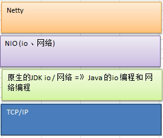

## Netty 的介绍
* Netty 是由 JBOSS 提供的一个 Java 开源框架，现为 Github 上的独立项目
* Netty 是一个异步的、基于事件驱动的网络应用框架，用以快速开发高性能、高可靠性的网络 IO 程序
* Netty 主要针对在 TCP 协议下，面向 Clients 端的高并发应用，或者 Peer-to-Peer 场景下的大量数据持续传输的应用
* Netty 本质是一个 NIO 框架，适用于服务器通讯相关的多种应用场景

#### 体系图

## Netty 的应用场景
> 互联网行业
* 在分布式系统中，各个节点之间需要远程服务调用，高性能的 RPC 框架必不可少，Netty 作为异步高性能的通信框架，往往作为基础通信组件被这些 RPC 框架使用。
* 典型的应用有 阿里巴巴分布式服务框架 Dubbo 的 RPC 框架使用 Dubbo 协议进行节点间通信，Dubbo 协议默认使用 Netty 作为基础通信组件，用于实现各进程节点之间的内部通信。
> 游戏行业
* Netty 作为高性能的基础通信组件，提供了 TCP/UDP 和 HTTP 协议栈，方便定制和开发私有协议栈，账号登录服务器。
* 地图服务器之间可以方便的通过 Netty 进行高性能的通信
> 大数据行业
* 经典的 Hadoop 的高性能通信和序列化组件<AVRO 实现数据文件共享> 的RPC 框架，默认采用 Netty 进行跨界点通信。
* 它的 Netty Service 基于 Netty 实现二次封装
> 其它的netty开源项目
<https://netty.io/wiki/related-projects.html>