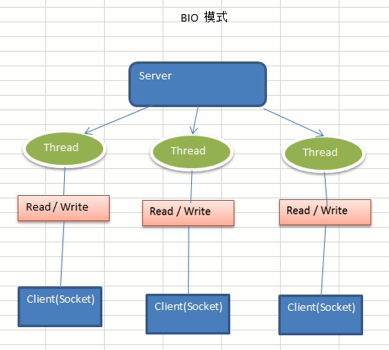
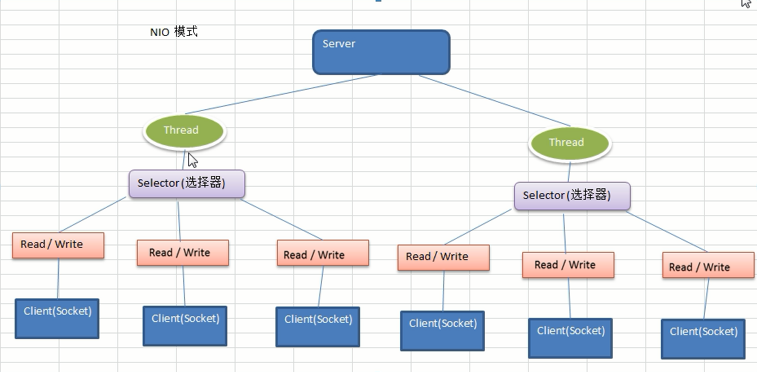

## I/O 模型
> 就是用什么样的通道进行数据的发送和接收，很大程度上决定了程序通信的性能

#### Java共支持3种网络编程模型/IO模式
> BIO、NIO、AIO
* Java BIO
> 同步并阻塞(传统阻塞型)，服务器实现模式为一个连接一个线程，即客户端有连接请求时服务器端就需要启动一个线程进行处理，如果这个连接不做任何事情会造成不必要的线程开销 【简单示意图】

* Java NIO 
> 同步非阻塞，服务器实现模式为一个线程处理多个请求(连接)，即客户端发送的连接请求都会注册到多路复用器上，多路复用器轮询到连接有I/O请求就进行处理 【简单示意图】

* Java AIO(NIO.2)【JDK1.7引用，目前还没有广泛的应用】
> 异步非阻塞，AIO 引入异步通道的概念，采用了 Proactor 模式，简化了程序编写，有效的请求才启动线程，它的特点是先由操作系统完成后才通知服务端程序启动线程去处理，一般适用于连接数较多且连接时间较长的应用

#### BIO/NIO/AIO适用场景
1. BIO方式适用于连接数目比较小且固定的架构，这种方式对服务器资源要求比较高，并发局限于应用中，JDK1.4以前的唯一选择，但程序简单易理解。
2. NIO方式适用于连接数目多且连接比较短（轻操作）的架构，比如聊天服务器，弹幕系统，服务器间通讯等。编程比较复杂，JDK1.4开始支持。
3. AIO方式使用于连接数目多且连接比较长（重操作）的架构，比如相册服务器，充分调用OS参与并发操作，编程比较复杂，JDK7开始支持。
