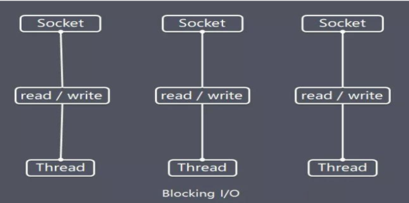

## BIO
> Java BIO 就是传统的java io 编程，其相关的类和接口在 java.io 

#### BIO(blocking I/O)
同步阻塞，服务器实现模式为一个连接一个线程，即客户端有连接请求时服务器端就需要启动一个线程进行处理，如果这个连接不做任何事情会造成不必要的线程开销，可以通过线程池机制改善(实现多个客户连接服务器)。 【后有应用实例】
BIO方式适用于连接数目比较小且固定的架构，这种方式对服务器资源要求比较高，并发局限于应用中，JDK1.4以前的唯一选择，程序简单易理解

#### BIO工作原理图

```shell
1.服务器端启动一个ServerSocket
2.客户端启动Socket对服务器进行通信，默认情况下服务器端需要对每个客户 建立一个线程与之通讯
3.客户端发出请求后, 先咨询服务器是否有线程响应，如果没有则会等待，或者被拒绝
4.如果有响应，客户端线程会等待请求结束后，在继续执行
```
#### BIO存在的问题
* 每个请求都需要创建独立的线程，与对应的客户端进行数据 Read，业务处理，数据 Write 。
* 当并发数较大时，需要创建大量线程来处理连接，系统资源占用较大。
* 连接建立后，如果当前线程暂时没有数据可读，则线程就阻塞在 Read 操作上，造成线程资源浪费


#### 案例
使用BIO模型编写一个服务器端，监听6666端口，当有客户端连接时，就启动一个线程与之通讯。
要求使用线程池机制改善，可以连接多个客户端.
服务器端可以接收客户端发送的数据(telnet 方式即可)。
```java
/**
 * Author : GuDao
 * 2020-11-12
 */
public class NettyBioServer {
    public static void main(String[] args) {
        //创建线程池
        ExecutorService newCachedThreadPool = Executors.newCachedThreadPool();
        try {
            //创建serviceSocket，监听端口8888中的连接
            ServerSocket serverSocket = new ServerSocket(8888);

            System.out.println("等待连接");
            final Socket socket = serverSocket.accept();
            System.out.println("连接成功");

            //创建线程读取内容
            newCachedThreadPool.execute(new Runnable() {
                public void run() {
                    System.out.println(Thread.currentThread().getName()+"进入了连接");
                    handler(socket);
                }
            });
        } catch (IOException e) {
            e.printStackTrace();
        }
    }

    //拦截端口中的消息
    public static void handler(Socket socket){
        InputStream inputStream = null;
        try {
            //获取输入流
            inputStream = socket.getInputStream();
            byte[] bytes = new byte[1024];

            while (true){
                int read = inputStream.read(bytes);
                if(read > -1){
                    //byte转换为string打印
                    System.out.println(Thread.currentThread().getName()+"读取信息："+new String(bytes,0,read));
                }
            }
        } catch (IOException e) {
            e.printStackTrace();
        }
    }
}
```
#### windows下的selnet命令打开


#### 代码调试步骤
1. 运行代码
2. 运行cmd，打开dos窗口，输入telnet 启动项目的ip 端口
3. Ctrl+]键，使其能操作命令行
4. 输入send 内容，向后台发送信息