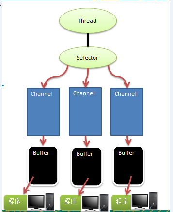

## NIO

#### 介绍说明
* Java NIO 全称 java non-blocking IO，是指 JDK 提供的新 API。从 JDK1.4 开始，Java 提供了一系列改进的输入/输出的新特性，被统称为 NIO(即 New IO)，是同步非阻塞的
* NIO 相关类都被放在 java.nio 包及子包下，并且对原 java.io 包中的很多类进行改写。【基本案例】
* NIO 有三大核心部分
    * Channel(通道)，Buffer(缓冲区), Selector(选择器) 
* NIO是 面向缓冲区 ，或者面向 块 编程的。数据读取到一个它稍后处理的缓冲区，需要时可在缓冲区中前后移动，这就增加了处理过程中的灵活性，使用它可以提供非阻塞式的高伸缩性网络
* 【NIO是基于事件驱动的】Java NIO的非阻塞模式，使一个线程从某通道发送请求或者读取数据，但是它仅能得到目前可用的数据，如果目前没有数据可用时，就什么都不会获取，而不是保持线程阻塞，所以直至数据变的可以读取之前，该线程可以继续做其他的事情。 非阻塞写也是如此，一个线程请求写入一些数据到某通道，但不需要等待它完全写入，这个线程同时可以去做别的事情。【后面有案例说明】
* 通俗理解：NIO是可以做到用一个线程来处理多个操作的。假设有10000个请求过来,根据实际情况，可以分配50或者100个线程来处理。不像之前的阻塞IO那样，非得分配10000个。
* HTTP2.0使用了多路复用的技术，做到同一个连接并发处理多个请求，而且并发请求的数量比HTTP1.1大了好几个数量级。

#### NIO与BIO比较
* BIO 以流的方式处理数据,而 NIO 以块的方式处理数据,块 I/O 的效率比流 I/O 高很多
* BIO 是阻塞的，NIO 则是非阻塞的
* BIO基于字节流和字符流进行操作，而 NIO 基于 Channel(通道)和 Buffer(缓冲区)进行操作，数据总是从通道读取到缓冲区中，或者从缓冲区写入到通道中。Selector(选择器)用于监听多个通道的事件（比如：连接请求，数据到达等），因此使用单个线程就可以监听多个客户端通道 

#### NIO三大核心模块关系图

1. 每个channel 都会对应一个Buffer
2. Selector 对应一个线程， 一个线程对应多个channel(连接)
3. 该图反应了有三个channel 注册到 该selector //程序
4. 程序切换到哪个channel 是有事件决定的, Event 就是一个重要的概念
5. Selector 会根据不同的事件，在各个通道上切换
6. Buffer 就是一个内存块 ， 底层是有一个数组
7. 数据的读取写入是通过Buffer, 这个和BIO , **BIO 中要么是输入流，或者是输出流, 不能双向，但是NIO的Buffer 是可以读也可以写, 需要 flip 方法切换**
8. **channel 是双向的**, 可以返回底层操作系统的情况, 比如Linux ， 底层的操作系统通道就是双向的.
