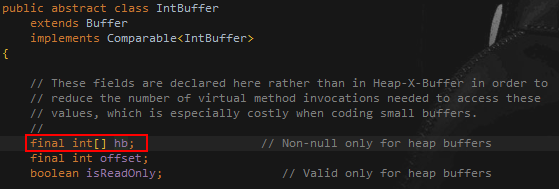
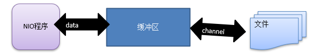
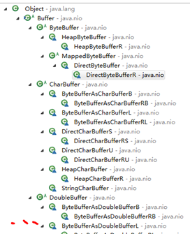
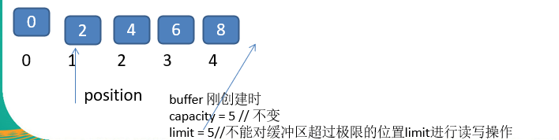
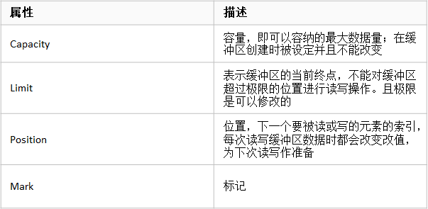

##　Buffer【缓冲区】
> Buffer中的数据真实存储的位置


#### 简单说明
缓冲区（Buffer）：缓冲区本质上是一个可以读写数据的内存块，可以理解成是一个容器对象(含数组)，该对象提供了一组方法，可以更轻松地使用内存块，缓冲区对象内置了一些机制，能够跟踪和记录缓冲区的状态变化情况。Channel 提供从文件、网络读取数据的渠道，但是读取或写入的数据都必须经由 Buffer，如图：<br>


#### Buffer 类及其子类
> 在 NIO 中，Buffer 是一个顶层父类，它是一个抽象类, 类的层级关系图


#### Buffer子类
    ByteBuffer，存储字节数据到缓冲区
    ShortBuffer，存储字符串数据到缓冲区
    CharBuffer，存储字符数据到缓冲区
    IntBuffer，存储整数数据到缓冲区
    LongBuffer，存储长整型数据到缓冲区
    DoubleBuffer，存储小数到缓冲区
    FloatBuffer，存储小数到缓冲区

#### Buffer类定义了所有的缓冲区都具有的四个属性来提供关于其所包含的数据元素的信息
```shell
// Invariants: mark <= position <= limit <= capacity
    private int mark = -1;
    private int position = 0;
    private int limit;
    private int capacity;
```

##### 参数说明


#### Buffer方法说明
```java
public abstract class Buffer {
    //JDK1.4时，引入的api
    /*常用*/public final int capacity( );//返回此缓冲区的容量
    /*常用*/public final int position( );//返回此缓冲区的位置
    /*常用*/public final Buffer position (int newPositio);//设置此缓冲区的位置
    /*常用*/public final int limit( );//返回此缓冲区的限制
    /*常用*/public final Buffer limit (int newLimit);//设置此缓冲区的限制
    public final Buffer mark( );//在此缓冲区的位置设置标记
    public final Buffer reset( );//将此缓冲区的位置重置为以前标记的位置
    public final Buffer clear( );//清除此缓冲区, 即将各个标记恢复到初始状态，但是数据并没有真正擦除, 后面操作会覆盖
    public final Buffer flip( );//反转此缓冲区
    public final Buffer rewind( );//重绕此缓冲区
    public final int remaining( );//返回当前位置与限制之间的元素数
    /*常用*/public final boolean hasRemaining( );//告知在当前位置和限制之间是否有元素
    /*常用*/public abstract boolean isReadOnly( );//告知此缓冲区是否为只读缓冲区
 
    //JDK1.6时引入的api
    /*常用*/public abstract boolean hasArray();//告知此缓冲区是否具有可访问的底层实现数组
    /*常用*/public abstract Object array();//返回此缓冲区的底层实现数组
    public abstract int arrayOffset();//返回此缓冲区的底层实现数组中第一个缓冲区元素的偏移量
    public abstract boolean isDirect();//告知此缓冲区是否为直接缓冲区
}
```
#### ByteBuffer
> ByteBuffer 类（二进制数据）
```java
public abstract class ByteBuffer {
    //缓冲区创建相关api
    public static ByteBuffer allocateDirect(int capacity);//创建直接缓冲区
    public static ByteBuffer allocate(int capacity);//设置缓冲区的初始容量
    public static ByteBuffer wrap(byte[] array);//把一个数组放到缓冲区中使用
    
    //构造初始化位置offset和上界length的缓冲区
    public static ByteBuffer wrap(byte[] array,int offset, int length);
    
     //缓存区存取相关API
    public abstract byte get( );//从当前位置position上get，get之后，position会自动+1
    public abstract byte get (int index);//从绝对位置get
    public abstract ByteBuffer put (byte b);//从当前位置上添加，put之后，position会自动+1
    public abstract ByteBuffer put (int index, byte b);//从绝对位置上put
 }
```

#### Buffer测试案例
```java
public class NettyNioBuffer {
    public static void main(String[] args) {
        //设置一个新的缓冲区
        IntBuffer buffer = IntBuffer.allocate(5);

        /**
         * capacity：返回此缓冲去的容量
         */
        for (int i = 0; i < buffer.capacity(); i++) {
            buffer.put(i);
        }

        /**
         * 反转此缓冲区
         *
         * 限制被设置为当前位置，然后将位置被设置为零。 如果标记被定义然后它被丢弃。
         * 序列后通道读取或放置操作，调用此方法为通道写入或相对get操作的顺序做准备。 例如：
         *        buf.put(magic);    // 前置 header
         *        in.read(buf);      // 将数据读入其余缓冲区
         *        buf.flip();        // 翻转 buffer
         *        out.write(buf);    // 将 header + data 写入通道
         */
        buffer.flip();

        /**
         * hasRemaining：判断缓冲区中是否还有参数
         */
        while (buffer.hasRemaining()){
            /**
             * get：读取此缓冲区当前位置的int和然后该位置递增
             */
            System.out.printf("%d",buffer.get());
        }
    }
}
```