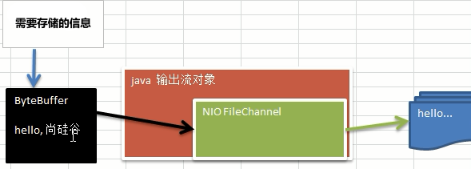
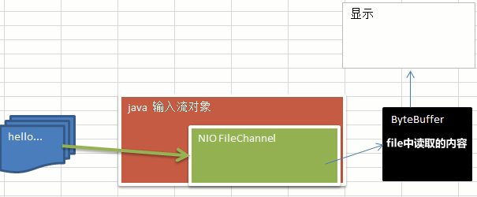

## Chinnal
> chinnal类似于流
* 通道可以同时进行读写，而流只能读或者只能写
* 通道可以实现异步读写数据
* 通道可以从缓冲读数据，也可以写数据到缓冲: 

* **BIO 中的 stream 是单向的**，例如 FileInputStream 对象只能进行读取数据的操作，而**NIO 中的通道(Channel)是双向的，可以读操作，也可以写操作**。
* Channel在NIO中是一个接口 public interface Channel extends Closeable{} 

#### 常用的 Channel 类有
> FileChannel、DatagramChannel、ServerSocketChannel 和 SocketChannel。

        ServerSocketChanne 类似 ServerSocket 
        SocketChannel 类似 Socket
    FileChannel 用于文件的数据读写
    DatagramChannel 用于 UDP 的数据读写
    ServerSocketChannel 和 SocketChanneSocketChannel 用于 TCP 的数据读写
    
#### FileChannel 类
> FileChannel主要用来对本地文件进行 IO 操作，常见的方法有
```shell
public int read(ByteBuffer dst) ，从通道读取数据并放到缓冲区中
public int write(ByteBuffer src) ，把缓冲区的数据写到通道中
public long transferFrom(ReadableByteChannel src, long position, long count)，从目标通道中复制数据到当前通道
public long transferTo(long position, long count, WritableByteChannel target)，把数据从当前通道复制给目标通道
```
#### Buffer 和 Channel的注意事项和细节
* ByteBuffer 支持类型化的put 和 get, put 放入的是什么数据类型，get就应该使用相应的数据类型来取出，否则可能有 BufferUnderflowException 异常。
* 可以将一个普通Buffer 转成只读Buffer
* NIO 还提供了 MappedByteBuffer，可以让文件直接在内存（堆外的内存）中进行修改， 而如何同步到文件，由NIO来完成
* 前面我们讲的读写操作，都是通过一个Buffer完成的，NIO 还支持 通过多个Buffer (即 Buffer 数组) 完成读写操作，即 Scattering 和 Gathering

#### 文件数据通过fileChinnal存储

```java
/**
 * Author : GuDao
 * 2020-11-13
 */
public class NioFilleChinnal {
    public static void main(String[] args) throws IOException {
        //创建输出流，指定输出文件
        FileOutputStream stream = new FileOutputStream("F:\\test.txt");

        //将数据存入byteBuffer中
        String info = "test";
        ByteBuffer byteBuffer = ByteBuffer.allocate(1024);
        byteBuffer.put(info.getBytes());

        //创建file通道
        //通过fileinputstream获取对应的Filechannel->实际类型FilechannelImpl
        FileChannel channel = stream.getChannel();

        //数据反转
        byteBuffer.flip();

        //将buffer数据写入chinnal中
        channel.write(byteBuffer);

        //关闭通道
        channel.close();
    }
}
```
#### 文件数据通过fileChinnal读取

```java
/**
 * Author : GuDao
 * 2020-11-13
 */
public class NioFileChinnalReadFile {
    public static void main(String[] args) throws Exception {
        //创建文件类
        File file = new File("F:\\test.txt");

        //创建输入流读取文件中内容
        FileInputStream inputStream = new FileInputStream(file);

        //创建Buffer
        ByteBuffer byteBuffer = ByteBuffer.allocate((int) file.length());

        //创建chinnal通道，将数据放到buffer中
        FileChannel channel = inputStream.getChannel();
        channel.read(byteBuffer);

        //打印数据
        System.out.println(new String(byteBuffer.array()));

        //关闭通道
        channel.close();
    }
}
```
#### 通过fileBuffer完成文件的拷贝


