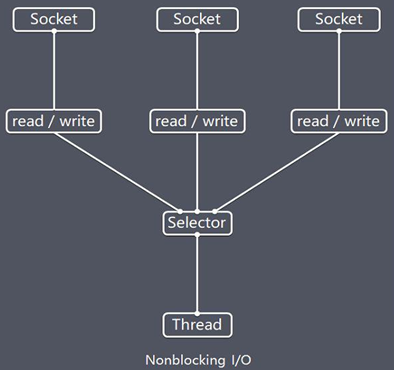

## Selector
> Java 的 NIO，用非阻塞的 IO 方式。可以用一个线程，处理多个的客户端连接，就会使用到Selector(选择器)
* Selector 能够检测多个注册的通道上是否有事件发生(注意:多个Channel以事件的方式可以注册到同一个Selector)，如果有事件发生，便获取事件然后针对每个事件进行相应的处理。这样就可以只用一个单线程去管理多个通道，也就是管理多个连接和请求。
* 只有在 连接/通道 真正有读写事件发生时，才会进行读写，就大大地减少了系统开销，并且不必为每个连接都创建一个线程，不用去维护多个线程
* 避免了多线程之间的上下文切换导致的开销

#### Selector说明

1. Netty 的 IO 线程 NioEventLoop 聚合了 Selector(选择器，也叫**多路复用器**)，可以同时并发处理成百上千个客户端连接。
2. 当线程从某客户端 Socket 通道进行读写数据时，若没有数据可用时，该线程可以进行其他任务。
3. 线程通常将非阻塞 IO 的空闲时间用于在其他通道上执行 IO 操作，所以单独的线程可以管理多个输入和输出通道。
4. 由于读写操作都是非阻塞的，这就可以充分提升 IO 线程的运行效率，避免由于频繁 I/O 阻塞导致的线程挂起。
5. **一个 I/O 线程可以并发处理 N 个客户端连接和读写操作**，这从根本上解决了传统同步阻塞 I/O 一连接一线程模型，架构的性能、弹性伸缩能力和可靠性都得到了极大的提升。

#### 内部方法
> Selector 类是一个抽象类, 
```java
public abstract class Selector implements Closeable { 

    public static Selector open();//得到一个选择器对象
    public int select(long timeout);//监控所有注册的通道，当其中有 IO 操作可以进行时，将对应的 SelectionKey 加入到内部集合中并返回，参数用来设置超时时间
    public Set<SelectionKey> selectedKeys();//从内部集合中得到所有的 SelectionKey	

}
```

#### 常用方法说明
```shell
selector.select()//阻塞
selector.select(1000);//阻塞1000毫秒，在1000毫秒后返回
selector.wakeup();//唤醒selector
selector.selectNow();//不阻塞，立马返还
```

