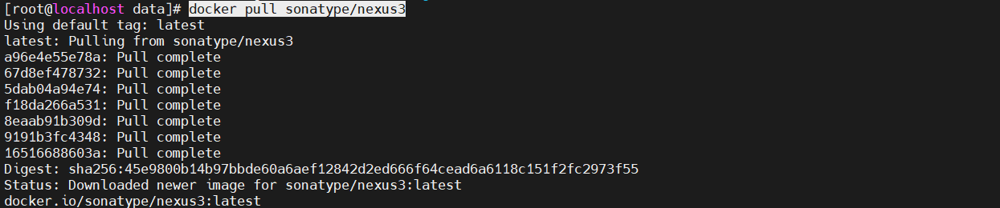
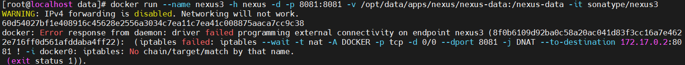
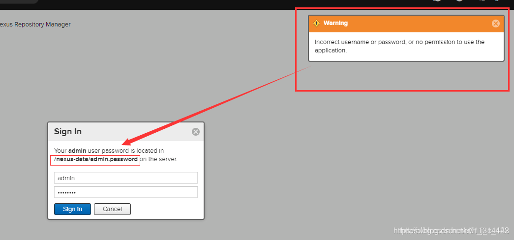
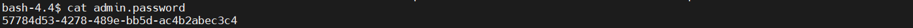

# Nexus 3 容器化部署

### docker镜像拉取
```shell
docker pull sonatype/nexus3
```


### 创建映射文件夹（可以不做）
```shell
mkdir -p /opt/data/apps/nexus/nexus-data && chown -R 200 /opt/data/apps/nexus/nexus-data
```

### 启动容器
> 使用8081端口
```shell
docker run --name nexus3 -h nexus -d -p 8081:8081 -v /opt/data/apps/nexus/nexus-data:/nexus-data -it sonatype/nexus3

# 不做映射
docker run --name nexus3 -h nexus -d -p 8081:8081 -it sonatype/nexus3
```
#### 启动报错

```shell
WARNING: IPv4 forwarding is disabled. Networking will not work.
60d54027bf1e408916c45628e2556a3034c7ea11c7ea41c008875aaca7cc9c38
docker: Error response from daemon: driver failed programming external connectivity on endpoint nexus3 (8f0b6109d92ba0c58a20ac041d83f3cc16a7e4622e716ff0d561afddaba4ff22):  (iptables failed: iptables --wait -t nat -A DOCKER -p tcp -d 0/0 --dport 8081 -j DNAT --to-destination 172.17.0.2:8081 ! -i docker0: iptables: No chain/target/match by that name.
 (exit status 1)).
```
#### 解决
> 重启docker
```shell
systemctl restart docker
```

### 访问
```shell
http://192.168.0.182:8081/#browse/welcome
```


### 登录
> 当前部署的版本密码不是admin123
#### 登录报错

```shell
# 进入容器
docker exec -it nexus3 bash

# 根据提示，进入nexus-data
cd /nexus-data

# 查看密码
cat admin.password

# 复制后登录
```


### 登录后，修改密码、允许匿名访问
