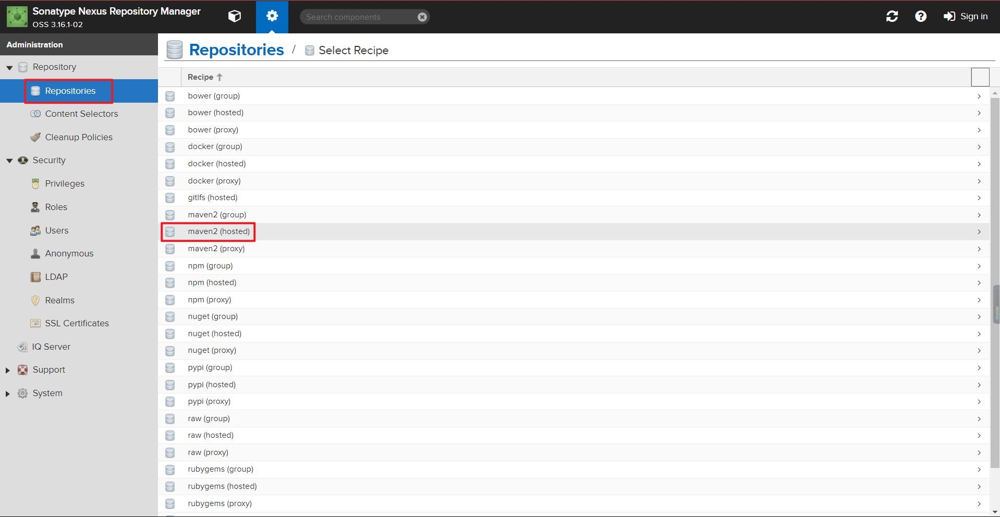
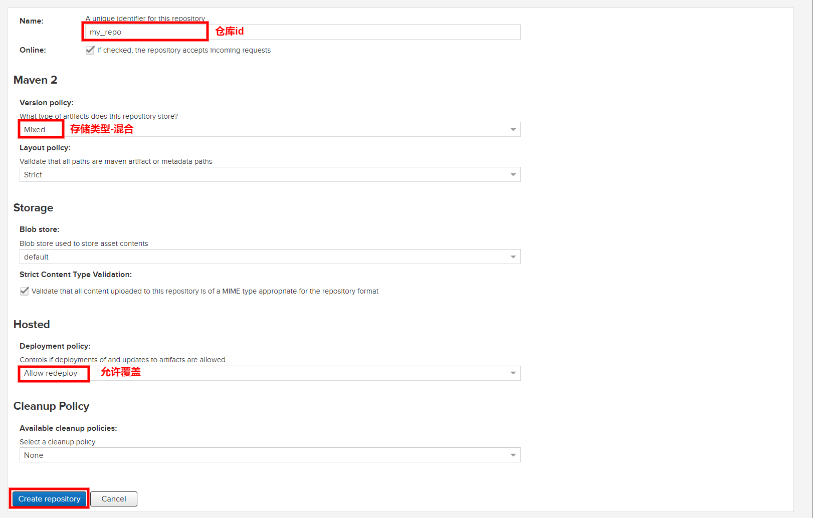
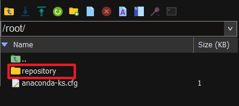
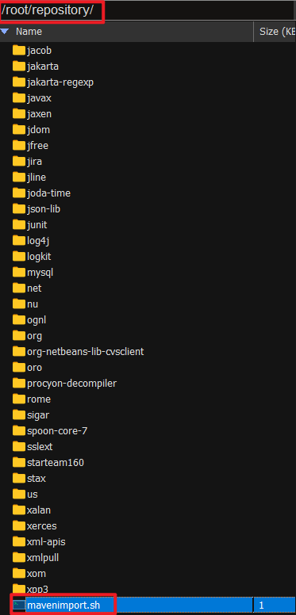
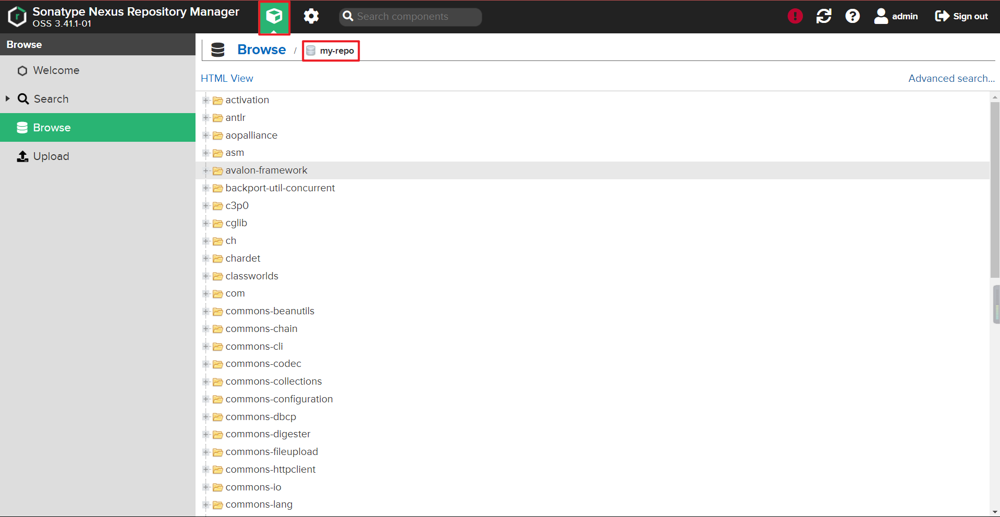

# Nexus 3 批量上传组件到私服仓库

### 创建hosted仓库


### hosted仓库配置


### 将本地的jar包上传到服务器（服务器随机，如果是内网，需要这台服务器能访问到nexus 3）


### 编写脚本，批量上传jar包到私服
> 通过脚本中的curl批量导入本地的jar包
#### 脚本内容（脚本最好跟jar包同级目录）

```shell
#!/bin/bash
# copy and run this script to the root of the repository directory containing files
# this script attempts to exclude uploading itself explicitly so the script name is important
# Get command line params
while getopts ":r:u:p:" opt; do
    case $opt in
        r) REPO_URL="$OPTARG"
        ;;
        u) USERNAME="$OPTARG"
        ;;
        p) PASSWORD="$OPTARG"
        ;;
    esac
done
  
find . -type f -not -path './mavenimport\.sh*' -not -path '*/\.*' -not -path '*/\^archetype\-catalog\.xml*' -not -path '*/\^maven\-metadata\-local*\.xml' -not -path '*/\^maven\-metadata\-deployment*\.xml' | sed "s|^\./||" | xargs -I '{}' curl -u "$USERNAME:$PASSWORD" -X PUT -v -T {} ${REPO_URL}/{};
```
#### 赋权脚本，运行导入
```shell
# 安装curl（如果没用装，需要安装）
yum install curl

# 赋权
chmod +x mavenimport.sh

# 执行脚本
./mavenimport.sh -u admin -p admin123 -r http://192.168.0.182:8081/repository/my-repo/
# 说明
./mavenimport.sh -u 用户名 -p 密码 -r 仓库地址
```

### 查看
