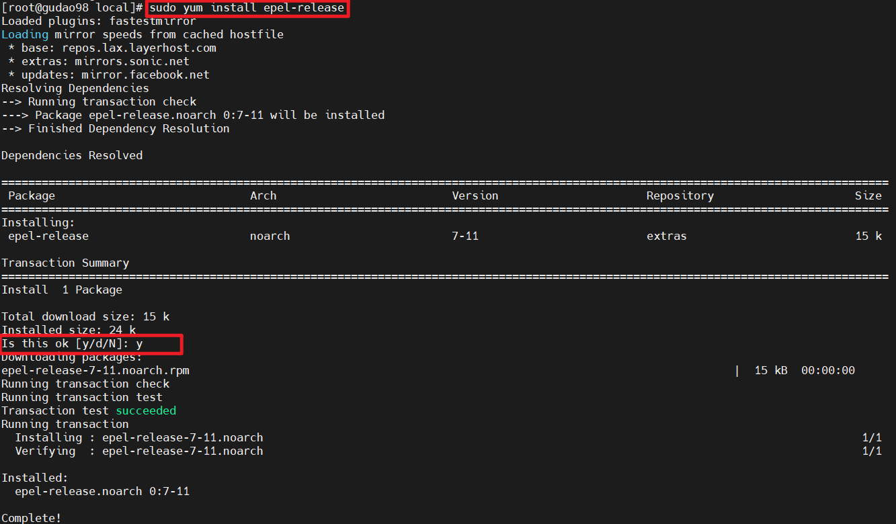

## Linux中的Nginx安装详情，非源码模式部署【CentOS 8】

### 安装说明
> 在Centos下，yum源不提供nginx的安装，可以通过直接下载安装包的方法（前面已经说明）；也通过切换yum源的方法获取安装，以下命令均需root权限执行：
* Nginx软件包可在EPEL存储库中获得。在安装Nginx之前我们先启用EPEL仓库，使用yum。然后再使用yum安装nginx
* 如果这是您首次从EPEL存储库安装软件包，yum可能会提示您导入EPEL GPG密钥。如果你是这种情况，请键入y并单击Enter

### 安装Nginx
```shell
sudo yum install epel-release
sudo yum install nginx
# 查看nginx状态
systemctl status nginx
```

#### 安装epel-release


#### 安装nginx


#### 查看nginx状态


### 打开80和443和的端口
> FirewallD是Centos 7上的默认防火墙解决方案。在安装过程中，Nginx使用预定义规则创建防火墙服务文件。打开HTTP协议的80端口和HTTPS协议443端口，允许来自这两个端口的连接。使用以下命令永久打开80和443和的端口
```shell
sudo firewall-cmd --permanent --zone=public --add-service=http
sudo firewall-cmd --permanent --zone=public --add-service=https
sudo firewall-cmd --reload
```

### Nginx配置文件的结构和最佳做法
> 所有Nginx配置文件都位于/etc/nginx/目录中。主要的Nginx配置文件为/etc/nginx/nginx.conf


### 配置修改完成后，启动或重新nginx
```shell
# 启动nginx
systemctl start nginx
# 重启nginx
systemctl restart nginx
```