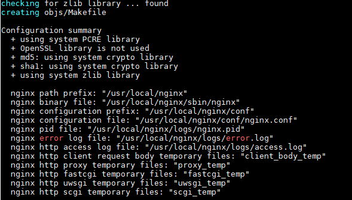
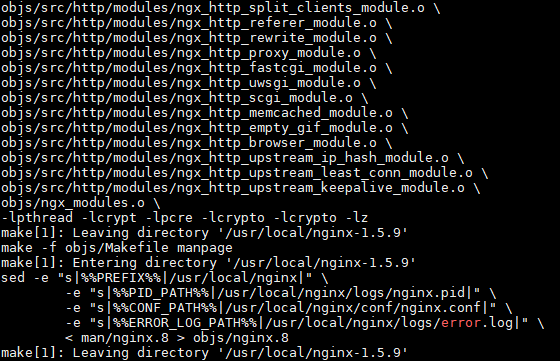
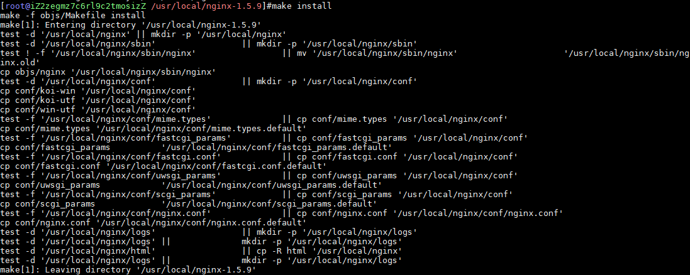
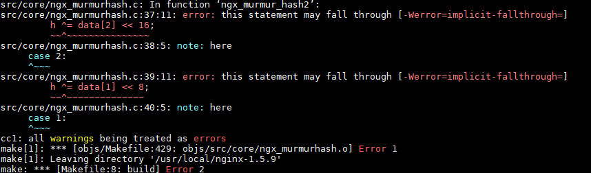
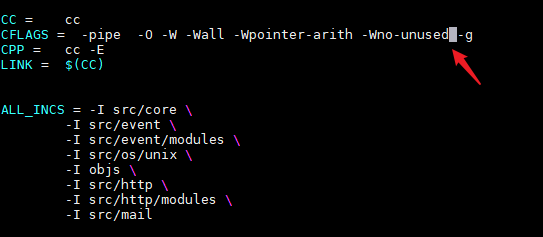
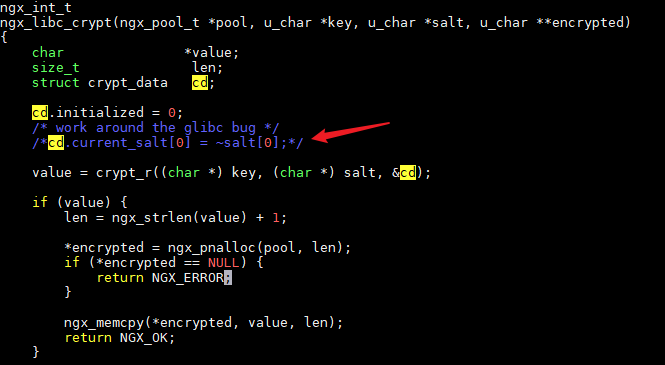

## Linux中的Nginx安装详情【CentOS 8】
### nginx下载地址
[Nginx安装包下载地址](http://nginx.org/download/)

### 安装说明
> 在Centos下，yum源不提供nginx的安装，可以通过切换yum源的方法获取安装。也可以通过直接下载安装包的方法，以下命令均需root权限执行：
* 首先安装必要的库（nginx中gzip模块需要zlib库，rewrite模块需要pcre库，ssl功能需要openssl库）。
* 选定/usr/local为安装目录，以下具体版本号根据实际改变。

### 不指定版本安装
#### 安装对应的工具包
```shell
yum install gcc openssl openssl-devel pcre pcre-devel zlib zlib-devel -y
```
#### 安装nginx
```shell
cd /usr/local/ 
wget http://nginx.org/download/nginx-1.5.9.tar.gz
tar -zxvf nginx-1.5.9.tar.gz
cd nginx-1.5.9
# --prefix是指定nginx安装路径
./configure --prefix=/usr/local/nginx 
make && make install
```
##### ./configure执行

##### make执行结果

##### make install执行结果


#### 启动nginx
```shell
# 进入--prefix后面的nginx安装路径
cd /usr/local/nginx 
# 进入sbin目录
cd sbin
# 启动nginx
./nginx
# 通过nginx.config配置文件启动nginx（先查看下是否有nginx在当前环境下启动着，如果有，通过kill命令关闭；不然会启动失败）
./nginx -c /nginx.conf配置文件路径
```

### 根据对应的工具包解压安装
#### 安装 gcc 编译器
```shell
yum install -y gcc gcc-c++
```
#### 安装 PCRE 库
```shell
cd /usr/local/ 
# 下载不了自行到网上查找：不能下载直接去我github中去拿
wget https://github.com/GudaoFQ/Ability_Note/tree/master/nginx/pluginpcre-8.36.tar.gz 
# 解压
tar -zxvf pcre-8.36.tar.gz 
# 进入解压后文件
cd pcre-8.36 
# 配置
./configure 
# 编译
make && make install
```
#### 安装 zlib 库
```shell
cd /usr/local/ 
wget https://github.com/GudaoFQ/Ability_Note/tree/master/nginx/plugin/zlib-1.2.8.tar.gz 
tar -zxvf zlib-1.2.8.tar.gz 
cd lib-1.2.8 
./configure 
make && make install
```
#### 安装 ssl
```shell
cd /usr/local/ 
wget https://github.com/GudaoFQ/Ability_Note/tree/master/nginx/plugin/openssl-1.0.1j.tar.gz 
tar -zxvf openssl-1.0.1j.tar.gz 
./config 
make && make install
```
#### 安装 nginx
```shell
cd /usr/local/ 
wget http://nginx.org/download/nginx-1.5.9.tar.gz
tar -zxvf nginx-1.5.9.tar.gz
cd nginx-1.5.9.tar.gz
# --prefix是指定nginx安装路径
./configure --prefix=/usr/local/nginx 
make && make install
```
#### 启动nginx
```shell
# 进入--prefix后面的nginx安装路径
cd /usr/local/nginx 
# 进入sbin目录
cd sbin
# 启动nginx
./nginx
# 通过nginx.config配置文件启动nginx（先查看下是否有nginx在当前环境下启动着，如果有，通过kill命令关闭；不然会启动失败）
./nginx -c /nginx.conf配置文件路径
```

### 安装过程的的BUG【问题不解决是生成不了nginx启动项的】
#### 问题werror编译报错

#### 解决
* 进入自己的nginx解压包下的objs目录，修改Makefile文件
    ```shell
    cd /usr/local/nginx-1.5.9/objs
    vim Makefile
    ```
* 把里面一个单词 -Werror 删除掉 然后保存一下
    
* 进入自己的nginx解压包下的src/os/unix目录，修改ngx_user.c文件
    ```shell
    cd /usr/local/nginx-1.5.9/src/os/unix
    vim ngx_user.c
    ```
* 注释掉报错位置
    
* 修改之后直接运行make和make install命令【不要运行./cofigure，不然会重置你修改后的Makefile文件】