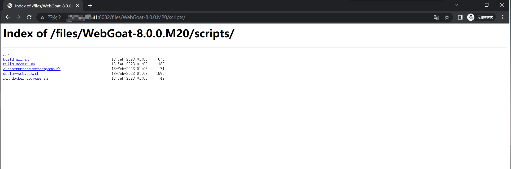

## nginx显示文件目录

### 安装nginx，可以查看 【YC】nginx自定义yum源.md

### 修改nginx配置文件
```shell
# 修改配置文件
vi /etc/nginx/nginx.conf

# 配置入下
user  nginx;
worker_processes  auto;

error_log  /var/log/nginx/error.log notice;
pid        /var/run/nginx.pid;


events {
    worker_connections  1024;
}


http {
    server {
        listen       8082;        #端口
        server_name  localhost;   #服务名

        location /files/ {
            alias   /dockerFile/;     # 需要展示的文件路径
            autoindex on;             # 开启索引功能
            autoindex_exact_size off; # 关闭计算文件确切大小（单位bytes），只显示大概大小（单位kb、mb、gb）
            autoindex_localtime on;   # 显示本机时间而非 GMT 时间
        }
    }
}
```

### 开启访问端口（上述中使用的是8082），或者直接关闭防火墙
```shell
# 开启访问端口
firewall-cmd --add-port=8082/tcp --permanent
sudo firewall-cmd --reload

## 关闭防火墙，不推荐使用（直接使用上面的即可）
systemctl stop firewalld
```

### 配置完成，访问


### 注意
> 如果`location /files/ { ...`中的`/files`后面不添加`/`出现**目录穿越漏洞**，所以，此处一定要加写成上述代码中的路径，添加末尾的`/`