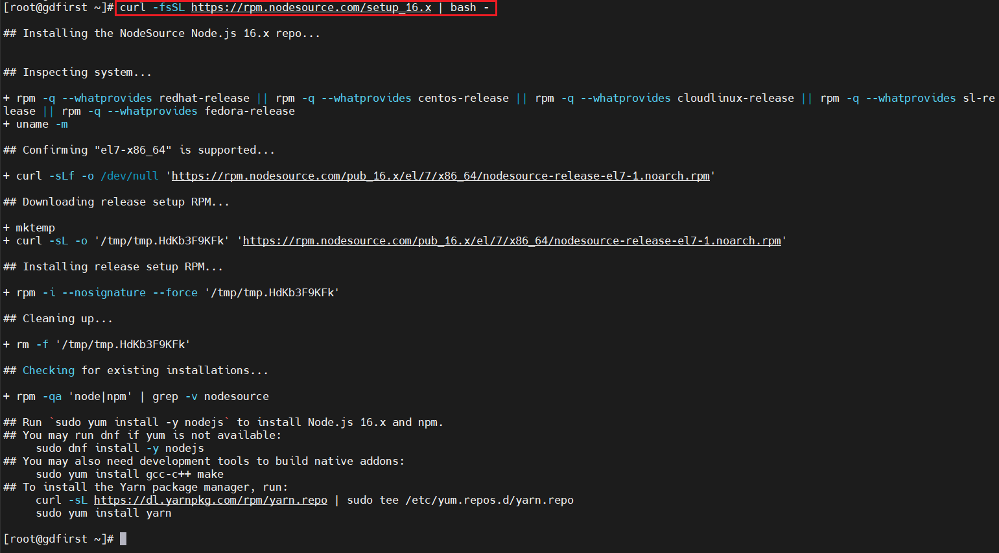
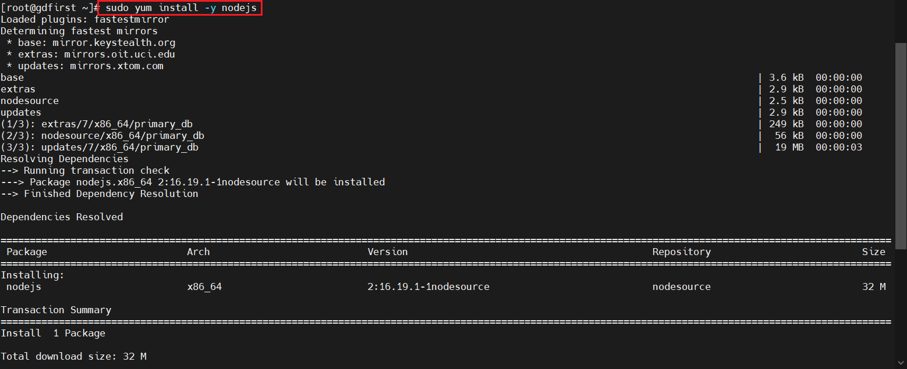
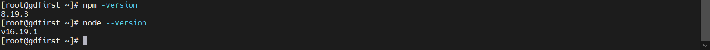
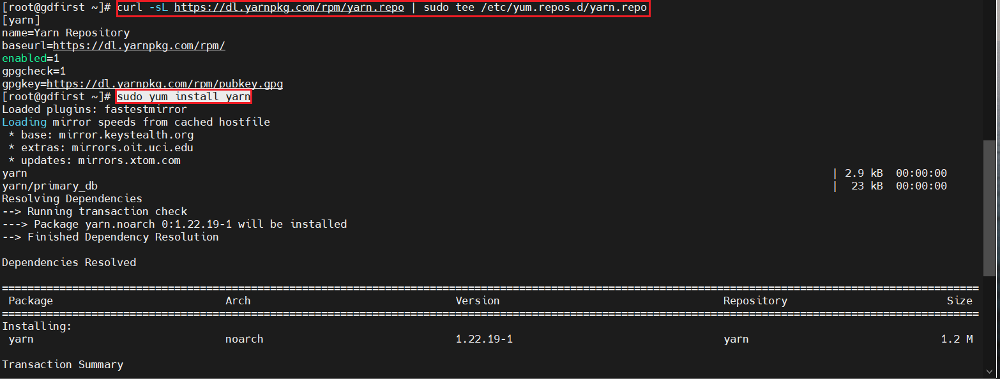

## Node基于CentOS 7安装

### 环境说明
* CentOS Linux release 7.9.2009 (Core)
* Node.js v16.x

### Node官方安装方案
[官方安装说明地址](https://nodejs.org/en/download/package-manager/#centos-fedora-and-red-hat-enterprise-linux)

### 使用二进制发行版安装
[发行版本开源地址](https://github.com/nodesource/distributions)
* 说明
    * CentOS 7 (64-bit) WARNING: BUILD SYSTEM CURRENTLY BROKEN FOR NODEJS 18+
    * 开源说明中指出nodejs18以上在CentOS 7有问题；所以这边使用16的版本
    
### 安装脚本下载（进入root用户执行）
```shell
sudo -i
# 执行安装脚本
curl -fsSL https://rpm.nodesource.com/setup_16.x | bash -
```


### 按照脚本提示，安装nodejs
```shell
sudo yum install -y nodejs
```


### 安装完成
```shell
npm -version

node --version
```


### 可选操作
#### 安装 yarn
```shell
# 下载yarn源
curl -sL https://dl.yarnpkg.com/rpm/yarn.repo | sudo tee /etc/yum.repos.d/yarn.repo
# 安装
sudo yum install yarn
```

