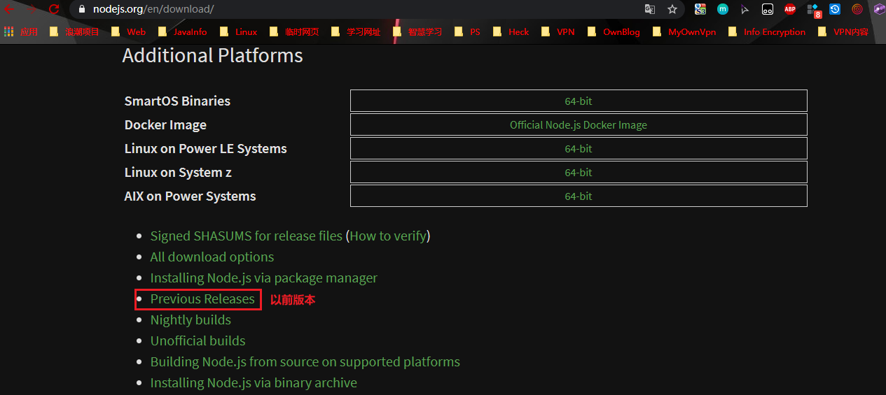
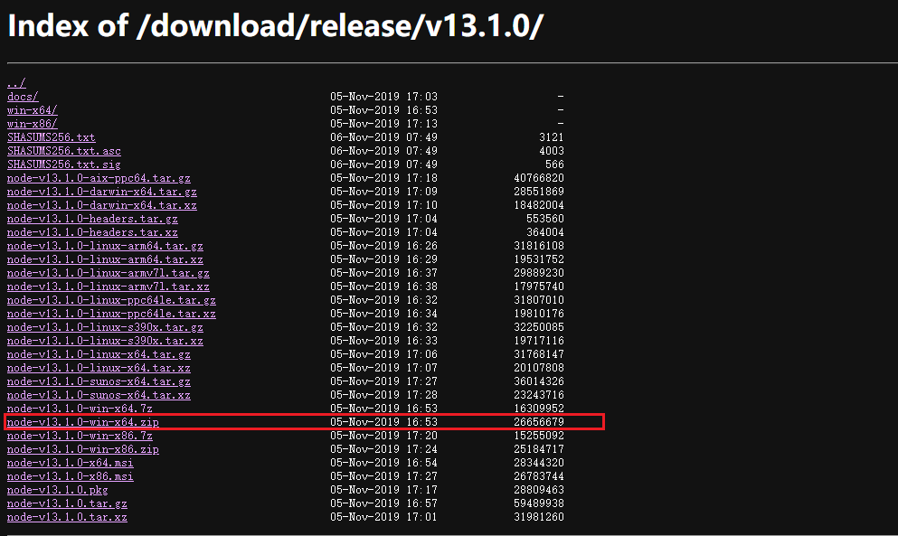
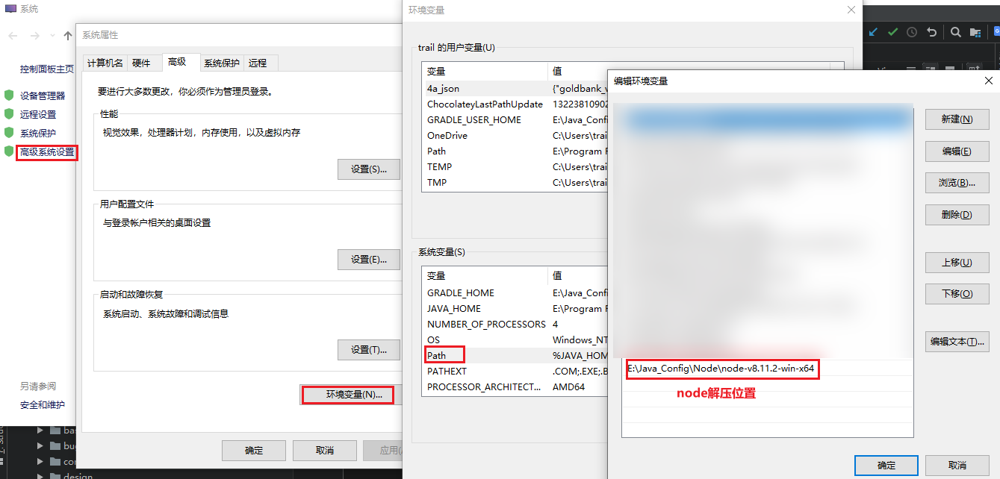
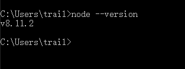

## Node基于Windows安装

#### node.js官网下载
官网：<https://nodejs.org/en/download/releases/>
版本下载目录：<https://nodejs.org/en/download/releases/>

#### zip方式安装

#### 环境变量配置

#### 配置完成验证
> 通过命令`node --version`
