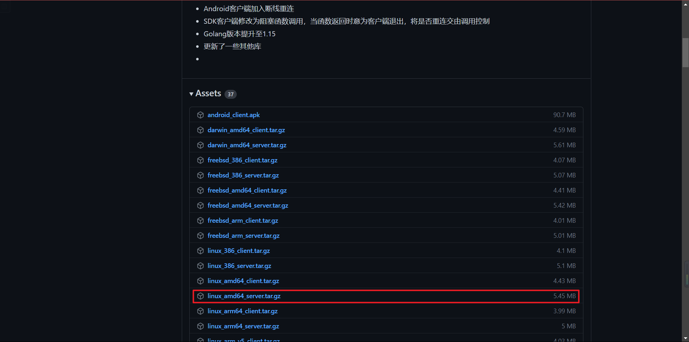
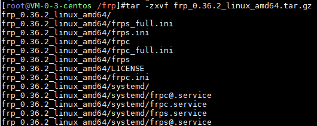
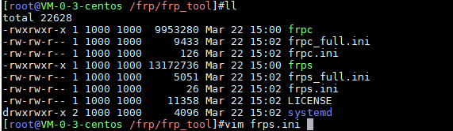

## 配置
* 带公网ip的服务器（此处使用的是腾讯云CentOs 7）
* 公司内网服务器（CentOs 7）

### NPS地址

[GitHub-NPS](https://github.com/ehang-io/nps/releases)

### 安装包选择


### 安装包下载
> `wget https://github.com/ehang-io/nps/releases/download/v0.26.10/linux_amd64_server.tar.gz`


### 解压
> `tar -zxvf frp_0.36.2_linux_amd64.tar.gz`



### 重命名
```shell
# 重命名
mv frp_0.36.2_linux_amd64 frp_tool
# 进入frp
cd frp_tool
```

### 配置server端；server端必须要有公网ip
> `vi frps.ini`



### 目录介绍
```shell
├── frpc //客户端
├── frpc_full.ini
├── frpc.ini//客户端配置
├── frps//服务端
├── frps_full.ini
├── frps.ini//服务端配置
└── LICENSE
```

### frps.ini详情
```shell
[common]
# 服务端口，供client注册
bind_port = 22333
# http服务端口；http穿透访问端口【浏览器通过服务器公网ip+端口访问穿透的网络】
vhost_http_port = 8089
# https服务端口；https穿透访问端口【浏览器通过服务器公网ip+端口访问穿透的网络】
vhost_https_port = 4439
# 认证token
token = 123456
# 监听地址
dashboard_addr = 0.0.0.0
# 监听端口，查看frp服务状态与信息
dashboard_port = 7500
# 监听界面账号
dashboard_user = test
# 监听界面密码
dashboard_pwd = 123456
# server端运行日志存储位置；需要自己创建该文件夹
log_file = /root/frp/frps.log
# 日志等级
log_level = debug
# 日志最大天数
log_max_days = 3
```

### 创建日志目录
> `mkdir` /root/frp

### 运行server端
> `./frps -c ./frps.ini`或者后台启动`nohup ./frpc -c ./frpc.ini &`

