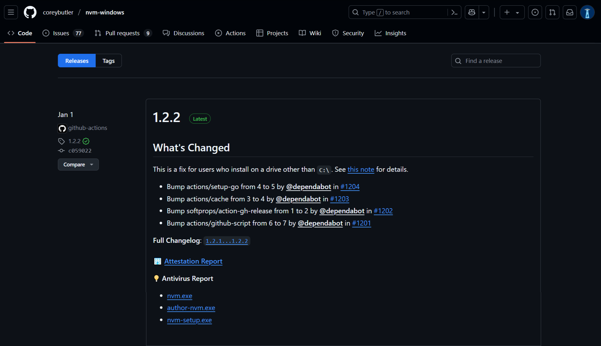
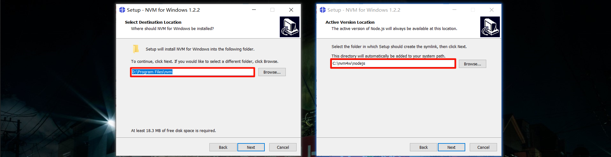
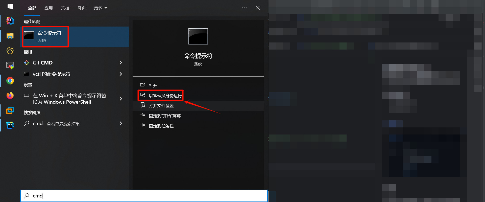
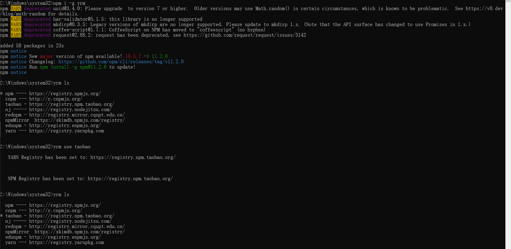
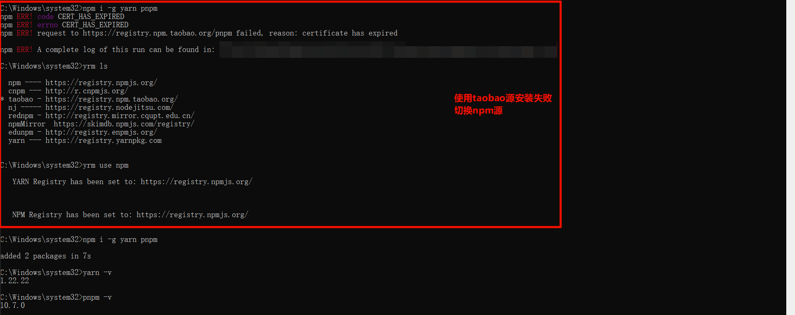

## 使用NVM for Windows管理NodeJs

### 环境说明
* Windows 10
* Nvm 1.2.2

[下载社区](https://github.com/coreybutler/nvm-windows/releases)



### 安装
#### 设置nvm安装地址，配置nodejs安装地址
> 此处配置的nvm安装地址，后会配置到环境变量中。安装完成后在环境变量中修改，在`nvm use xxx`时会报错



#### 管理员权限运行命令行
> 安装nvm后，需要管理员权限运行命令行，否则会报错



#### `nvm -v`查看nvm安装版本
```shell
# 命令行输入`nvm -v`查看nvm安装版本
nvm -v

# 输出
1.2.2
```

#### `nvm list available`查看此版本的nvm支持安装哪些版本的nodejs
```shell
# 命令行输入`nvm list available`，查看此版本的nvm支持安装哪些版本的nodejs
nvm list available

# 输出
|   CURRENT    |     LTS      |  OLD STABLE  | OLD UNSTABLE |
|--------------|--------------|--------------|--------------|
|   23.10.0    |   22.14.0    |   0.12.18    |   0.11.16    |
|    23.9.0    |   22.13.1    |   0.12.17    |   0.11.15    |
|    23.8.0    |   22.13.0    |   0.12.16    |   0.11.14    |
|    23.7.0    |   22.12.0    |   0.12.15    |   0.11.13    |
|    23.6.1    |   22.11.0    |   0.12.14    |   0.11.12    |
|    23.6.0    |   20.19.0    |   0.12.13    |   0.11.11    |
|    23.5.0    |   20.18.3    |   0.12.12    |   0.11.10    |
|    23.4.0    |   20.18.2    |   0.12.11    |    0.11.9    |
|    23.3.0    |   20.18.1    |   0.12.10    |    0.11.8    |
|    23.2.0    |   20.18.0    |    0.12.9    |    0.11.7    |
|    23.1.0    |   20.17.0    |    0.12.8    |    0.11.6    |
|    23.0.0    |   20.16.0    |    0.12.7    |    0.11.5    |
|   22.10.0    |   20.15.1    |    0.12.6    |    0.11.4    |
|    22.9.0    |   20.15.0    |    0.12.5    |    0.11.3    |
|    22.8.0    |   20.14.0    |    0.12.4    |    0.11.2    |
|    22.7.0    |   20.13.1    |    0.12.3    |    0.11.1    |
|    22.6.0    |   20.13.0    |    0.12.2    |    0.11.0    |
|    22.5.1    |   20.12.2    |    0.12.1    |    0.9.12    |
|    22.5.0    |   20.12.1    |    0.12.0    |    0.9.11    |
|    22.4.1    |   20.12.0    |   0.10.48    |    0.9.10    |

This is a partial list. For a complete list, visit https://nodejs.org/en/download/releases
```

#### `nvm install xxx`选定版本，安装nodejs
> `nvm install lts`命令是安装 lts 的最新版本
```shell
# 命令行输入`nvm install xxx`选定版本，安装nodejs
nvm install 20.13.0

# 输出
Installation complete.
If you want to use this version, type:

nvm use 20.13.0
```

#### `nvm use xxx`切换nodejs版本
```shell
# 命令行输入`nvm use xxx`切换nodejs版本
nvm use 20.13.0

# 输出
Now using node v20.13.0 (64-bit)
```

### 工具安装
#### 安装yrm并切换taobao镜像
> `yrm ls`返回列表中的*停在taobao前，表示安装成功并切换到了taobao镜像
```shell
# 安装yrm
npm i -g yrm
# 切换taobao镜像
yrm use taobao
# 查看镜像列表
yrm ls
```



#### 安装yarn及pnpm
```shell
npm i -g yarn pnpm
```

