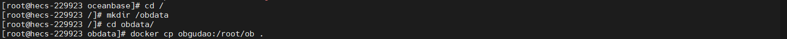
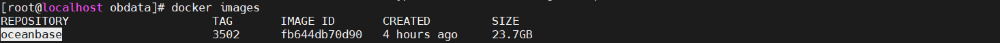
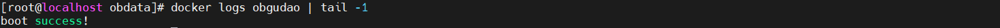
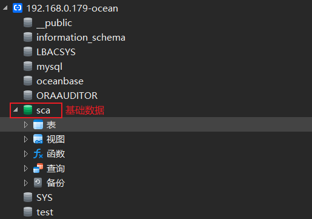

## OceanBase数据库Docker持久化
> 目前官网和社区都没有给出一套可行的oceanbase的docker映射持久化方案；
> 此次提供的也有些问题，需要先将基础数据同步完成后，将其cp出来，在将这个容器大成镜像；最后在创建容器的时候，通过commit出来的镜像创建并映射`/root/ob`文件夹；
> 但是oceanbase只要做了ob的映射，重新启动容器就会失败，报OBAgent启动失败

[toc]

### 配置说明
* CentOS Linux release 7.9.2009 (Core)
* 4C 8G
* OceanBase：4.1.0.0

### 将数据文件映射出来
```shell
# 创建数据存储文件夹
mkdir /obdata
cd /obdata
# 将数据拷贝到当前目录
docker cp obgudao:/root/ob .
```


### 容器commit镜像
```shell
docker commit obgudao oceanbase:3502
```


### 重新创建新容器（我这边先将原来的删除，然后重新启一个）
```shell
docker stop obgudao
docker rm obgudao

docker run  -p 2881:2881 -v /obdata/ob:/root/ob --name obgudao -e MINI_MODE=1 -d oceanbase:3502
```


### 数据验证


### 后面每次重启都会报错的解决方案
* 需要删除原来容器，再通过`docker run`重新创建新容器
* 因为做了持久化映射，所有数据都没有丢失