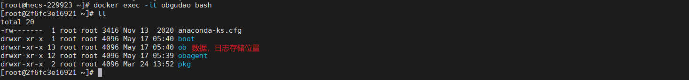

## OceanBase数据库Docker形式部署
[toc]

### 配置说明
* CentOS Linux release 7.9.2009 (Core)
* 4C 8G
* OceanBase：4.1.0.0

### OceanBase容器创建
> 容器hub地址：https://hub.docker.com/r/oceanbase/oceanbase-ce/tags
```shell
# 根据当前容器部署最大规格的实例
docker run -p 2881:2881 --name obgudao -d oceanbase/oceanbase-ce:4.1.0.0

## 部署 mini 的独立实例
docker run -p 2881:2881 --name obgudao -e MINI_MODE=1 -d oceanbase/oceanbase-ce:4.1.0.0
```


### 查看是否创建成功
```shell
# 查看ob容器的最后一条日志
docker logs obgudao | tail -1
```


### 进入容器，进行密码修改
> OceanBase最初root用户没有密码，需要进行手动配置
#### 进入容器
```shell
docker exec -it obgudao bash
```

#### 连接数据库
```shell
# -Doceanbase我没有进行添加，没有选择数据库
# obclient -h127.1 -uroot -P2881 -A -c
obclient -h127.1 -uroot -P2881 -A -c -Doceanbase
# -h 提供 OceanBase 数据库连接 IP，通常是一个 OBProxy 地址
# -D 数据库名称
# -P 端口
# -u 提供租户的连接账户，格式有两种：用户名@租户名#集群名或者 集群名:租户名:用户名。MySQL 租户的管理员用户名默认是 root
# -c 表示在 MySQL 运行环境中不要忽略注释
# -A：表示在 MySQL 连接数据库时不自动获取统计信息
# 如果连接语句中不带 -c 项，则连接至租户后 Hint 无法生效
```

#### 修改密码
```shell
ALTER USER root IDENTIFIED BY '******!@#';
```

