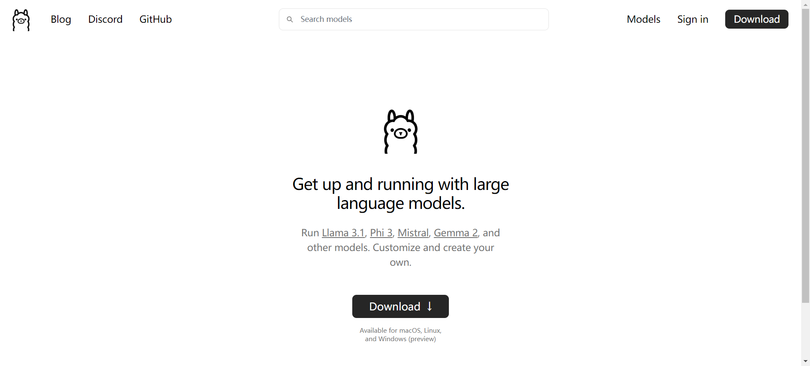
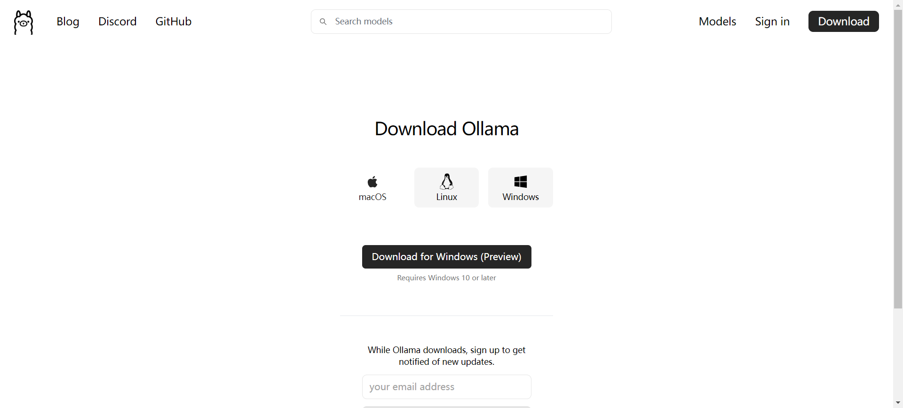
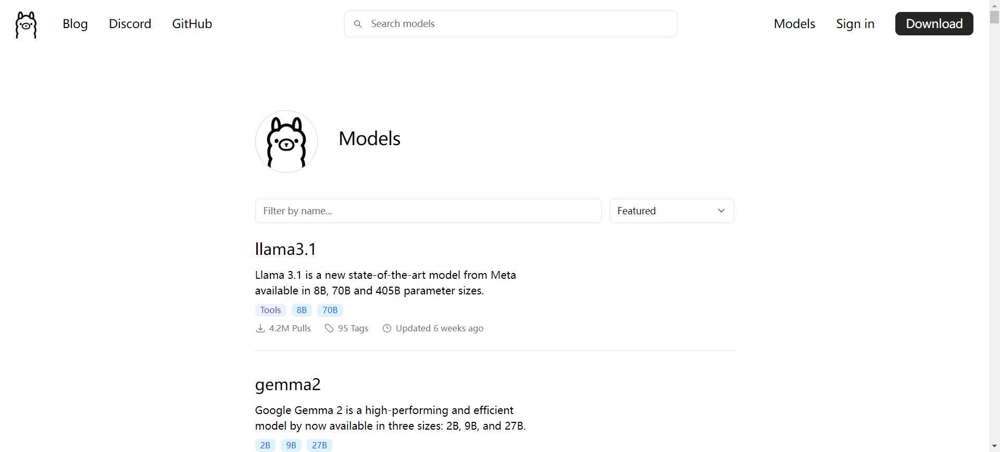
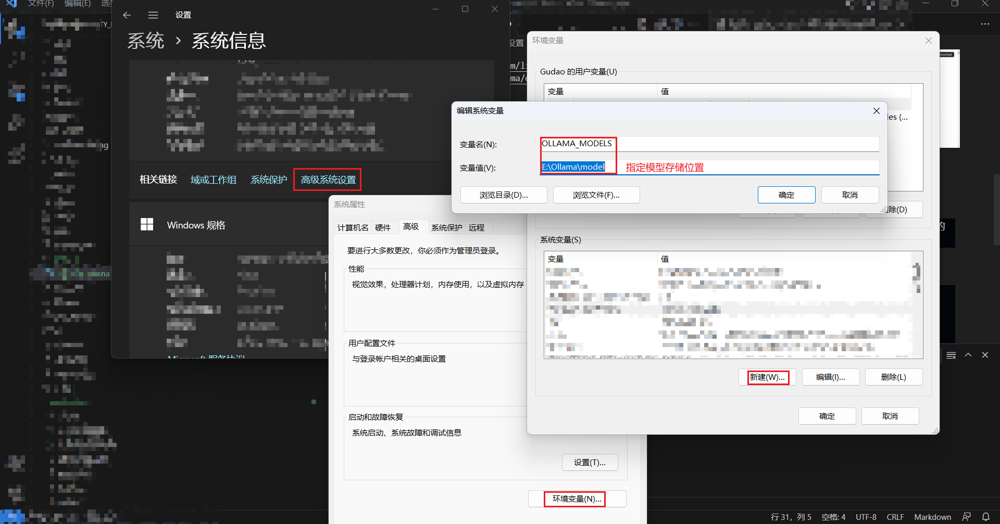
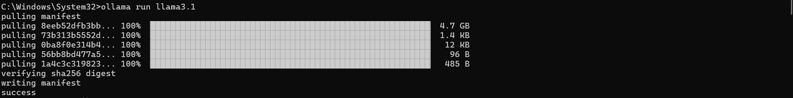
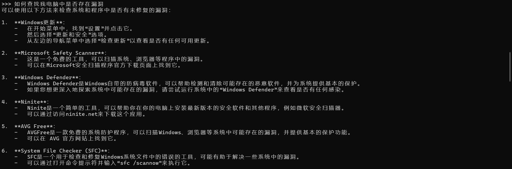

## Ollama下载与模型位置设置
[toc]

### 配置说明
* 系统：Win 11
* 显卡：4060 8G
* 内存：32G
* 处理器：AMD R9 7945
* Ollama版本：ollama version is 0.3.9
* 使用模型：Llama 3.1 8B

### 下载Ollama工具
> Ollama是一个开源的大模型管理工具；一个基于 Go 语言开发的简单易用的本地大语言模型运行框架。可以将其类比为 docker（同基于 cobra (opens new window)包实现命令行交互中的 list,pull,push,run 等命令），事实上它也的确制定了类 docker 的一种模型应用标准，在后边的内容中，你能更加真切体会到这一点。

目前 Ollama 支持多模型和并发（通过设置OLLAMA_NUM_PARALLEL 和 OLLAMA_MAX_LOADED_MODELS），并支持如下大模型：
* Llava Llama 3: A new high-performing LLaVA model fine-tuned from Llama 3 Instruct.
* Llava Phi 3: A new small LLaVA model fine-tuned from Phi 3.
* StarCoder2 15B Instruct: A new instruct fine-tune of the StarCoder2 model
* CodeGemma 1.1: A new release of the CodeGemma model.
* StableLM2 12B: A new 12B version of the StableLM 2 model from Stability AI
* Moondream 2: Moondream 2's runtime parameters have been improved for better responses

#### Ollama地址
[官网地址](https://ollama.com/)


[下载地址](https://ollama.com/download)


[模型仓库](https://ollama.com/library)


### 安装
#### 通过下载地址下载并安装Ollama
> Ollama默认会下载到C盘；在不做注册表修改的情况下；Ollama 是一个本地推理框架客户端，可一键部署如 Llama 3, Mistral, Llava 等大型语言模型。 ollama 启动成功后，会在本地 11434 端口启动一个 API 服务，可通过 http://localhost:11434 访问。

#### 下载补充
```shell
# Windows
https://ollama.com/download/OllamaSetup.exe
 
# MacOS
https://ollama.com/download/Ollama-darwin.zip
 
# Linux
curl -fsSL https://ollama.com/install.sh | sh
 
# Docker
docker pull ollama/ollama # https://hub.docker.com/r/ollama/ollama
 
# Ollama - Docker CPU Only
docker run -d -v ollama:/root/.ollama -p 11434:11434 --name ollama ollama/ollama
```

#### 修改models下载位置
> Ollama默认会将pull下来的模型放在：`C:\Users\<username>\.ollama\models`下，需要通过修改系统环境变量指定模型下载位置。防止C盘空间占满

```shell
# 添加系统变量
OLLAMA_MODELS
```


**注意**
* macOS模型存放位置：~/.ollama/models
* Linux模型存放位置：/usr/share/ollama/.ollama/models
* Win模型存放位置：C:\Users\%username%\.ollama\models
* [官方说明地址：Github](https://github.com/ollama/ollama/blob/main/docs/faq.md)

### 拉取模型并运行
```shell
# 拉取DeepSeek-R1模型运行
ollama run deepseek-r1:8b

#（此命令为meta公司开源模型，使用上面的模型，这个就是可选项）拉取官方模型3.1并运行
ollama run llama3.1
```


### Ollama命令说明
#### ollama create：创建模型
```shell
# ollama create 模型名称 -f 根据Modelfile官方格式的写的配置文件位置
ollama create mymodel -f ./Modelfile
```
#### ollama list：显示模型列表
```shell
ollama list
NAME            ID              SIZE    MODIFIED
llama3.1:latest f66fc8dc39ea    4.7 GB  2 hours ago
```
#### ollama show 显示模型的信息
```shell
# ollama show 模型NAME
ollama show llama3.1:latest
  Model
        arch                    llama
        parameters              8.0B
        quantization            Q4_0
        context length          131072
        embedding length        4096

  Parameters
        stop    "<|start_header_id|>"
        stop    "<|end_header_id|>"
        stop    "<|eot_id|>"

  License
        LLAMA 3.1 COMMUNITY LICENSE AGREEMENT
        Llama 3.1 Version Release Date: July 23, 2024
```
#### ollama pull：拉取模型
```shell
# ollama pull 模型名称
ollama pull llama3.1
pulling manifest
pulling 8eeb52dfb3bb... 100% ▕████████████████████████████████████████████████████████▏ 4.7 GB
pulling 73b313b5552d... 100% ▕████████████████████████████████████████████████████████▏ 1.4 KB
pulling 0ba8f0e314b4... 100% ▕████████████████████████████████████████████████████████▏  12 KB
pulling 56bb8bd477a5... 100% ▕████████████████████████████████████████████████████████▏   96 B
pulling 1a4c3c319823... 100% ▕████████████████████████████████████████████████████████▏  485 B
verifying sha256 digest
writing manifest
success
```
#### ollama push：推送模型
> push前需要在https://ollama.com/进行注册账户，然后添加自己的key，之后才能进行push
```shell
# ollama push模型名称
ollama push xxx/my-llama3.1
```
#### ollama cp：拷贝一个模型
```shell
# ollama cp 源模型名称 修改后名称
ollama cp llama3.1 my-llama3.1
```
#### ollama rm：删除一个模型
```shell
# ollama rm 模型名称
ollama rm llama3.1
```
#### ollama run：运行一个模型
```shell
# ollama run 模型名称
ollama run llama3.1
```

### 最终展示
